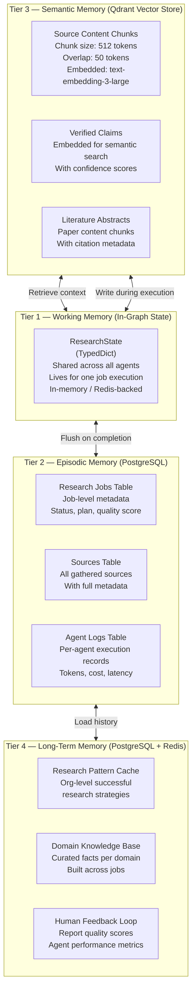
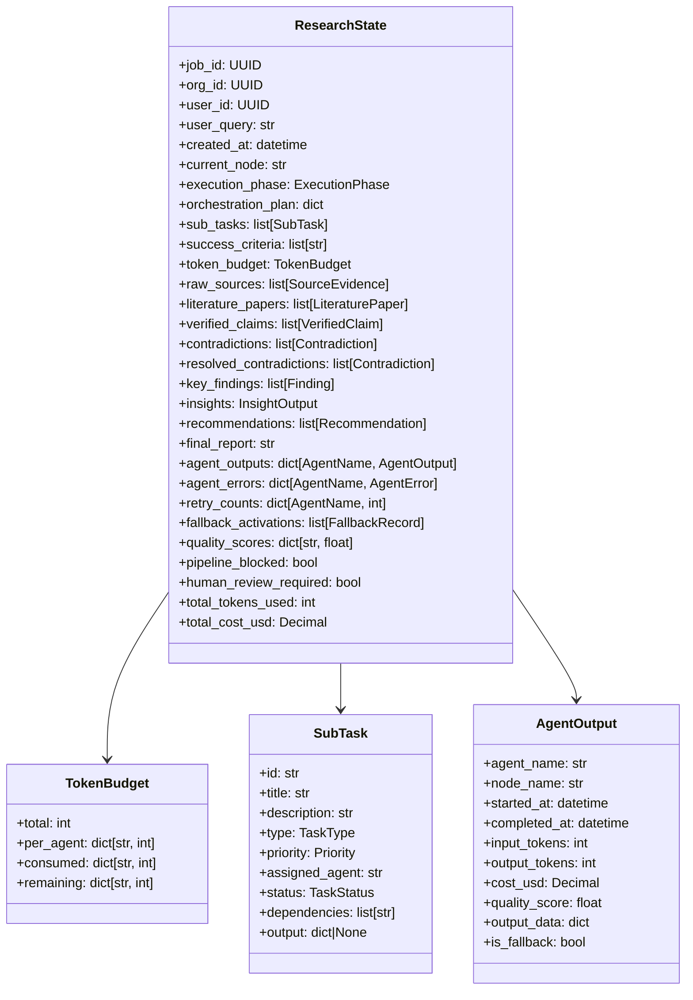
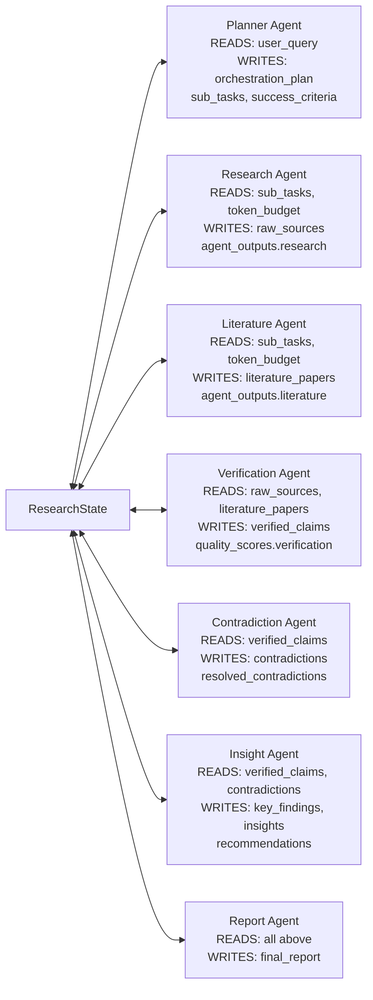
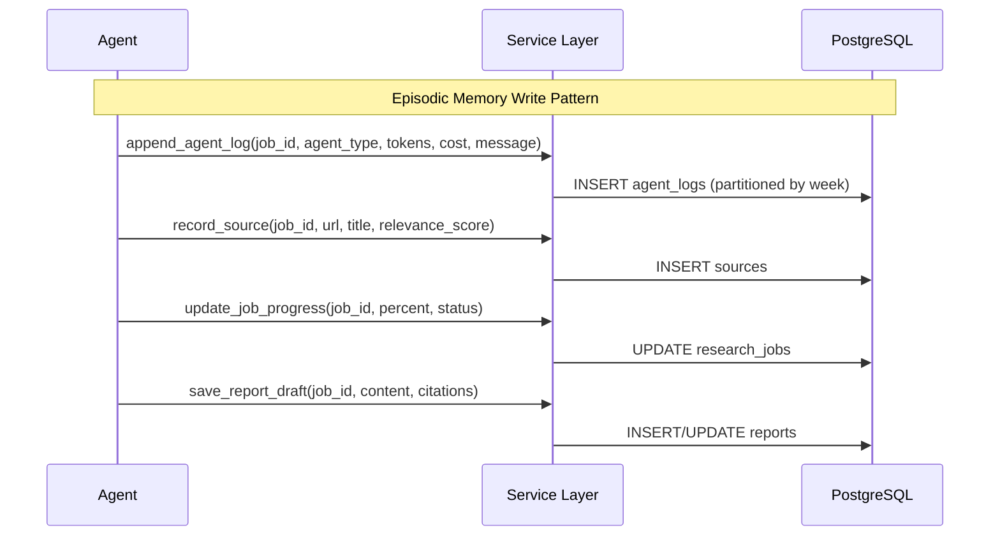
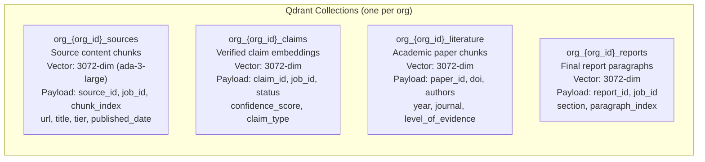
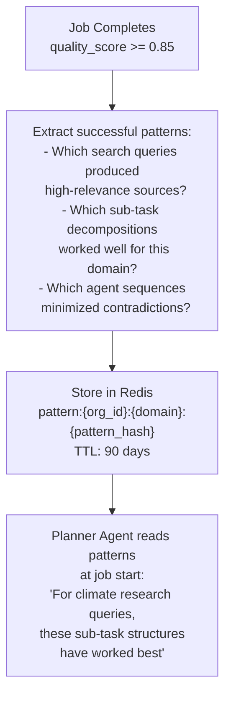
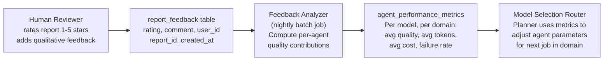

# Multi-Agent AI Research System — Agent Memory Design

## Memory Architecture Overview

The system employs a **four-tier memory architecture** — each tier optimized for different temporal and access patterns:



---

## Tier 1 — Working Memory (Graph State)

The **central shared state** object that all agents read from and write to. This is the "blackboard" pattern — agents communicate exclusively through state, not direct calls.

### ResearchState Schema



### State Isolation Per Agent

Each agent reads its **designated slice** of state and writes to its **designated output fields** only. No agent can overwrite another agent's output:



### State Persistence Strategy

| Trigger | Action |
|---|---|
| After each agent node completes | Snapshot state to Redis (TTL = 2 hours) |
| After each checkpoint | Serialize full state to PostgreSQL `research_jobs.state_checkpoint` (JSONB) |
| On pipeline failure | Persist final state + error context to DB for debugging |
| On pipeline completion | Flush to DB; clear Redis key |

**LangGraph Checkpointer**: Uses `AsyncPostgresSaver` — each `StateSnapshot` is stored in `checkpoint_blobs` table with thread_id = job_id, allowing mid-pipeline resume on process restart.

---

## Tier 2 — Episodic Memory (PostgreSQL)

Structured relational storage for job-level and execution-level data. Agents write to this layer via the API (not directly to DB).

### Data Written Per Job



### Memory Fields in `research_jobs`

| Column | Type | Memory Purpose |
|---|---|---|
| `orchestration_plan` | JSONB | Planner's complete plan — referenced by all agents |
| `state_checkpoint` | JSONB | Latest LangGraph state snapshot |
| `quality_score` | NUMERIC | Final quality assessment from Insight Agent |
| `total_tokens_used` | INTEGER | Running token count across all agents |
| `total_cost_usd` | NUMERIC | Running cost total |
| `error_message` | TEXT | Last failure description |
| `retry_count` | SMALLINT | Number of pipeline-level retries |

---

## Tier 3 — Semantic Memory (Qdrant)

Vector store for all content that agents need to retrieve via semantic similarity.

### Collections Design



### Chunking Strategy

| Collection | Chunk Size | Overlap | Metadata Included |
|---|---|---|---|
| `sources` | 512 tokens | 50 tokens | source_id, url, title, tier, relevance_score, job_id |
| `literature` | 384 tokens | 64 tokens | paper_id, doi, year, journal, level_of_evidence, job_id |
| `claims` | Full claim text | N/A | claim_id, status, confidence_score, job_id |
| `reports` | 256 tokens | 32 tokens | report_id, section, job_id |

### Retrieval Patterns Per Agent

| Agent | Retrieval Pattern | Filter |
|---|---|---|
| Research Agent | Similarity search for sub-task queries | `job_id`, `org_id` |
| Verification Agent | Similarity search for claim corroboration | `org_id`, `tier >= 1` |
| Contradiction Agent | Dense retrieval of semantically similar claims | `job_id`, `confidence_score >= 0.5` |
| Insight Agent | Cross-job retrieval for pattern recognition | `org_id`, `quality_score >= 0.8` |
| Report Agent | Ordered retrieval for citation lookup | `job_id`, section filter |

---

## Tier 4 — Long-Term Memory (Cross-Job Learning)

Accumulated intelligence that improves research quality over time, scoped per organization.

### Research Pattern Cache



### Domain Knowledge Base

```
PostgreSQL table: domain_knowledge
Columns: org_id, domain, fact, confidence, source_job_ids, last_validated, created_at

- Built from high-confidence verified claims across multiple jobs
- Seeded into Research Agent context for each new job in the same domain
- Invalidated when contradicted by newer evidence (temporal invalidation)
- Example: "As of Q3 2025, global EV market share is 18.2% (±0.3%)" — stored, reused
```

### Human Feedback Integration



---

## Memory Access Control

| Memory Tier | Who Writes | Who Reads | Isolation |
|---|---|---|---|
| Working Memory (State) | All agents (designated fields) | All agents | Job-scoped |
| Episodic (PostgreSQL) | Service layer (API) | All agents via service | Org + Job scoped |
| Semantic (Qdrant) | Research + Lit agents | All agents | Org-scoped collection |
| Long-term (Redis/PG) | Nightly batch + feedback | Planner Agent | Org-scoped keys |

> [!IMPORTANT]
> Cross-org memory access is architecturally impossible — all Qdrant collections, Redis keys, and PostgreSQL queries are namespaced by `org_id`. Agent prompts include org_id in retrieval tool calls.
