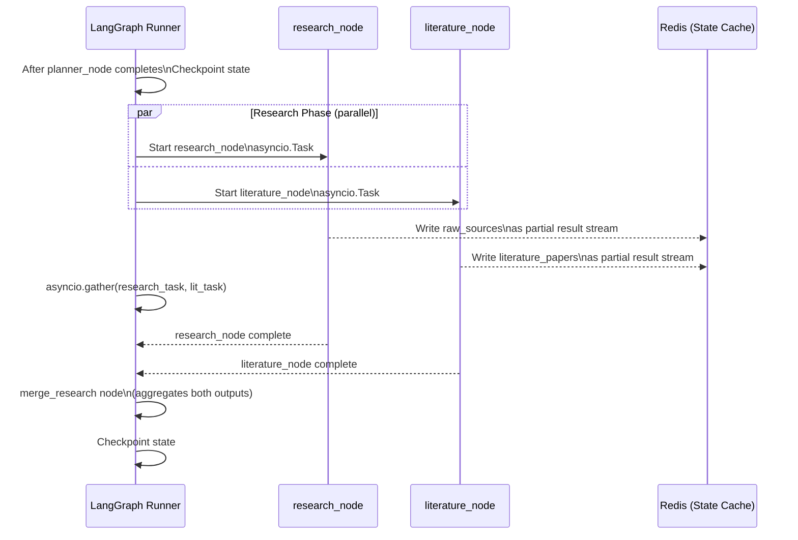

# Multi-Agent AI Research System — LangGraph Workflow

## Graph Overview

The research pipeline is implemented as a **LangGraph StateGraph** with conditional branching, parallel execution, and checkpoint-based resumability.

```mermaid
flowchart TD
    START([START]) --> VALIDATE

    VALIDATE["validate_query\n(sync node)\nInput validation\nRate limit check\nBudget check"]

    VALIDATE -->|Invalid| END_INVALID([END: Query Rejected])
    VALIDATE -->|Valid| PLAN

    PLAN["planner_node\nGPT-4o\nDecompose query\nCreate orchestration plan"]

    PLAN -->|plan_failed| FALLBACK_PLAN["fallback_node\n(Qwen 3)\nAttempt re-planning"]
    PLAN -->|plan_success| CHECK_PLAN

    FALLBACK_PLAN -->|still_failed| END_FAIL([END: Pipeline Failed])
    FALLBACK_PLAN -->|recovered| CHECK_PLAN

    CHECK_PLAN{"check_plan_quality\nIs plan valid?\nAre sub-tasks\nwell-formed?"}

    CHECK_PLAN -->|needs_clarification| CLARIFY["request_clarification\nReturn to user\nwith specific questions"]
    CLARIFY --> END_CLARIFY([END: Awaiting User Input])

    CHECK_PLAN -->|plan_approved| PARALLEL_RESEARCH

    subgraph PARALLEL_RESEARCH["Parallel Research Phase (Fan-Out)"]
        RES["research_node\nGemini 2.5 Pro\nWeb search + source gathering"]
        LIT["literature_node\nClaude Sonnet\nAcademic paper search"]
    end

    CHECK_PLAN --> RES
    CHECK_PLAN --> LIT

    RES -->|research_failed| FALLBACK_RES["fallback_node\n(Qwen 3 for research)"]
    LIT -->|lit_failed| FALLBACK_LIT["fallback_node\n(Qwen 3 for literature)"]

    FALLBACK_RES & FALLBACK_LIT --> MERGE_RESEARCH
    RES & LIT --> MERGE_RESEARCH

    MERGE_RESEARCH["merge_research\n(sync node)\nCombine sources +\nliterature into unified corpus"]

    MERGE_RESEARCH --> CHECK_COVERAGE{"check_coverage\nAre all critical sub-tasks\nadequately covered?\nMin sources met?"}

    CHECK_COVERAGE -->|insufficient_coverage| GAP_FILL["gap_fill_node\nResearch Agent\nTargeted gap filling\nfor uncovered sub-tasks"]
    GAP_FILL --> VERIFY_NODE

    CHECK_COVERAGE -->|coverage_ok| VERIFY_NODE

    subgraph PARALLEL_QA["Parallel QA Phase (Fan-Out)"]
        VERIFY_NODE["verification_node\nDeepSeek R1\nFact-check all claims\nConfidence scoring"]
        CONTRA_NODE["contradiction_node\nDeepSeek R1\nCross-source contradiction\ndetection + resolution"]
    end

    MERGE_RESEARCH --> VERIFY_NODE
    MERGE_RESEARCH --> CONTRA_NODE

    VERIFY_NODE -->|verify_failed| FALLBACK_VER["fallback_node\n(Qwen 3 for verification)"]
    CONTRA_NODE -->|contra_failed| FALLBACK_CON["fallback_node\n(Qwen 3 for contradiction)"]

    FALLBACK_VER & FALLBACK_CON --> MERGE_QA
    VERIFY_NODE & CONTRA_NODE --> MERGE_QA

    MERGE_QA["merge_qa\n(sync node)\nMerge verification results\nApply contradiction resolutions"]

    MERGE_QA --> CHECK_QA{"check_qa_thresholds\nCorpus confidence >= 0.75?\nCritical contradictions = 0?"}

    CHECK_QA -->|critical_contradiction| HALT_REVIEW["halt_for_review\nNotify user\nAwait human override"]
    HALT_REVIEW --> END_REVIEW([END: Human Review Required])

    CHECK_QA -->|low_confidence| RERUN_RESEARCH["rerun_research\nExpand source gathering\nfor low-confidence claims"]
    RERUN_RESEARCH --> VERIFY_NODE

    CHECK_QA -->|qa_passed| INSIGHT_NODE

    INSIGHT_NODE["insight_node\nGPT-4o\nPattern synthesis\nKey findings + recommendations"]

    INSIGHT_NODE -->|insight_failed| FALLBACK_INS["fallback_node\n(Qwen 3 for insights)"]
    FALLBACK_INS --> REPORT_NODE
    INSIGHT_NODE --> CHECK_INSIGHT

    CHECK_INSIGHT{"check_insight_quality\nSuccess criteria met?\nMinimum findings count?"}

    CHECK_INSIGHT -->|criteria_not_met| REPLAN["replan_node\nPlanner re-evaluates\nAdjusts strategy"]
    REPLAN --> PARALLEL_RESEARCH

    CHECK_INSIGHT -->|quality_ok| REPORT_NODE

    REPORT_NODE["report_node\nGPT-4o\nAssemble final report\nQuality gate check"]

    REPORT_NODE -->|report_failed| FALLBACK_REP["fallback_node\n(Qwen 3 for report)"]
    FALLBACK_REP --> FINALIZE

    REPORT_NODE -->|draft_only| HUMAN_REVIEW["human_review_node\nFlag issues\nRequest approval"]
    HUMAN_REVIEW --> END_DRAFT([END: Draft Pending Approval])

    REPORT_NODE -->|report_complete| FINALIZE

    FINALIZE["finalize_node\n(sync node)\nPersist report to DB\nUpdate job status\nCalculate final scores\nEmit completion event"]

    FINALIZE --> END_SUCCESS([END: Research Complete ✅])
```



---

## State Schema (TypedDict)

```python
# app/agents/state.py  (conceptual — no code generation, design only)

class ResearchState(TypedDict):
    # ─── Identity ────────────────────────────────────────────
    job_id:             str
    org_id:             str
    user_id:            str
    user_query:         str
    created_at:         str  # ISO8601

    # ─── Planning ────────────────────────────────────────────
    orchestration_plan: dict            # Planner output
    sub_tasks:          list[dict]
    success_criteria:   list[str]
    token_budget:       dict            # per-agent allocation

    # ─── Research Corpus ─────────────────────────────────────
    raw_sources:        list[dict]      # Research Agent output
    literature_papers:  list[dict]      # Lit Review Agent output
    merged_corpus:      dict            # post-merge_research

    # ─── QA Results ──────────────────────────────────────────
    verified_claims:    list[dict]      # Verification Agent output
    contradictions:     list[dict]      # Contradiction Agent output
    resolved_contradictions: list[dict]
    corpus_confidence:  float           # 0.0-1.0

    # ─── Synthesis ───────────────────────────────────────────
    key_findings:       list[dict]      # Insight Agent output
    insights:           dict
    recommendations:    list[dict]

    # ─── Output ──────────────────────────────────────────────
    final_report:       str             # Markdown
    report_status:      str             # draft | complete | failed

    # ─── Execution Tracking ──────────────────────────────────
    current_node:       str
    execution_phase:    str
    agent_outputs:      dict[str, dict]
    agent_errors:       dict[str, dict]
    retry_counts:       dict[str, int]
    fallback_activations: list[dict]

    # ─── Quality Signals ─────────────────────────────────────
    quality_scores:     dict[str, float]
    total_tokens_used:  int
    total_cost_usd:     float
    pipeline_blocked:   bool
    human_review_required: bool
    replan_count:       int             # Circuit breaker for replan loops
    gap_fill_count:     int             # Circuit breaker for gap-fill loops
```

---

## Node Specifications

### `validate_query` Node
| Property | Value |
|---|---|
| Type | Sync node (no LLM call) |
| Inputs | `user_query`, `org_id`, `token_budget` |
| Logic | Check: query not empty, length ≤ 10,000 chars, org active, budget > 1000 tokens |
| Edge conditions | `invalid` → END, `valid` → `planner_node` |

### `planner_node` Node
| Property | Value |
|---|---|
| Type | Async LLM node |
| Model | GPT-4o |
| Inputs | `user_query`, `token_budget`, long-term pattern cache |
| Outputs | `orchestration_plan`, `sub_tasks`, `success_criteria` |
| Timeout | 60 seconds |
| Edge conditions | `plan_success`, `plan_failed`, `needs_clarification` |

### `research_node` + `literature_node` — Parallel Fan-Out
| Property | Value |
|---|---|
| Execution | `asyncio.gather()` — true parallel |
| Inputs | `sub_tasks` (filtered by assigned_agent), `token_budget` |
| Outputs | `raw_sources`, `literature_papers` |
| Timeout | 5 minutes each |
| Coordination | Write to separate state fields; no inter-agent dependency |

### `merge_research` Node
| Property | Value |
|---|---|
| Type | Sync aggregation node |
| Logic | Deduplicate sources by content_hash + URL; merge into `merged_corpus` |
| Coverage check | Count sources per sub_task; flag gaps |
| Output | `merged_corpus`, sub-task coverage report |

### `verification_node` + `contradiction_node` — Parallel Fan-Out
| Property | Value |
|---|---|
| Execution | `asyncio.gather()` — parallel DeepSeek R1 calls |
| Inputs | `merged_corpus` (both agents read same corpus) |
| Outputs | `verified_claims` (verification), `contradictions` (contradiction) |
| Timeout | 8 minutes each (extended reasoning budget) |

### `merge_qa` Node
| Property | Value |
|---|---|
| Type | Sync merge node |
| Logic | Apply contradiction resolutions to verified_claims; compute `corpus_confidence` |
| Formula | `corpus_confidence = (verified + 0.5*partial) / total_claims` |

### QA Gate — `check_qa_thresholds` Conditional
```
IF critical_contradictions > 0:
    → halt_for_review (human in the loop)

ELIF corpus_confidence < 0.75 AND gap_fill_count < 2:
    → rerun_research (expand sources)

ELIF corpus_confidence < 0.60:
    → halt_for_review (too low to proceed)

ELSE:
    → insight_node (proceed)
```

### `insight_node` Node
| Property | Value |
|---|---|
| Type | Async LLM node |
| Model | GPT-4o |
| Inputs | `verified_claims`, `contradictions`, `literature_papers`, `success_criteria` |
| Outputs | `key_findings`, `insights`, `recommendations` |
| Timeout | 3 minutes |

### Insight Gate — `check_insight_quality` Conditional
```
IF success_criteria_met < 0.7 AND replan_count < 2:
    → replan_node (loop back with adjusted plan)

ELIF key_findings count < 3:
    → replan_node

ELSE:
    → report_node
```

### `report_node` Node
| Property | Value |
|---|---|
| Type | Async LLM node |
| Model | GPT-4o |
| Inputs | Full state (all sections) |
| Outputs | `final_report` (Markdown), `report_status` |
| Timeout | 5 minutes |
| Self-check | Agent runs quality gate before declaring `report_complete` |

### `finalize_node` Node
| Property | Value |
|---|---|
| Type | Sync persistence node |
| Actions | Write report to DB, update job status, flush Redis cache, emit WebSocket event |
| Outputs | Job status = `completed`, `quality_score`, `total_cost_usd` |

---

## Parallel Execution Design



---

## Graph Compilation Configuration

| Setting | Value | Rationale |
|---|---|---|
| `checkpointer` | `AsyncPostgresSaver` | Persist state to PostgreSQL — survive process restart |
| `interrupt_before` | `["halt_for_review"]` | Pause graph for human-in-the-loop before halting |
| `interrupt_after` | `["planner_node"]` | Allow plan inspection before executing expensive research |
| `recursion_limit` | `50` | Prevent infinite replan/gap-fill loops |
| `thread_id` | `job_id` | One thread per research job |
| `stream_mode` | `"values"` | Stream state updates to WebSocket for real-time progress |

---

## Streaming Events

Each node completion emits a streaming event consumed by the API WebSocket handler:

| Event | Emitted By | Payload |
|---|---|---|
| `plan_created` | planner_node | `{sub_tasks_count, estimated_duration, token_budget}` |
| `research_progress` | research_node | `{sources_found, sub_tasks_completed, percent}` |
| `literature_progress` | literature_node | `{papers_found, percent}` |
| `verification_progress` | verification_node | `{claims_checked, verified, percent}` |
| `contradictions_found` | contradiction_node | `{count, severity_breakdown}` |
| `insights_ready` | insight_node | `{findings_count, criteria_met}` |
| `report_complete` | report_node | `{word_count, quality_score}` |
| `job_complete` | finalize_node | `{report_id, total_cost_usd, total_tokens}` |
| `agent_fallback` | fallback_node | `{failed_agent, reason, quality_degraded}` |
| `human_review_required` | halt_for_review | `{reason, contradictions}` |
