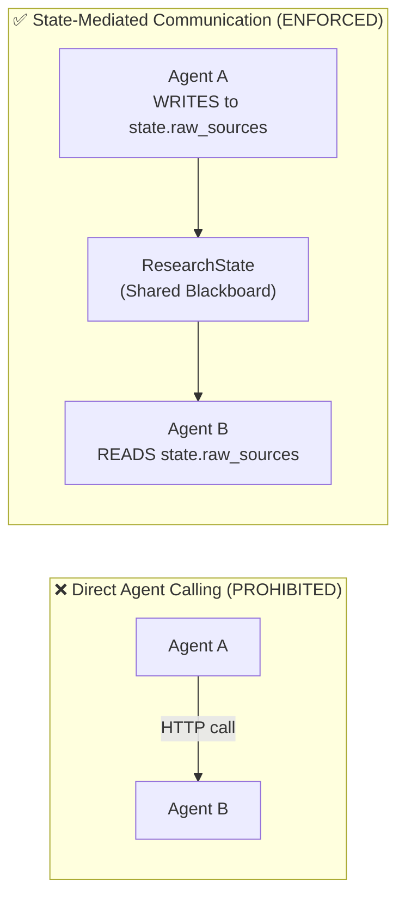
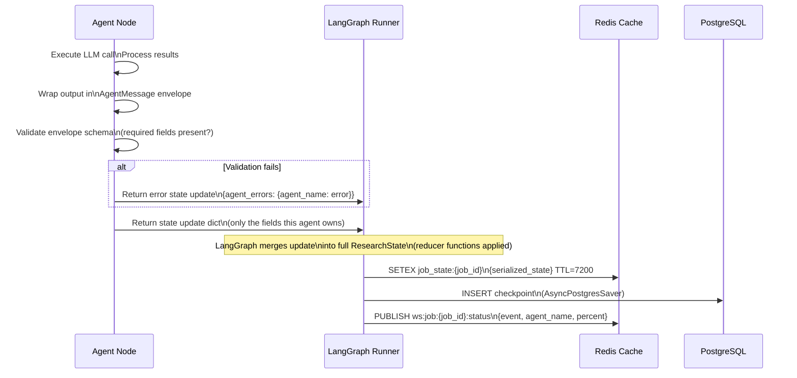
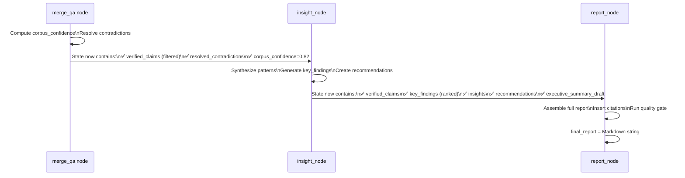

# Multi-Agent AI Research System — Agent Communication Protocol

## Communication Principles

Agents in this system **never call each other directly**. All inter-agent communication occurs through two mechanisms:

1. **Shared Graph State** (primary) — the LangGraph `ResearchState` TypedDict is the blackboard. Agents read from and write to designated state fields.
2. **Redis Pub/Sub** (secondary) — for real-time progress events that the API WebSocket layer subscribes to.



---

## Message Envelope Standard

Every piece of data written into graph state by an agent is wrapped in a **standard envelope** that provides provenance, tracing, and quality metadata:

### AgentMessage Envelope

```json
{
  "envelope": {
    "message_id":       "msg_550e8400-e29b-41d4-a716-446655440001",
    "schema_version":   "1.0",
    "agent_name":       "research_agent",
    "model_id":         "gemini-2.5-pro-preview",
    "job_id":           "job_550e8400-e29b-41d4-a716-446655440000",
    "org_id":           "org_abc123",
    "trace_id":         "trace_xyz789",
    "span_id":          "span_001",
    "parent_span_id":   null,
    "node_name":        "research_node",
    "created_at":       "2026-06-03T08:00:00Z",
    "execution_time_ms": 12450,
    "input_tokens":     3200,
    "output_tokens":    8500,
    "cost_usd":         0.0892,
    "is_fallback":      false,
    "quality_score":    0.87,
    "confidence_level": "high"
  },
  "payload": {
    /* Agent-specific output object */
  },
  "errors": [],
  "warnings": [
    {
      "code":    "RESEARCH_GAP",
      "message": "Sub-task task_003 has only 2 sources (minimum is 3)",
      "severity": "medium"
    }
  ]
}
```

### Envelope Field Reference

| Field | Type | Description |
|---|---|---|
| `message_id` | UUID | Unique envelope ID for deduplication |
| `schema_version` | string | Protocol version for backward compatibility |
| `agent_name` | string | Canonical agent identifier |
| `model_id` | string | Exact model version used |
| `trace_id` | string | Distributed trace ID (OpenTelemetry) |
| `span_id` | string | Span within the trace |
| `parent_span_id` | string|null | Parent span (for sub-agent calls) |
| `execution_time_ms` | int | Wall-clock execution time |
| `input_tokens` | int | Tokens consumed in input |
| `output_tokens` | int | Tokens produced in output |
| `cost_usd` | float | Actual API cost for this call |
| `is_fallback` | bool | Whether Qwen 3 Fallback was used |
| `quality_score` | float | Agent's self-assessed output quality |
| `confidence_level` | string | `high(>0.8) | medium(0.6-0.8) | low(<0.6)` |

---

## State Write Protocol

When an agent completes execution, it writes its output to state following this **atomic write protocol**:



---

## State Field Ownership Map

Each state field has exactly **one writer** and **multiple readers**. This prevents race conditions and ensures clean data lineage:

| State Field | Writer | Readers | Reducer |
|---|---|---|---|
| `orchestration_plan` | planner_node | all nodes | replace |
| `sub_tasks` | planner_node | all nodes | replace |
| `success_criteria` | planner_node | insight_node, report_node | replace |
| `token_budget` | planner_node | all nodes | replace |
| `raw_sources` | research_node | merge_research, verify | append |
| `literature_papers` | literature_node | merge_research, verify | append |
| `merged_corpus` | merge_research | verification, contradiction | replace |
| `verified_claims` | verification_node | merge_qa, insight, report | replace |
| `contradictions` | contradiction_node | merge_qa, insight, report | replace |
| `resolved_contradictions` | merge_qa | insight, report | replace |
| `corpus_confidence` | merge_qa | check_qa_thresholds | replace |
| `key_findings` | insight_node | report_node | replace |
| `insights` | insight_node | report_node | replace |
| `recommendations` | insight_node | report_node | replace |
| `final_report` | report_node | finalize_node | replace |
| `agent_outputs` | all nodes | monitor, finalize | append by key |
| `agent_errors` | all nodes | retry logic | append by key |
| `retry_counts` | retry logic | all nodes | increment |
| `fallback_activations` | fallback_node | finalize, audit | append |
| `total_tokens_used` | all nodes | finalize | accumulate (sum) |
| `total_cost_usd` | all nodes | finalize | accumulate (sum) |

### Reducer Functions

```
append:      new_value = existing_list + [new_item]
replace:     new_value = new_item (overwrite)
accumulate:  new_value = existing_value + new_item
append_by_key: new_dict = {**existing_dict, key: new_value}
```

---

## Inter-Agent Data Handoffs

### Handoff 1: Planner → Research + Literature

```json
// What Planner writes (sub_tasks field)
{
  "sub_tasks": [
    {
      "id":             "task_001",
      "title":          "Current market size of renewable energy sector",
      "description":    "Find current global renewable energy market cap, growth rate, and major players",
      "type":           "web_research",
      "priority":       "critical",
      "assigned_agent": "research_agent",
      "dependencies":   [],
      "expected_output":"Market size figures with sources, year, and growth projections"
    },
    {
      "id":             "task_002",
      "title":          "Academic literature on solar panel efficiency trends",
      "type":           "literature_review",
      "priority":       "high",
      "assigned_agent": "literature_review_agent",
      "dependencies":   []
    }
  ]
}
```

### Handoff 2: Research + Literature → Verification

```json
// What merge_research produces (merged_corpus field)
{
  "corpus_id": "corpus_job_abc",
  "total_sources": 24,
  "total_papers": 11,
  "sources": [
    {
      "source_id":    "src_001",
      "type":         "web",
      "url":          "https://iea.org/reports/renewables-2025",
      "title":        "Renewables 2025 - IEA",
      "tier":         1,
      "relevance":    0.94,
      "key_claims":   ["Global renewable capacity reached 4,500 GW in 2024"],
      "data_points":  [{"metric": "global_capacity_gw", "value": "4500", "year": 2024}],
      "sub_task_ids": ["task_001"]
    }
  ],
  "papers": [
    {
      "paper_id":    "lit_001",
      "doi":         "10.1038/s41560-024-01234-5",
      "title":       "Perovskite solar cell efficiency: 2025 review",
      "year":        2025,
      "key_findings":["Lab efficiency reached 33.7% using tandem architecture"],
      "sub_task_ids":["task_002"]
    }
  ],
  "coverage_by_task": {
    "task_001": {"sources": 8, "papers": 2, "coverage": "adequate"},
    "task_002": {"sources": 3, "papers": 9, "coverage": "excellent"}
  }
}
```

### Handoff 3: Verification → Contradiction Detection

```json
// Verified claims consumed by Contradiction Agent
{
  "verified_claims": [
    {
      "claim_id":   "claim_001",
      "claim_text": "Global renewable capacity reached 4,500 GW in 2024",
      "source_id":  "src_001",
      "status":     "VERIFIED",
      "confidence": 0.92
    },
    {
      "claim_id":   "claim_007",
      "claim_text": "Global renewable capacity was 3,870 GW at end of 2024",
      "source_id":  "src_012",
      "status":     "VERIFIED",
      "confidence": 0.88
    }
  ]
  // Contradiction agent detects claim_001 vs claim_007 are contradictory
}
```

### Handoff 4: QA → Insight → Report



---

## Redis Pub/Sub Event Protocol

For real-time WebSocket streaming, agents publish progress events to Redis channels:

### Channel Naming

```
ws:job:{job_id}:status     — Job-level status updates
ws:job:{job_id}:logs       — Agent log stream (high frequency)
ws:job:{job_id}:progress   — Percentage progress updates
```

### Event Schema

```json
{
  "event_type":  "agent_progress | agent_complete | agent_error | job_complete | human_review_required",
  "job_id":      "job_abc123",
  "agent_name":  "research_agent",
  "timestamp":   "2026-06-03T08:05:00Z",
  "data": {
    "percent":       45,
    "message":       "Found 12 sources for task_001",
    "tokens_used":   4200,
    "cost_usd":      0.042,
    "node_name":     "research_node"
  }
}
```

### Event Publishing Rules

| Rule | Description |
|---|---|
| Publish on every sub-task completion | Keep UI progress bar moving |
| Publish on every agent node completion | Phase transition visible to user |
| Publish warnings (not just errors) | Research gaps visible in real-time |
| Never publish sensitive claim content | Only counts and percentages to progress channel |
| Use `logs` channel for full log content | Gated by user permission check before sending to client |

---

## Tool Call Protocol

Agents interact with external tools (search, vector store, DB) through a **typed tool call envelope**:

```json
{
  "tool_call": {
    "tool_id":     "tc_001",
    "tool_name":   "web_search",
    "agent_name":  "research_agent",
    "job_id":      "job_abc123",
    "called_at":   "2026-06-03T08:01:00Z",
    "inputs": {
      "query":   "global renewable energy market size 2024",
      "num_results": 10,
      "date_restrict": "y2"
    }
  },
  "tool_result": {
    "completed_at":  "2026-06-03T08:01:02Z",
    "latency_ms":    1850,
    "success":       true,
    "result": [/* array of search results */],
    "error":         null
  }
}
```

All tool calls are logged in `agent_logs` with:
- `tool_name`, `tool_input` (sanitized), `tool_output` (truncated to 1000 chars), `latency_ms`
- This enables full auditability of what external data each agent retrieved

---

## Error Communication Protocol

When an agent fails, it communicates the failure through state in a structured format:

```json
// Written to state.agent_errors[agent_name]
{
  "agent_name":       "research_agent",
  "node_name":        "research_node",
  "error_type":       "API_TIMEOUT | API_RATE_LIMIT | QUALITY_THRESHOLD_FAILED | SCHEMA_VALIDATION_ERROR | CONTEXT_OVERFLOW",
  "error_code":       "GEMINI_TIMEOUT_504",
  "error_message":    "Gemini API did not respond within 300 seconds",
  "failed_at":        "2026-06-03T08:05:00Z",
  "retry_count":      2,
  "partial_output":   {/* whatever was completed before failure, if any */},
  "recovery_hint":    "ACTIVATE_FALLBACK",
  "fatal":            false
}
```

The **retry/fallback router** reads `state.agent_errors` after each node to determine the next edge in the graph.
