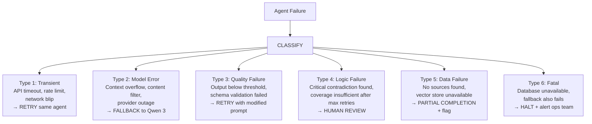
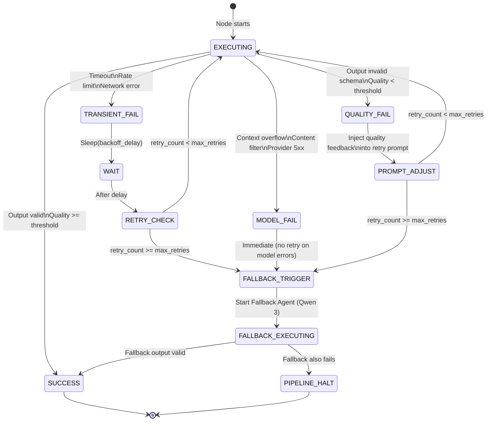
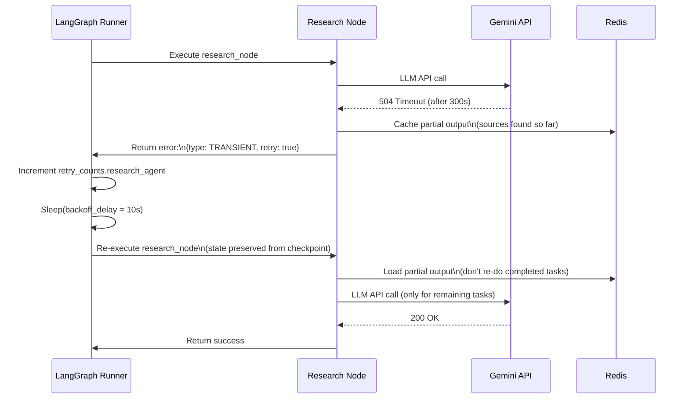
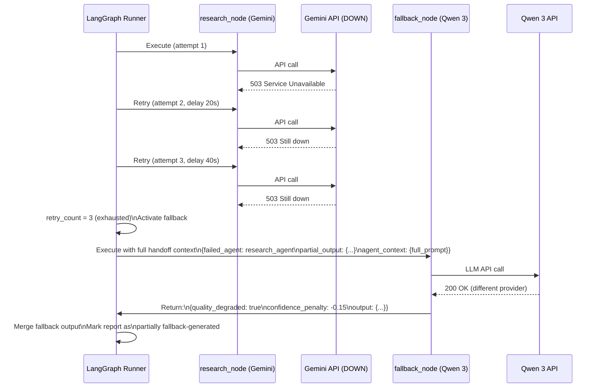
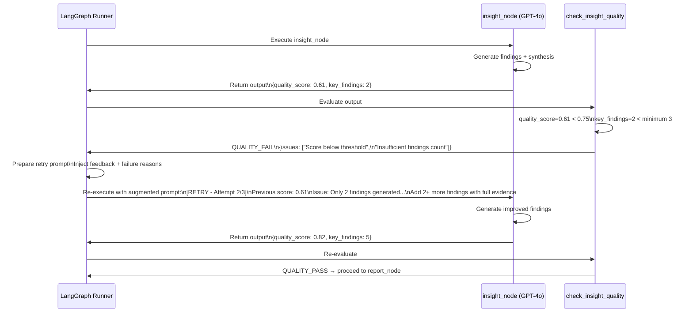

# Multi-Agent AI Research System — Retry Logic & Failure Recovery

## Failure Taxonomy

Before designing retry logic, failures are classified by type — each type has a different recovery strategy:



---

## Retry Configuration Per Agent

| Agent | Model | Max Retries | Retry Delay | Backoff | Fallback |
|---|---|---|---|---|---|
| Planner | GPT-4o | 3 | 5s | Exponential (5→10→20s) | Qwen 3 |
| Research | Gemini 2.5 Pro | 3 | 10s | Exponential (10→20→40s) | Qwen 3 |
| Literature Review | Claude Sonnet | 3 | 10s | Exponential (10→20→40s) | Qwen 3 |
| Verification | DeepSeek R1 | 2 | 15s | Linear (15→15s) | Qwen 3 |
| Contradiction | DeepSeek R1 | 2 | 15s | Linear (15→15s) | Qwen 3 |
| Insight | GPT-4o | 3 | 5s | Exponential (5→10→20s) | Qwen 3 |
| Report | GPT-4o | 2 | 5s | Exponential (5→10s) | Qwen 3 |
| Fallback (Qwen 3) | Qwen 3 | 1 | 10s | None | None → Human |

---

## Retry State Machine Per Agent Node



---

## Retry Prompt Injection

When an agent fails due to quality issues, the retry is not a blind repeat — the retry prompt is **augmented with feedback**:

### Quality Failure Retry Prompt Extension

```
[RETRY CONTEXT - Attempt {n} of {max}]

Your previous attempt was rejected for the following reasons:
{failure_reasons}

Specific issues to fix:
{field_errors}

Previous partial output (for reference):
{partial_output}

Please address all issues above and produce a valid, complete response.
```

### Retry Feedback Examples

| Failure Type | Injected Feedback |
|---|---|
| Missing required JSON fields | `"Fields missing: key_findings, recommendations. These are required."` |
| Quality score too low | `"Your output scored 0.52 (minimum 0.75). Reasoning was insufficient — expand chain-of-thought."` |
| Too few sources | `"Only 4 sources found for task_001 — minimum 8 required. Broaden search queries."` |
| Citation format error | `"Citations must include author, year, and URL. Missing year in 3 citations."` |
| Schema validation | `"confidence_score must be 0.0-1.0. You returned 'high' (string). Use numeric value."` |

---

## Fallback Activation Protocol

The fallback agent receives a fully contextualized handoff when activated:

### Fallback Handoff Payload

```json
{
  "fallback_request": {
    "request_id":        "fb_req_001",
    "failed_agent":      "research_agent",
    "failed_model":      "gemini-2.5-pro-preview",
    "failure_type":      "API_TIMEOUT",
    "failure_details":   "Gemini API returned 504 after 300s on attempt 3/3",
    "retry_exhausted":   true,
    "partial_output":    {
      "sources_found": 8,
      "sources": [/* partial list */],
      "incomplete_tasks": ["task_003", "task_005"]
    }
  },
  "agent_context": {
    "system_prompt":    "[full system prompt of the failed research_agent]",
    "task_inputs":      {/* sub_tasks assigned to research_agent */},
    "token_budget":     25000,
    "quality_threshold": 0.70
  },
  "job_context": {
    "job_id":       "job_abc123",
    "user_query":   "...",
    "plan_summary": "...",
    "elapsed_time_s": 340
  }
}
```

### Fallback Decision Tree

```mermaid
flowchart TD
    FB_TRIGGER[Fallback Activated\nfor Agent X] --> PARTIAL{Did failed agent\nproduce partial output?}

    PARTIAL -->|Yes, >= 50% complete| SALVAGE["Salvage partial output\nQwen 3 completes\nremaining tasks only"]

    PARTIAL -->|No, < 50% complete| FULL["Full task attempt\nQwen 3 does\neverything"]

    SALVAGE --> ASSESS{Is salvaged output\nquality >= 0.65?}
    FULL --> ASSESS

    ASSESS -->|Yes| MARK["Mark as fallback output\nquality_degraded = true\nconfidence_penalty = -0.15\nContinue pipeline"]

    ASSESS -->|No| PARTIAL_SAVE["Save whatever exists\npartial_completion = true\ncompletion_percent = X%\nMark fields as [INCOMPLETE]"]

    PARTIAL_SAVE --> CONTINUE{Can pipeline\ncontinue without\nthis output?}

    CONTINUE -->|Yes (non-critical agent)| SKIP["Skip this agent\nFlag in report\nContinue downstream"]

    CONTINUE -->|No (critical agent)| HALT["pipeline_blocked = true\nhuman_review_required = true\nNotify via WebSocket + email"]
```

---

## Agent Criticality Classification

Not all agents are equally critical. Some can be skipped with degraded output; others are blockers:

| Agent | Criticality | Can Skip? | Impact of Skipping |
|---|---|---|---|
| Planner | 🔴 BLOCKING | No | Cannot route without plan |
| Research | 🔴 BLOCKING | No | No evidence corpus |
| Literature Review | 🟠 HIGH | Yes (with warning) | Report lacks academic backing |
| Verification | 🔴 BLOCKING | No | Unverified claims in final report |
| Contradiction Detection | 🟠 HIGH | Yes (with warning) | Contradictions may appear in report |
| Insight Generation | 🟠 HIGH | Yes (with warning) | Report lacks synthesis layer |
| Report Generation | 🔴 BLOCKING | No | No output at all |
| Fallback | 🟡 MEDIUM | — | Escalate to human |

---

## Circuit Breakers

### Replan Circuit Breaker

```
IF replan_count >= 2:
    DO NOT trigger another replan
    INSTEAD: Accept current quality and proceed to report
    ADD warning to report: "This report required multiple planning iterations;
                            quality may be below optimal threshold"
```

### Gap-Fill Circuit Breaker

```
IF gap_fill_count >= 2:
    DO NOT trigger another gap-fill research pass
    INSTEAD: Proceed with available sources
    FLAG sub-tasks with < minimum sources as [INSUFFICIENT COVERAGE]
```

### Contradiction Resolution Circuit Breaker

```
IF contradiction.severity == "critical" AND contradiction.resolution == "inconclusive":
    Immediately set: human_review_required = true
    Set: pipeline_blocked = true
    Emit: halt_for_review event
    DO NOT proceed to Insight Agent
```

### Cost Budget Circuit Breaker

```
IF total_cost_usd >= job.token_budget_usd * 0.90:
    Stop all non-critical agent calls
    Mark remaining agents as SKIPPED
    Generate partial report with available outputs
    Notify user via WebSocket: "Cost budget nearly exhausted"

IF total_cost_usd >= job.token_budget_usd:
    Hard stop — cancel all pending agents
    Set job status = FAILED
    Reason: "Token budget exhausted"
```

---

## Failure Recovery Flows

### Recovery Flow A — Transient API Failure (Most Common)



### Recovery Flow B — Provider Outage (Fallback Path)



### Recovery Flow C — Quality Failure (Iterative Improvement)



### Recovery Flow D — Critical Contradiction (Human in Loop)

```mermaid
sequenceDiagram
    actor HUMAN as Research Lead
    participant CONTRA as contradiction_node
    participant GRAPH as LangGraph Runner
    participant WS as WebSocket
    participant EMAIL as Email Service

    CONTRA->>CONTRA: Detect critical contradiction:\nClaim A: "X caused Y" (src_001, confidence 0.91)\nClaim B: "X did NOT cause Y" (src_012, confidence 0.88)\nResolution: INCONCLUSIVE

    CONTRA->>GRAPH: Return:\n{contradictions: [{severity: critical,\n resolution: inconclusive}]\npipeline_blocked: true\nhuman_review_required: true}

    GRAPH->>WS: Publish event:\n{event: human_review_required\ncontradiction_id: cont_001\nreason: "Critical unresolved contradiction"}

    GRAPH->>EMAIL: Send alert to\nresearch_lead@org.com

    GRAPH->>GRAPH: interrupt_before=["halt_for_review"]\nPause graph execution\nAwait human input

    HUMAN->>GRAPH: POST /jobs/{job_id}/review\n{action: "accept_claim_A", notes: "Source 001 is peer-reviewed; Source 012 is industry blog"}

    GRAPH->>GRAPH: Apply resolution:\nMark claim_A as ACCEPTED\nMark claim_B as REJECTED\nUpdate resolved_contradictions\npipeline_blocked = false

    GRAPH->>GRAPH: Resume from halt_for_review\nProceed to insight_node
```

---

## Health Monitoring During Execution

```mermaid
flowchart TD
    MONITOR["Background Health Monitor\n(runs every 30 seconds during job)"]

    MONITOR --> CHECK1{Agent stuck?\n(no state update in >5 min)}
    CHECK1 -->|Yes| KILL["Force-cancel hung agent\nTreat as timeout failure\nTrigger retry"]

    MONITOR --> CHECK2{Cost >= 80% budget?}
    CHECK2 -->|Yes| WARN["Send cost warning\nWebSocket event\nto user"]

    MONITOR --> CHECK3{Total time >= 90% timeout?}
    CHECK3 -->|Yes| SKIP_OPTS["Skip optional agents\n(lit review if incomplete)\nFast-path to report"]

    MONITOR --> CHECK4{Multiple agents failed?}
    CHECK4 -->|Yes - >= 2 agents| ESCALATE["human_review_required = true\nAlert ops team\nGenerate status report"]

    MONITOR --> CHECK5{Redis unreachable?}
    CHECK5 -->|Yes| FALLBACK_STORE["Fall back to in-memory state\nLog warning\nContinue pipeline"]
```

---

## Failure Audit Trail

Every failure, retry, and fallback activation is recorded in `agent_logs` for post-mortem analysis:

| Event | Log Level | Fields Recorded |
|---|---|---|
| Agent retry triggered | WARNING | `agent_name`, `attempt_number`, `failure_reason`, `delay_ms` |
| Fallback activated | WARNING | `failed_agent`, `fallback_model`, `quality_degraded` |
| Quality gate failure | WARNING | `quality_score`, `threshold`, `issues` |
| Critical contradiction | ERROR | `contradiction_id`, `conflicting_sources` |
| Pipeline halted | ERROR | `reason`, `blocked_at_node`, `human_review_required` |
| Fallback also failed | CRITICAL | `failed_agent`, `fallback_failure_reason`, `pipeline_halted` |
| Human review resolved | INFO | `reviewer_id`, `resolution`, `notes` |
| Circuit breaker triggered | WARNING | `breaker_name`, `current_count`, `max_count` |
