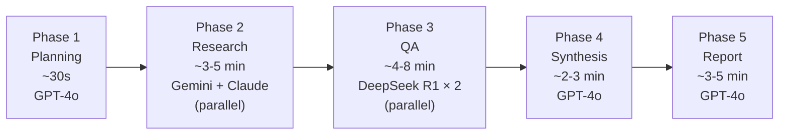

# Multi-Agent AI Research System — Index
## Phase - 3 ( AI agent module )

> **Senior AI Systems Engineer Design Document**
> Stack: LangGraph · GPT-4o · Gemini 2.5 Pro · Claude Sonnet · DeepSeek R1 · Qwen 3
> Version: 1.0.0 | Status: Approved for Implementation

---

## Document

| # | Document | Description |
|---|---|---|
| 01 | [Agent Definitions & Responsibilities](./01_agent_definitions.md) | Identity, responsibilities, full system prompts, I/O contracts for all 8 agents |
| 02 | [Agent Memory Design](./02_agent_memory_design.md) | 4-tier memory architecture: working state, episodic (PostgreSQL), semantic (Qdrant), long-term learning |
| 03 | [LangGraph Workflow](./03_langgraph_workflow.md) | Complete graph design, state schema, node specs, parallel fan-out, conditional edges, streaming events |
| 04 | [Agent Communication Protocol](./04_agent_communication_protocol.md) | Message envelope, state ownership map, handoff payloads, tool call protocol, error communication |
| 05 | [Retry Logic & Failure Recovery](./05_retry_failure_recovery.md) | Failure taxonomy, retry configs, fallback flows, circuit breakers, health monitoring |

---

## Agent Roster

| Agent | Model | Role | Temp | Max Tokens |
|---|---|---|---|---|
| 🧠 Planner | GPT-4o | Query decomposition + orchestration plan | 0.2 | 4,096 |
| 🔬 Research | Gemini 2.5 Pro | Web search + source gathering + vector indexing | 0.3 | 65,536 |
| 📚 Literature Review | Claude Sonnet | Academic paper search + citation graph + synthesis | 0.1 | 16,000 |
| ✅ Verification | DeepSeek R1 | Fact-checking + claim confidence scoring | 0.0 | 32,768 |
| ⚡ Contradiction Detection | DeepSeek R1 | Cross-source contradiction analysis + resolution | 0.0 | 32,768 |
| 💡 Insight Generation | GPT-4o | Pattern synthesis + key findings + recommendations | 0.7 | 16,384 |
| 📄 Report Generation | GPT-4o | Full report assembly + quality gate | 0.3 | 32,768 |
| 🛡️ Fallback | Qwen 3 | Activates on any agent failure | Dynamic | 32,768 |

---

## Pipeline Phases

**Estimated total runtime**: 12–25 minutes (typical query, no retries)

---

## Key Design Decisions

| Decision | Rationale |
|---|---|
| **Blackboard pattern** (state-mediated communication) | No direct agent-to-agent calls — prevents coupling, enables replay, simplifies debugging |
| **DeepSeek R1 for QA** | Extended chain-of-thought reasoning is ideal for verification and contradiction analysis — more auditable than black-box models |
| **Claude Sonnet for literature** | Claude's superior context window handling and instruction-following for structured extraction excels at bibliographic tasks |
| **Gemini 2.5 Pro for research** | 1M context window enables processing large document sets without chunking loss |
| **GPT-4o for planning + synthesis** | Superior instruction-following for structured JSON output (planning) and creative synthesis (insights/report) |
| **Qwen 3 as fallback** | Different provider ecosystem = different failure modes; when OpenAI/Google/Anthropic are down, Qwen 3 (Alibaba infrastructure) is likely up |
| **Parallel research + QA** | Research and Literature agents run simultaneously; Verification and Contradiction agents run simultaneously — ~40% time reduction |
| **Circuit breakers on replan/gap-fill** | Prevent infinite loops from quality thresholds that can never be met for sparse topics |
| **Human-in-the-loop for critical contradictions** | Unresolved critical contradictions in a research report are a quality integrity issue — human judgment is required |
| **AsyncPostgresSaver checkpointer** | Mid-pipeline crash recovery — graph can resume from any checkpoint without re-running completed agents |
