# Backend Architecture — Database Schema & ER Diagram

## Design Principles

- **UUID primary keys** on all tables — safe for distributed systems, no enumeration
- **soft deletes** via `deleted_at` — preserves audit integrity
- **`updated_at` auto-trigger** managed by PostgreSQL trigger function
- **JSONB** for flexible metadata without schema churn
- **Row-Level Security (RLS)** enabled on all tenant-sensitive tables
- **Enum types** defined at the database level for constraint enforcement

---

## PostgreSQL Enum Types

```sql
CREATE TYPE user_role         AS ENUM ('superadmin', 'admin', 'researcher', 'viewer');
CREATE TYPE user_status       AS ENUM ('active', 'inactive', 'suspended', 'pending_verification');
CREATE TYPE project_status    AS ENUM ('draft', 'active', 'paused', 'completed', 'archived');
CREATE TYPE project_visibility AS ENUM ('private', 'org', 'public');
CREATE TYPE job_status        AS ENUM ('queued', 'running', 'completed', 'failed', 'cancelled', 'retrying');
CREATE TYPE job_priority      AS ENUM ('low', 'normal', 'high', 'critical');
CREATE TYPE source_type       AS ENUM ('web', 'pdf', 'database', 'api', 'manual', 'vector_store');
CREATE TYPE source_status     AS ENUM ('pending', 'indexed', 'failed', 'excluded');
CREATE TYPE report_status     AS ENUM ('draft', 'generating', 'completed', 'failed', 'archived');
CREATE TYPE report_format     AS ENUM ('markdown', 'pdf', 'html', 'json');
CREATE TYPE agent_type        AS ENUM ('orchestrator', 'research', 'synthesis', 'critique', 'factcheck', 'memory', 'code', 'report');
CREATE TYPE log_level         AS ENUM ('debug', 'info', 'warning', 'error', 'critical');
CREATE TYPE audit_action      AS ENUM ('create', 'read', 'update', 'delete', 'login', 'logout', 'export', 'share', 'api_key_create', 'api_key_revoke');
```

---

## Table Definitions

### `organizations`
```sql
CREATE TABLE organizations (
    id              UUID PRIMARY KEY DEFAULT gen_random_uuid(),
    name            VARCHAR(255) NOT NULL,
    slug            VARCHAR(100) NOT NULL UNIQUE,
    plan            VARCHAR(50)  NOT NULL DEFAULT 'free',
    settings        JSONB        NOT NULL DEFAULT '{}',
    token_budget    INTEGER      NOT NULL DEFAULT 100000,
    is_active       BOOLEAN      NOT NULL DEFAULT TRUE,
    created_at      TIMESTAMPTZ  NOT NULL DEFAULT NOW(),
    updated_at      TIMESTAMPTZ  NOT NULL DEFAULT NOW(),
    deleted_at      TIMESTAMPTZ
);

CREATE INDEX idx_organizations_slug ON organizations(slug) WHERE deleted_at IS NULL;
```

### `users`
```sql
CREATE TABLE users (
    id                  UUID PRIMARY KEY DEFAULT gen_random_uuid(),
    org_id              UUID         NOT NULL REFERENCES organizations(id) ON DELETE RESTRICT,
    email               VARCHAR(320) NOT NULL,
    username            VARCHAR(100) NOT NULL,
    full_name           VARCHAR(255) NOT NULL,
    password_hash       VARCHAR(255) NOT NULL,
    role                user_role    NOT NULL DEFAULT 'researcher',
    status              user_status  NOT NULL DEFAULT 'pending_verification',
    avatar_url          TEXT,
    preferences         JSONB        NOT NULL DEFAULT '{}',
    email_verified_at   TIMESTAMPTZ,
    last_login_at       TIMESTAMPTZ,
    failed_login_count  SMALLINT     NOT NULL DEFAULT 0,
    locked_until        TIMESTAMPTZ,
    created_at          TIMESTAMPTZ  NOT NULL DEFAULT NOW(),
    updated_at          TIMESTAMPTZ  NOT NULL DEFAULT NOW(),
    deleted_at          TIMESTAMPTZ,

    CONSTRAINT uq_users_email_org     UNIQUE (org_id, email),
    CONSTRAINT uq_users_username_org  UNIQUE (org_id, username),
    CONSTRAINT chk_failed_login       CHECK (failed_login_count >= 0)
);

CREATE INDEX idx_users_org_id       ON users(org_id) WHERE deleted_at IS NULL;
CREATE INDEX idx_users_email        ON users(email)  WHERE deleted_at IS NULL;
CREATE INDEX idx_users_status       ON users(status) WHERE deleted_at IS NULL;
```

### `api_keys`
```sql
CREATE TABLE api_keys (
    id          UUID PRIMARY KEY DEFAULT gen_random_uuid(),
    user_id     UUID         NOT NULL REFERENCES users(id) ON DELETE CASCADE,
    name        VARCHAR(100) NOT NULL,
    key_prefix  VARCHAR(8)   NOT NULL,          -- first 8 chars, visible to user
    key_hash    VARCHAR(255) NOT NULL UNIQUE,    -- bcrypt hash of full key
    scopes      TEXT[]       NOT NULL DEFAULT '{}',
    expires_at  TIMESTAMPTZ,
    last_used_at TIMESTAMPTZ,
    is_active   BOOLEAN      NOT NULL DEFAULT TRUE,
    created_at  TIMESTAMPTZ  NOT NULL DEFAULT NOW()
);

CREATE INDEX idx_api_keys_user_id  ON api_keys(user_id);
CREATE INDEX idx_api_keys_hash     ON api_keys(key_hash);
```

### `projects`
```sql
CREATE TABLE projects (
    id              UUID PRIMARY KEY DEFAULT gen_random_uuid(),
    org_id          UUID               NOT NULL REFERENCES organizations(id) ON DELETE RESTRICT,
    owner_id        UUID               NOT NULL REFERENCES users(id) ON DELETE RESTRICT,
    title           VARCHAR(500)       NOT NULL,
    slug            VARCHAR(200)       NOT NULL,
    description     TEXT,
    status          project_status     NOT NULL DEFAULT 'draft',
    visibility      project_visibility NOT NULL DEFAULT 'private',
    tags            TEXT[]             NOT NULL DEFAULT '{}',
    settings        JSONB              NOT NULL DEFAULT '{}',
    metadata        JSONB              NOT NULL DEFAULT '{}',
    job_count       INTEGER            NOT NULL DEFAULT 0,
    created_at      TIMESTAMPTZ        NOT NULL DEFAULT NOW(),
    updated_at      TIMESTAMPTZ        NOT NULL DEFAULT NOW(),
    archived_at     TIMESTAMPTZ,
    deleted_at      TIMESTAMPTZ,

    CONSTRAINT uq_projects_slug_org UNIQUE (org_id, slug)
);

CREATE INDEX idx_projects_org_id    ON projects(org_id)    WHERE deleted_at IS NULL;
CREATE INDEX idx_projects_owner_id  ON projects(owner_id)  WHERE deleted_at IS NULL;
CREATE INDEX idx_projects_status    ON projects(status)    WHERE deleted_at IS NULL;
CREATE INDEX idx_projects_tags      ON projects USING GIN(tags);
```

### `project_members`
```sql
CREATE TABLE project_members (
    id          UUID PRIMARY KEY DEFAULT gen_random_uuid(),
    project_id  UUID        NOT NULL REFERENCES projects(id) ON DELETE CASCADE,
    user_id     UUID        NOT NULL REFERENCES users(id)    ON DELETE CASCADE,
    role        VARCHAR(50) NOT NULL DEFAULT 'viewer',   -- owner, editor, viewer
    invited_by  UUID        REFERENCES users(id),
    joined_at   TIMESTAMPTZ NOT NULL DEFAULT NOW(),

    CONSTRAINT uq_project_members UNIQUE (project_id, user_id)
);

CREATE INDEX idx_project_members_project ON project_members(project_id);
CREATE INDEX idx_project_members_user    ON project_members(user_id);
```

### `research_jobs`
```sql
CREATE TABLE research_jobs (
    id                  UUID PRIMARY KEY DEFAULT gen_random_uuid(),
    project_id          UUID         NOT NULL REFERENCES projects(id) ON DELETE CASCADE,
    created_by          UUID         NOT NULL REFERENCES users(id)    ON DELETE RESTRICT,
    title               VARCHAR(500) NOT NULL,
    query               TEXT         NOT NULL,
    status              job_status   NOT NULL DEFAULT 'queued',
    priority            job_priority NOT NULL DEFAULT 'normal',
    config              JSONB        NOT NULL DEFAULT '{}',   -- model prefs, enabled agents, etc.
    orchestration_plan  JSONB,                                -- decomposed task graph
    progress_percent    SMALLINT     NOT NULL DEFAULT 0,
    quality_score       NUMERIC(4,3),                         -- 0.000 – 1.000
    total_tokens_used   INTEGER      NOT NULL DEFAULT 0,
    total_cost_usd      NUMERIC(10,6) NOT NULL DEFAULT 0,
    error_message       TEXT,
    retry_count         SMALLINT     NOT NULL DEFAULT 0,
    max_retries         SMALLINT     NOT NULL DEFAULT 3,
    scheduled_at        TIMESTAMPTZ,
    started_at          TIMESTAMPTZ,
    completed_at        TIMESTAMPTZ,
    created_at          TIMESTAMPTZ  NOT NULL DEFAULT NOW(),
    updated_at          TIMESTAMPTZ  NOT NULL DEFAULT NOW(),
    deleted_at          TIMESTAMPTZ,

    CONSTRAINT chk_progress     CHECK (progress_percent BETWEEN 0 AND 100),
    CONSTRAINT chk_quality      CHECK (quality_score IS NULL OR quality_score BETWEEN 0 AND 1),
    CONSTRAINT chk_retry        CHECK (retry_count >= 0 AND retry_count <= max_retries)
) PARTITION BY RANGE (created_at);

-- Monthly partitions (example for 2026)
CREATE TABLE research_jobs_2026_01 PARTITION OF research_jobs
    FOR VALUES FROM ('2026-01-01') TO ('2026-02-01');
CREATE TABLE research_jobs_2026_06 PARTITION OF research_jobs
    FOR VALUES FROM ('2026-06-01') TO ('2026-07-01');

CREATE INDEX idx_jobs_project_id  ON research_jobs(project_id) WHERE deleted_at IS NULL;
CREATE INDEX idx_jobs_status      ON research_jobs(status)     WHERE deleted_at IS NULL;
CREATE INDEX idx_jobs_created_by  ON research_jobs(created_by);
CREATE INDEX idx_jobs_created_at  ON research_jobs(created_at DESC);
```

### `sources`
```sql
CREATE TABLE sources (
    id              UUID PRIMARY KEY DEFAULT gen_random_uuid(),
    job_id          UUID          NOT NULL REFERENCES research_jobs(id) ON DELETE CASCADE,
    project_id      UUID          NOT NULL REFERENCES projects(id)      ON DELETE CASCADE,
    source_type     source_type   NOT NULL,
    status          source_status NOT NULL DEFAULT 'pending',
    title           VARCHAR(1000),
    url             TEXT,
    file_path       TEXT,                      -- S3 key or local path
    content_hash    VARCHAR(64),               -- SHA-256 of raw content
    content_preview TEXT,                      -- first 500 chars
    metadata        JSONB         NOT NULL DEFAULT '{}',
    relevance_score NUMERIC(4,3),              -- 0.000 – 1.000
    chunk_count     INTEGER,
    indexed_at      TIMESTAMPTZ,
    created_at      TIMESTAMPTZ   NOT NULL DEFAULT NOW(),
    updated_at      TIMESTAMPTZ   NOT NULL DEFAULT NOW()
);

CREATE INDEX idx_sources_job_id     ON sources(job_id);
CREATE INDEX idx_sources_project_id ON sources(project_id);
CREATE INDEX idx_sources_type       ON sources(source_type);
CREATE INDEX idx_sources_status     ON sources(status);
CREATE UNIQUE INDEX idx_sources_hash_job ON sources(job_id, content_hash)
    WHERE content_hash IS NOT NULL;
```

### `reports`
```sql
CREATE TABLE reports (
    id                  UUID PRIMARY KEY DEFAULT gen_random_uuid(),
    job_id              UUID          NOT NULL REFERENCES research_jobs(id) ON DELETE CASCADE,
    project_id          UUID          NOT NULL REFERENCES projects(id)      ON DELETE CASCADE,
    created_by          UUID          NOT NULL REFERENCES users(id)         ON DELETE RESTRICT,
    title               VARCHAR(500)  NOT NULL,
    status              report_status NOT NULL DEFAULT 'draft',
    format              report_format NOT NULL DEFAULT 'markdown',
    executive_summary   TEXT,
    content             TEXT,           -- full markdown content
    file_path           TEXT,           -- S3 key for PDF/HTML exports
    citations           JSONB         NOT NULL DEFAULT '[]',
    metadata            JSONB         NOT NULL DEFAULT '{}',
    quality_score       NUMERIC(4,3),
    word_count          INTEGER,
    version             SMALLINT      NOT NULL DEFAULT 1,
    is_published        BOOLEAN       NOT NULL DEFAULT FALSE,
    published_at        TIMESTAMPTZ,
    created_at          TIMESTAMPTZ   NOT NULL DEFAULT NOW(),
    updated_at          TIMESTAMPTZ   NOT NULL DEFAULT NOW(),
    deleted_at          TIMESTAMPTZ,

    CONSTRAINT chk_report_quality CHECK (quality_score IS NULL OR quality_score BETWEEN 0 AND 1)
);

CREATE INDEX idx_reports_job_id      ON reports(job_id)      WHERE deleted_at IS NULL;
CREATE INDEX idx_reports_project_id  ON reports(project_id)  WHERE deleted_at IS NULL;
CREATE INDEX idx_reports_created_by  ON reports(created_by);
CREATE INDEX idx_reports_status      ON reports(status)      WHERE deleted_at IS NULL;
CREATE INDEX idx_reports_published   ON reports(published_at DESC NULLS LAST)
    WHERE is_published = TRUE AND deleted_at IS NULL;
```

### `report_feedback`
```sql
CREATE TABLE report_feedback (
    id          UUID PRIMARY KEY DEFAULT gen_random_uuid(),
    report_id   UUID        NOT NULL REFERENCES reports(id) ON DELETE CASCADE,
    user_id     UUID        NOT NULL REFERENCES users(id)   ON DELETE CASCADE,
    rating      SMALLINT    NOT NULL,    -- 1–5
    comment     TEXT,
    created_at  TIMESTAMPTZ NOT NULL DEFAULT NOW(),

    CONSTRAINT uq_feedback_report_user UNIQUE (report_id, user_id),
    CONSTRAINT chk_rating CHECK (rating BETWEEN 1 AND 5)
);
```

### `agent_logs`
```sql
CREATE TABLE agent_logs (
    id              UUID PRIMARY KEY DEFAULT gen_random_uuid(),
    job_id          UUID        NOT NULL REFERENCES research_jobs(id) ON DELETE CASCADE,
    agent_type      agent_type  NOT NULL,
    agent_instance  VARCHAR(100),          -- unique agent run ID
    parent_log_id   UUID        REFERENCES agent_logs(id),  -- for nested sub-agent calls
    level           log_level   NOT NULL DEFAULT 'info',
    message         TEXT        NOT NULL,
    model_name      VARCHAR(100),
    input_tokens    INTEGER,
    output_tokens   INTEGER,
    cost_usd        NUMERIC(10,6),
    latency_ms      INTEGER,
    tool_name       VARCHAR(100),
    tool_input      JSONB,
    tool_output     JSONB,
    error_code      VARCHAR(50),
    error_detail    TEXT,
    trace_id        VARCHAR(64),
    span_id         VARCHAR(32),
    metadata        JSONB        NOT NULL DEFAULT '{}',
    created_at      TIMESTAMPTZ  NOT NULL DEFAULT NOW()
) PARTITION BY RANGE (created_at);

-- Weekly partitions for high-volume log table
CREATE TABLE agent_logs_2026_w23 PARTITION OF agent_logs
    FOR VALUES FROM ('2026-06-01') TO ('2026-06-08');

CREATE INDEX idx_agent_logs_job_id     ON agent_logs(job_id);
CREATE INDEX idx_agent_logs_agent_type ON agent_logs(agent_type);
CREATE INDEX idx_agent_logs_level      ON agent_logs(level);
CREATE INDEX idx_agent_logs_trace_id   ON agent_logs(trace_id) WHERE trace_id IS NOT NULL;
CREATE INDEX idx_agent_logs_created_at ON agent_logs(created_at DESC);
```

### `audit_logs`
```sql
CREATE TABLE audit_logs (
    id              UUID PRIMARY KEY DEFAULT gen_random_uuid(),
    org_id          UUID          REFERENCES organizations(id),
    user_id         UUID          REFERENCES users(id),
    action          audit_action  NOT NULL,
    resource_type   VARCHAR(100)  NOT NULL,   -- 'user', 'project', 'report', etc.
    resource_id     UUID,
    old_value       JSONB,
    new_value       JSONB,
    ip_address      INET,
    user_agent      TEXT,
    request_id      VARCHAR(64),
    trace_id        VARCHAR(64),
    result          VARCHAR(20)   NOT NULL DEFAULT 'success',  -- 'success', 'failure'
    failure_reason  TEXT,
    created_at      TIMESTAMPTZ   NOT NULL DEFAULT NOW()
) PARTITION BY RANGE (created_at);

-- Quarterly partitions (7-year compliance retention)
CREATE TABLE audit_logs_2026_q2 PARTITION OF audit_logs
    FOR VALUES FROM ('2026-04-01') TO ('2026-07-01');

CREATE INDEX idx_audit_logs_org_id        ON audit_logs(org_id);
CREATE INDEX idx_audit_logs_user_id       ON audit_logs(user_id);
CREATE INDEX idx_audit_logs_action        ON audit_logs(action);
CREATE INDEX idx_audit_logs_resource      ON audit_logs(resource_type, resource_id);
CREATE INDEX idx_audit_logs_created_at    ON audit_logs(created_at DESC);
```

---

## Auto-Update Triggers

```sql
-- Reusable trigger function for updated_at
CREATE OR REPLACE FUNCTION trigger_set_updated_at()
RETURNS TRIGGER AS $$
BEGIN
    NEW.updated_at = NOW();
    RETURN NEW;
END;
$$ LANGUAGE plpgsql;

-- Apply to all mutable tables
CREATE TRIGGER set_updated_at BEFORE UPDATE ON organizations
    FOR EACH ROW EXECUTE FUNCTION trigger_set_updated_at();
CREATE TRIGGER set_updated_at BEFORE UPDATE ON users
    FOR EACH ROW EXECUTE FUNCTION trigger_set_updated_at();
CREATE TRIGGER set_updated_at BEFORE UPDATE ON projects
    FOR EACH ROW EXECUTE FUNCTION trigger_set_updated_at();
CREATE TRIGGER set_updated_at BEFORE UPDATE ON research_jobs
    FOR EACH ROW EXECUTE FUNCTION trigger_set_updated_at();
CREATE TRIGGER set_updated_at BEFORE UPDATE ON sources
    FOR EACH ROW EXECUTE FUNCTION trigger_set_updated_at();
CREATE TRIGGER set_updated_at BEFORE UPDATE ON reports
    FOR EACH ROW EXECUTE FUNCTION trigger_set_updated_at();

-- Auto-increment project job counter
CREATE OR REPLACE FUNCTION trigger_increment_job_count()
RETURNS TRIGGER AS $$
BEGIN
    UPDATE projects SET job_count = job_count + 1 WHERE id = NEW.project_id;
    RETURN NEW;
END;
$$ LANGUAGE plpgsql;

CREATE TRIGGER on_job_insert AFTER INSERT ON research_jobs
    FOR EACH ROW EXECUTE FUNCTION trigger_increment_job_count();
```

---

## ER Diagram

```mermaid
erDiagram
    ORGANIZATIONS {
        uuid id PK
        varchar name
        varchar slug UK
        varchar plan
        jsonb settings
        integer token_budget
        boolean is_active
        timestamptz created_at
        timestamptz updated_at
        timestamptz deleted_at
    }

    USERS {
        uuid id PK
        uuid org_id FK
        varchar email
        varchar username
        varchar full_name
        varchar password_hash
        user_role role
        user_status status
        jsonb preferences
        timestamptz email_verified_at
        timestamptz last_login_at
        smallint failed_login_count
        timestamptz locked_until
        timestamptz created_at
        timestamptz updated_at
        timestamptz deleted_at
    }

    API_KEYS {
        uuid id PK
        uuid user_id FK
        varchar name
        varchar key_prefix
        varchar key_hash UK
        text_array scopes
        timestamptz expires_at
        timestamptz last_used_at
        boolean is_active
        timestamptz created_at
    }

    PROJECTS {
        uuid id PK
        uuid org_id FK
        uuid owner_id FK
        varchar title
        varchar slug
        text description
        project_status status
        project_visibility visibility
        text_array tags
        jsonb settings
        integer job_count
        timestamptz created_at
        timestamptz updated_at
        timestamptz deleted_at
    }

    PROJECT_MEMBERS {
        uuid id PK
        uuid project_id FK
        uuid user_id FK
        varchar role
        uuid invited_by FK
        timestamptz joined_at
    }

    RESEARCH_JOBS {
        uuid id PK
        uuid project_id FK
        uuid created_by FK
        varchar title
        text query
        job_status status
        job_priority priority
        jsonb config
        jsonb orchestration_plan
        smallint progress_percent
        numeric quality_score
        integer total_tokens_used
        numeric total_cost_usd
        text error_message
        smallint retry_count
        timestamptz started_at
        timestamptz completed_at
        timestamptz created_at
        timestamptz updated_at
    }

    SOURCES {
        uuid id PK
        uuid job_id FK
        uuid project_id FK
        source_type source_type
        source_status status
        varchar title
        text url
        text file_path
        varchar content_hash
        text content_preview
        jsonb metadata
        numeric relevance_score
        integer chunk_count
        timestamptz indexed_at
        timestamptz created_at
    }

    REPORTS {
        uuid id PK
        uuid job_id FK
        uuid project_id FK
        uuid created_by FK
        varchar title
        report_status status
        report_format format
        text executive_summary
        text content
        text file_path
        jsonb citations
        numeric quality_score
        integer word_count
        smallint version
        boolean is_published
        timestamptz published_at
        timestamptz created_at
        timestamptz updated_at
        timestamptz deleted_at
    }

    REPORT_FEEDBACK {
        uuid id PK
        uuid report_id FK
        uuid user_id FK
        smallint rating
        text comment
        timestamptz created_at
    }

    AGENT_LOGS {
        uuid id PK
        uuid job_id FK
        agent_type agent_type
        varchar agent_instance
        uuid parent_log_id FK
        log_level level
        text message
        varchar model_name
        integer input_tokens
        integer output_tokens
        numeric cost_usd
        integer latency_ms
        varchar tool_name
        jsonb tool_input
        jsonb tool_output
        varchar error_code
        varchar trace_id
        timestamptz created_at
    }

    AUDIT_LOGS {
        uuid id PK
        uuid org_id FK
        uuid user_id FK
        audit_action action
        varchar resource_type
        uuid resource_id
        jsonb old_value
        jsonb new_value
        inet ip_address
        varchar request_id
        varchar result
        text failure_reason
        timestamptz created_at
    }

    ORGANIZATIONS ||--o{ USERS             : "has members"
    ORGANIZATIONS ||--o{ PROJECTS          : "owns"
    ORGANIZATIONS ||--o{ AUDIT_LOGS        : "scoped to"
    USERS          ||--o{ API_KEYS         : "owns"
    USERS          ||--o{ PROJECTS         : "created by (owner)"
    USERS          ||--o{ PROJECT_MEMBERS  : "member of"
    USERS          ||--o{ RESEARCH_JOBS    : "creates"
    USERS          ||--o{ REPORTS          : "authors"
    USERS          ||--o{ REPORT_FEEDBACK  : "submits"
    USERS          ||--o{ AUDIT_LOGS       : "actor"
    PROJECTS       ||--o{ PROJECT_MEMBERS  : "has members"
    PROJECTS       ||--o{ RESEARCH_JOBS    : "contains"
    PROJECTS       ||--o{ SOURCES          : "aggregates"
    PROJECTS       ||--o{ REPORTS          : "produces"
    RESEARCH_JOBS  ||--o{ SOURCES          : "collects"
    RESEARCH_JOBS  ||--|{ REPORTS          : "produces"
    RESEARCH_JOBS  ||--o{ AGENT_LOGS       : "generates"
    REPORTS        ||--o{ REPORT_FEEDBACK  : "receives"
    AGENT_LOGS     ||--o{ AGENT_LOGS       : "parent_of (nested)"
```



---

## Row-Level Security Policies

```sql
-- Enable RLS
ALTER TABLE projects      ENABLE ROW LEVEL SECURITY;
ALTER TABLE research_jobs ENABLE ROW LEVEL SECURITY;
ALTER TABLE reports       ENABLE ROW LEVEL SECURITY;
ALTER TABLE sources       ENABLE ROW LEVEL SECURITY;

-- Researchers see only their org's projects
CREATE POLICY projects_org_isolation ON projects
    USING (org_id = current_setting('app.current_org_id')::UUID);

-- Users see only jobs within accessible projects
CREATE POLICY jobs_project_scope ON research_jobs
    USING (
        project_id IN (
            SELECT id FROM projects
            WHERE org_id = current_setting('app.current_org_id')::UUID
        )
    );
```
