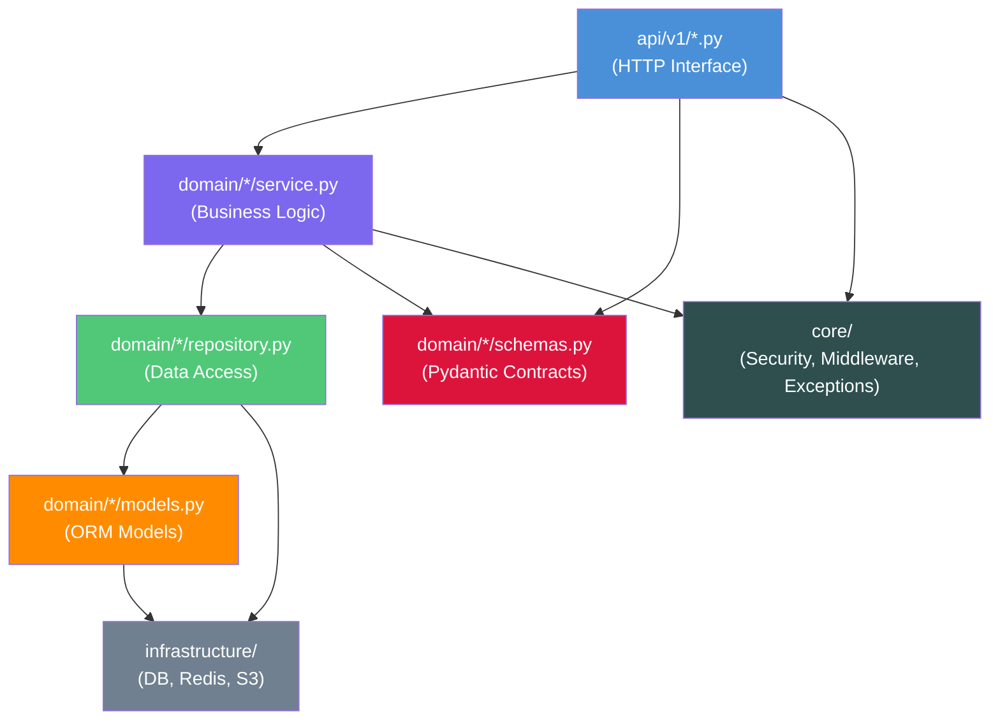

# Backend Architecture — Folder Structure

## Project Type

**Single Python Service** using FastAPI with a **Domain-Driven Design (DDD)** + **Hexagonal Architecture** layout.

Each domain (`users`, `projects`, `jobs`, `sources`, `reports`, `agent_logs`, `audit_logs`) is a self-contained vertical slice with its own:
- SQLAlchemy ORM model
- Pydantic request/response schemas
- Repository (data access layer)
- Service (business logic layer)
- Router (HTTP interface)

---

## Full Directory Tree

```
backend/
│
├── 📄 pyproject.toml              # Poetry: deps, tool config (ruff, mypy, pytest)
├── 📄 alembic.ini                 # Alembic migration config
├── 📄 Dockerfile                  # Multi-stage production image
├── 📄 Dockerfile.dev              # Development image with hot-reload
├── 📄 .env.example                # Template — NEVER commit .env
├── 📄 .python-version             # Pinned Python version (3.12.x)
│
├── 📁 app/
│   ├── 📄 main.py                 # FastAPI app factory (create_app)
│   ├── 📄 config.py               # Settings via pydantic-settings (env-driven)
│   ├── 📄 dependencies.py         # FastAPI DI: DB session, Redis, current user
│   ├── 📄 lifespan.py             # Startup/shutdown event handlers
│   │
│   ├── 📁 api/                    # HTTP interface layer
│   │   ├── 📄 router.py           # Root APIRouter — mounts all domain routers
│   │   └── 📁 v1/
│   │       ├── 📄 __init__.py
│   │       ├── 📄 auth.py         # POST /auth/register, /login, /refresh, /logout
│   │       ├── 📄 users.py        # CRUD /users, /users/me, /users/{id}
│   │       ├── 📄 organizations.py # CRUD /organizations, members
│   │       ├── 📄 projects.py     # CRUD /projects, /projects/{id}/members
│   │       ├── 📄 jobs.py         # CRUD /projects/{id}/jobs, /jobs/{id}/cancel
│   │       ├── 📄 sources.py      # GET/DELETE /jobs/{id}/sources
│   │       ├── 📄 reports.py      # CRUD /jobs/{id}/reports, export, feedback
│   │       ├── 📄 agent_logs.py   # GET /jobs/{id}/logs (stream + paginated)
│   │       ├── 📄 audit_logs.py   # GET /audit-logs (admin only)
│   │       ├── 📄 api_keys.py     # POST/DELETE /users/me/api-keys
│   │       └── 📄 health.py       # GET /health, /health/ready, /health/live
│   │
│   ├── 📁 core/                   # Cross-cutting infrastructure
│   │   ├── 📄 security.py         # JWT encode/decode, password hash (bcrypt)
│   │   ├── 📄 rate_limiter.py     # Redis sliding-window rate limiter
│   │   ├── 📄 exceptions.py       # Custom exception hierarchy + handlers
│   │   ├── 📄 middleware.py       # Request ID, logging, CORS, timing middleware
│   │   ├── 📄 pagination.py       # Cursor + offset pagination utilities
│   │   ├── 📄 responses.py        # Standard success/error response envelopes
│   │   └── 📄 constants.py        # Shared constants (max limits, defaults)
│   │
│   ├── 📁 domain/                 # Business logic — one package per domain
│   │   │
│   │   ├── 📁 auth/
│   │   │   ├── 📄 schemas.py      # LoginRequest, TokenResponse, RefreshRequest
│   │   │   ├── 📄 service.py      # login(), refresh_token(), logout()
│   │   │   └── 📄 dependencies.py # get_current_user, require_role
│   │   │
│   │   ├── 📁 users/
│   │   │   ├── 📄 models.py       # SQLAlchemy User, APIKey ORM models
│   │   │   ├── 📄 schemas.py      # UserCreate, UserUpdate, UserResponse
│   │   │   ├── 📄 repository.py   # UserRepository: get, create, update, delete
│   │   │   └── 📄 service.py      # UserService: business rules on top of repo
│   │   │
│   │   ├── 📁 organizations/
│   │   │   ├── 📄 models.py       # Organization ORM model
│   │   │   ├── 📄 schemas.py
│   │   │   ├── 📄 repository.py
│   │   │   └── 📄 service.py
│   │   │
│   │   ├── 📁 projects/
│   │   │   ├── 📄 models.py       # Project, ProjectMember ORM models
│   │   │   ├── 📄 schemas.py      # ProjectCreate, ProjectResponse, MemberInvite
│   │   │   ├── 📄 repository.py
│   │   │   └── 📄 service.py
│   │   │
│   │   ├── 📁 jobs/
│   │   │   ├── 📄 models.py       # ResearchJob ORM model
│   │   │   ├── 📄 schemas.py      # JobCreate, JobResponse, JobStatusUpdate
│   │   │   ├── 📄 repository.py
│   │   │   └── 📄 service.py
│   │   │
│   │   ├── 📁 sources/
│   │   │   ├── 📄 models.py       # Source ORM model
│   │   │   ├── 📄 schemas.py      # SourceResponse, SourceFilter
│   │   │   ├── 📄 repository.py
│   │   │   └── 📄 service.py
│   │   │
│   │   ├── 📁 reports/
│   │   │   ├── 📄 models.py       # Report, ReportFeedback ORM models
│   │   │   ├── 📄 schemas.py      # ReportResponse, FeedbackCreate
│   │   │   ├── 📄 repository.py
│   │   │   └── 📄 service.py
│   │   │
│   │   ├── 📁 agent_logs/
│   │   │   ├── 📄 models.py       # AgentLog ORM model
│   │   │   ├── 📄 schemas.py      # AgentLogResponse, LogFilter
│   │   │   ├── 📄 repository.py
│   │   │   └── 📄 service.py
│   │   │
│   │   └── 📁 audit_logs/
│   │       ├── 📄 models.py       # AuditLog ORM model
│   │       ├── 📄 schemas.py      # AuditLogResponse, AuditFilter
│   │       ├── 📄 repository.py
│   │       └── 📄 service.py
│   │
│   └── 📁 infrastructure/         # External system adapters
│       ├── 📁 database/
│       │   ├── 📄 session.py      # Async SQLAlchemy engine + session factory
│       │   ├── 📄 base.py         # Declarative Base with common columns mixin
│       │   └── 📄 utils.py        # Query helpers, pagination builders
│       ├── 📁 cache/
│       │   ├── 📄 redis.py        # Redis async client factory
│       │   └── 📄 keys.py         # Centralized Redis key name constants
│       └── 📁 storage/
│           └── 📄 s3.py           # S3-compatible object storage client
│
├── 📁 alembic/                    # Database migration scripts
│   ├── 📄 env.py                  # Alembic env (uses async SQLAlchemy)
│   ├── 📄 script.py.mako          # Migration template
│   └── 📁 versions/
│       ├── 📄 0001_initial_schema.py
│       ├── 📄 0002_add_rls_policies.py
│       ├── 📄 0003_add_partitioning.py
│       └── 📄 0004_add_audit_triggers.py
│
├── 📁 tests/
│   ├── 📄 conftest.py             # Fixtures: test DB, client, auth tokens
│   ├── 📄 factories.py            # Factory Boy model factories
│   ├── 📁 unit/
│   │   ├── 📁 domain/
│   │   │   ├── 📄 test_user_service.py
│   │   │   ├── 📄 test_project_service.py
│   │   │   ├── 📄 test_job_service.py
│   │   │   └── 📄 test_report_service.py
│   │   └── 📁 core/
│   │       ├── 📄 test_security.py
│   │       └── 📄 test_pagination.py
│   ├── 📁 integration/
│   │   ├── 📄 test_auth_api.py
│   │   ├── 📄 test_users_api.py
│   │   ├── 📄 test_projects_api.py
│   │   ├── 📄 test_jobs_api.py
│   │   ├── 📄 test_reports_api.py
│   │   └── 📄 test_audit_api.py
│   └── 📁 fixtures/
│       └── 📄 seed_data.sql
│
└── 📁 docs/                       # Backend-specific documentation
    ├── 📄 01_database_schema.md
    ├── 📄 02_folder_structure.md
    ├── 📄 03_api_specification.md
    ├── 📄 04_request_response_schemas.md
    └── 📄 05_domain_services.md
```

---

## Module Dependency Rules



**Rules:**
- `api/` → may only import from `domain/`, `core/`, `dependencies.py`
- `domain/service.py` → may only import from same domain's `repository.py`, `schemas.py`, `core/`
- `domain/repository.py` → may only import from same domain's `models.py`, `infrastructure/`
- Cross-domain calls → Service A may call Service B (never Repository A calling Repository B directly)
- `infrastructure/` → no imports from `domain/` or `api/`

---

## Key File Responsibilities

| File | Pattern | Responsibility |
|---|---|---|
| `app/main.py` | App Factory | Creates FastAPI app, registers routers, exception handlers |
| `app/config.py` | Settings | `class Settings(BaseSettings)` — all config from env vars |
| `app/dependencies.py` | DI | `get_db()`, `get_redis()`, `get_current_user()` |
| `domain/*/models.py` | ORM | SQLAlchemy 2.0 mapped classes, no business logic |
| `domain/*/schemas.py` | DTO | Pydantic v2 models for request validation and response serialization |
| `domain/*/repository.py` | Repository | All SQL via SQLAlchemy — no raw SQL strings |
| `domain/*/service.py` | Service | Business rules, orchestration, no direct DB calls |
| `infrastructure/database/session.py` | Adapter | `AsyncSession` factory — single source of DB connection |
| `alembic/versions/` | Migration | One migration per schema change, auto-generated + reviewed |
