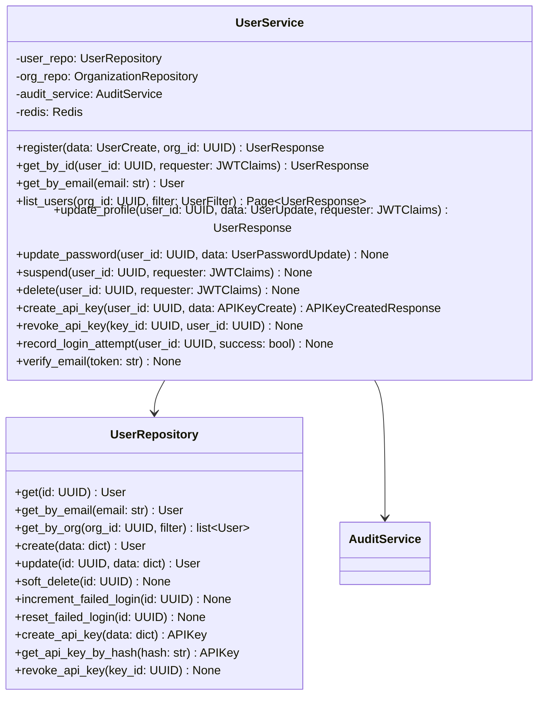
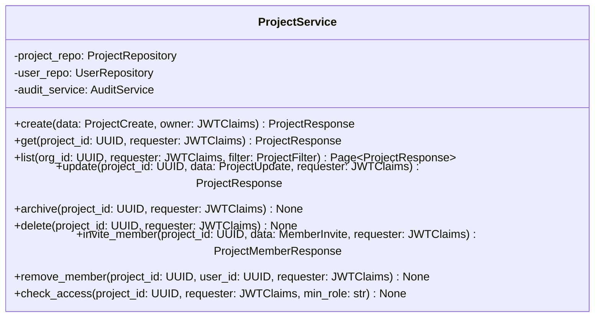
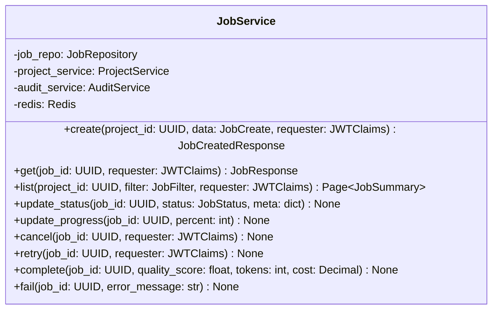
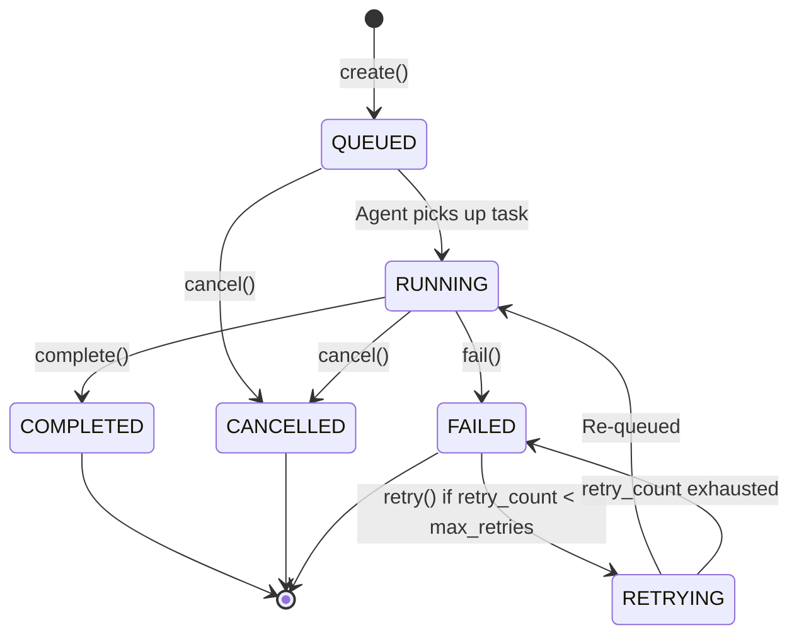
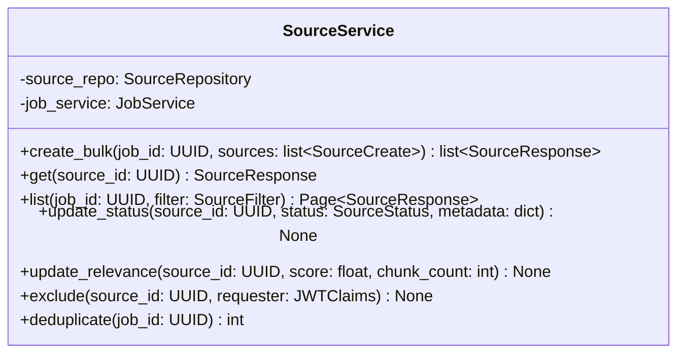
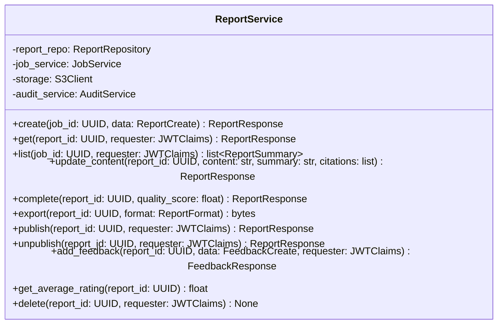
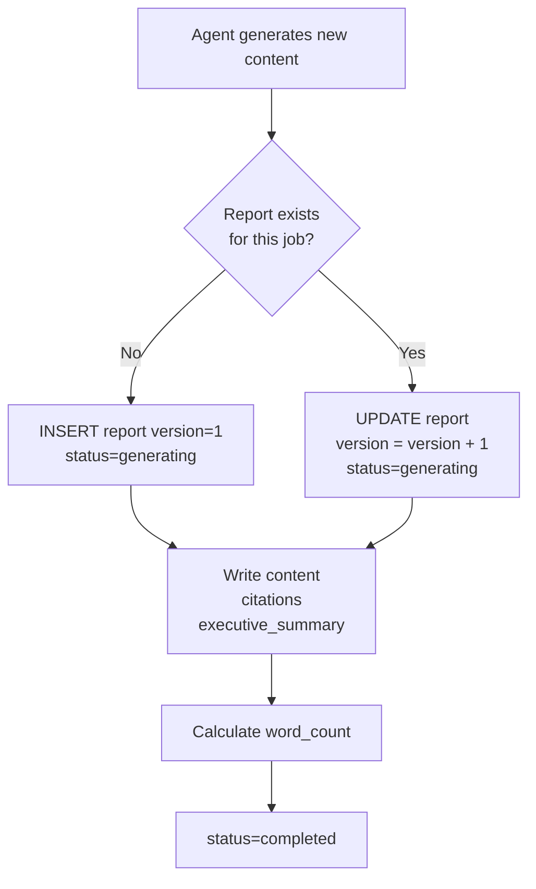
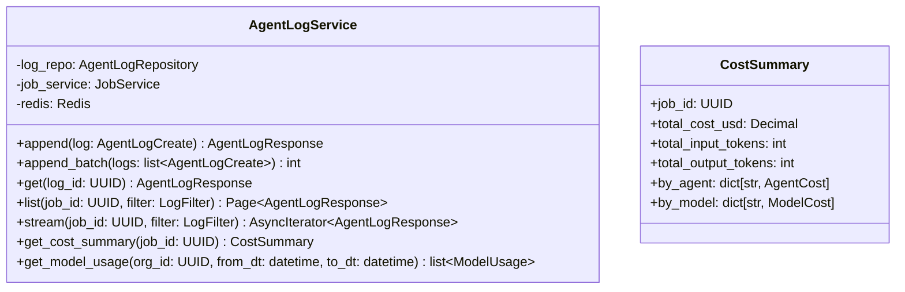
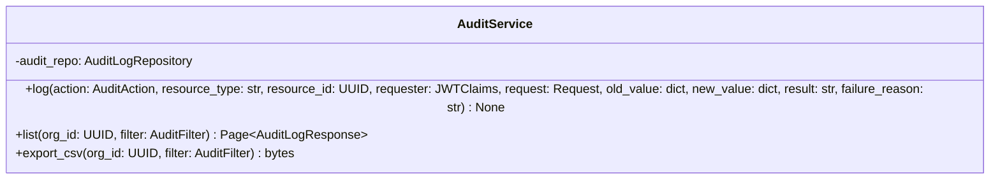
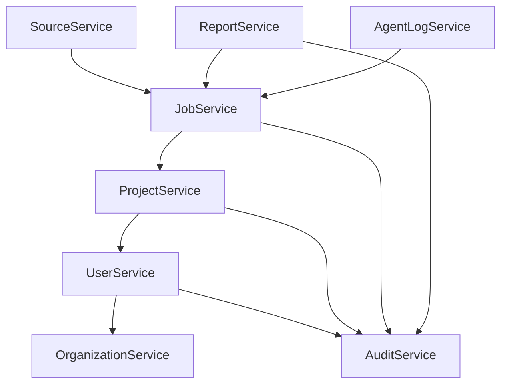

# Backend Architecture — Domain Services Design

## Service Architecture Pattern

Each domain service follows the same contract:
- **Constructor injection** of its repository (and any cross-domain services needed)
- **No direct DB session access** — only via repository methods
- **Raises domain-specific exceptions** — never raw SQLAlchemy errors
- **Emits audit events** — every mutating operation triggers an audit log entry
- **Transaction ownership** — the service layer, not the repository, manages transaction boundaries

---

## 1. User Management Service

### Responsibilities
- User registration with email verification flow
- Password management (hash, verify, change, reset)
- Account lifecycle: activate, suspend, lock after brute-force
- API key creation and revocation
- Role-based access checks (delegated to AuthService)

### Service Contract



### Account Lock Flow

```mermaid
flowchart TD
    LOGIN[Login Attempt] --> VERIFY{Password Valid?}
    VERIFY -->|Yes| RESET[Reset failed_login_count = 0\nUpdate last_login_at]
    VERIFY -->|No| INCREMENT[Increment failed_login_count]
    INCREMENT --> CHECK{Count >= 5?}
    CHECK -->|No| FAIL[Return 401]
    CHECK -->|Yes| LOCK[Set locked_until = NOW() + 30min\nSend alert email]
    LOCK --> FAIL
    RESET --> TOKEN[Issue token pair]
```

---

## 2. Research Project Management Service

### Responsibilities
- Project CRUD with slug auto-generation
- Member invitation and role management
- Project visibility enforcement (private/org/public)
- Job count cache maintenance
- Soft-archive flow

### Service Contract



### Visibility Access Matrix

| Visibility | Own Org Members | Other Orgs | Public |
|---|---|---|---|
| `private` | Members only | ❌ | ❌ |
| `org` | All org members | ❌ | ❌ |
| `public` | All org members | ✅ Read | ✅ Read |

### Slug Generation Logic

```
slug = re.sub(r'[^a-z0-9]+', '-', title.lower().strip()).strip('-')
# If slug collides within org → append short UUID suffix: "my-project-a3f2"
```

---

## 3. Research Job Service

### Responsibilities
- Job creation with config validation
- Queue dispatch via Redis (priority-weighted sorted set)
- Real-time status update via Redis + WebSocket broadcast
- Job cancellation (Redis task cancellation signal)
- Retry logic with exponential backoff

### Service Contract



### Job Lifecycle State Machine



### Redis Queue Design

```
ZADD task_queue:{priority}  {unix_timestamp_score}  {job_id}
# Priority queues: task_queue:critical, task_queue:high, task_queue:normal, task_queue:low
# Agents ZPOPMIN in order: critical → high → normal → low
```

### Status Broadcast (Redis → WebSocket)

```
PUBLISH ws:job:{job_id}  {"event": "status_update", "status": "RUNNING", "progress": 45}
```

---

## 4. Source Management Service

### Responsibilities
- Source record creation (called by agent workers via internal API)
- Relevance score and metadata updates
- Deduplication via content_hash within a job
- Source exclusion (manual override)
- Bulk source listing with rich filtering

### Service Contract



### Deduplication Strategy

```mermaid
flowchart LR
    NEW[New Source\ncontent_hash = SHA-256(content)]
    CHECK{Hash exists\nin job?}
    NEW --> CHECK
    CHECK -->|Yes| SKIP[Skip insertion\nreturn existing source_id]
    CHECK -->|No| INSERT[INSERT source\nmark status=pending]
    INSERT --> EMBED[Queue for embedding\n→ Qdrant]
```

---

## 5. Report Storage Service

### Responsibilities
- Report creation linked to a job
- Content versioning (each regeneration increments `version`)
- Export orchestration (Markdown → PDF/HTML via Pandoc/WeasyPrint)
- Publish/unpublish lifecycle
- Feedback collection and score aggregation

### Service Contract



### Report Versioning Flow



---

## 6. Agent Execution Log Service

### Responsibilities
- High-throughput append-only log writes (called by agent workers)
- Batch insert for performance (agent workers buffer locally and flush every 2s)
- Filtered querying with cursor pagination
- Server-Sent Events streaming for real-time log tailing
- Cost aggregation per job, per model, per agent type

### Service Contract



### Log Stream Implementation

```
1. Client connects to GET /jobs/{job_id}/logs/stream (SSE)
2. Service subscribes to Redis channel: ws:job:{job_id}:logs
3. Agent workers PUBLISH to ws:job:{job_id}:logs after each log write
4. SSE handler forwards event to connected client
5. On job completion, emit final "job_status" event and close stream
```

---

## 7. Audit Log Service

### Responsibilities
- Immutable audit trail for all mutating operations
- Called as a side effect inside every service mutating method
- Never throws exceptions — audit failure is logged but doesn't block the primary operation
- Rich filtering for compliance reporting and incident investigation

### Service Contract



### Audit Log Write Pattern

```mermaid
flowchart LR
    SERVICE[Service Method\nmutates data] --> TRY
    TRY{Try primary\noperation} -->|Success| AUDIT_OK[audit_service.log\nresult=success]
    TRY -->|Failure| AUDIT_FAIL[audit_service.log\nresult=failure\nfailure_reason=str(e)]
    AUDIT_OK --> RETURN[Return to caller]
    AUDIT_FAIL --> RAISE[Re-raise original exception]
```

**Key invariant**: Audit writes use a **separate, short-lived DB session** so they commit independently — an audit record is written even if the surrounding transaction rolls back.

---

## Cross-Service Dependency Graph



**Rule**: Dependency arrows flow downward only. No circular dependencies.

---

## Redis Usage by Service

| Service | Key Pattern | Operation | TTL |
|---|---|---|---|
| AuthService | `refresh:{user_id}:{jti}` | SETEX on login | 7 days |
| AuthService | `blocklist:{jti}` | SETEX on logout | Until exp |
| UserService | `user_lock:{user_id}` | SETEX on lockout | 30 min |
| UserService | `email_verify:{token}` | SETEX on register | 24 hours |
| JobService | `task_queue:{priority}` | ZADD / ZPOPMIN | — |
| JobService | `job_status:{job_id}` | HSET | Session TTL |
| AgentLogService | `ws:job:{job_id}:logs` | PUBLISH (channel) | — |
| RateLimiter | `ratelimit:{user_id}:{window}` | INCR + EXPIRE | Per window |
