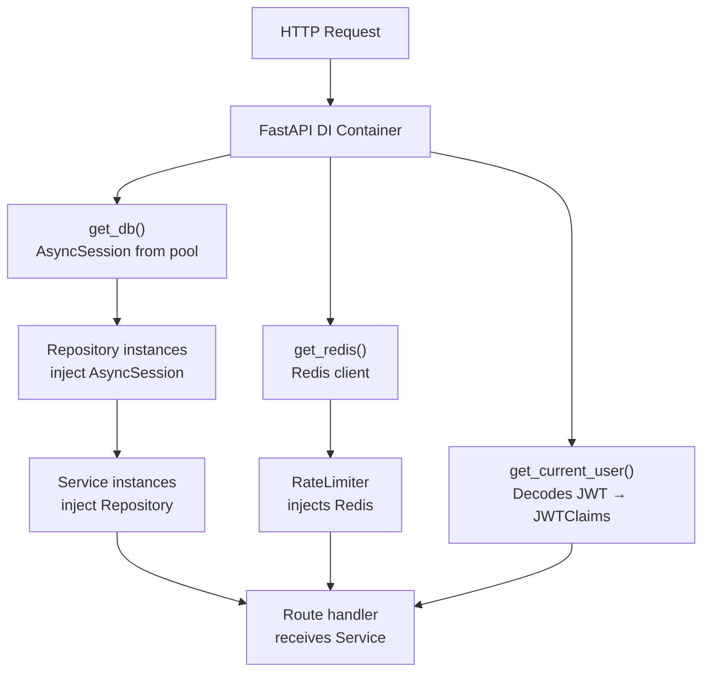

# Backend Architecture — Infrastructure & Alembic Design

## SQLAlchemy Configuration

### Async Engine Setup

```python
# app/infrastructure/database/session.py

DATABASE_URL = settings.database_url  # postgresql+asyncpg://...

engine = create_async_engine(
    DATABASE_URL,
    pool_size=20,          # base connections per worker
    max_overflow=10,       # burst connections
    pool_timeout=30,       # wait for connection (seconds)
    pool_recycle=1800,     # recycle connections every 30 min
    pool_pre_ping=True,    # validate connection before use
    echo=settings.debug,   # SQL logging in development
)

AsyncSessionLocal = async_sessionmaker(
    bind=engine,
    class_=AsyncSession,
    expire_on_commit=False,  # prevent lazy-load after commit
    autoflush=False,
)

@asynccontextmanager
async def get_db_session() -> AsyncGenerator[AsyncSession, None]:
    async with AsyncSessionLocal() as session:
        try:
            yield session
            await session.commit()
        except Exception:
            await session.rollback()
            raise
        finally:
            await session.close()
```

### SQLAlchemy Base with Common Columns

```python
# app/infrastructure/database/base.py

class TimestampMixin:
    created_at: Mapped[datetime] = mapped_column(
        DateTime(timezone=True), server_default=func.now(), nullable=False
    )
    updated_at: Mapped[datetime] = mapped_column(
        DateTime(timezone=True), server_default=func.now(),
        onupdate=func.now(), nullable=False
    )

class SoftDeleteMixin:
    deleted_at: Mapped[datetime | None] = mapped_column(
        DateTime(timezone=True), nullable=True, index=True
    )

class UUIDPrimaryKeyMixin:
    id: Mapped[UUID] = mapped_column(
        postgresql.UUID(as_uuid=True),
        primary_key=True,
        default=uuid4,
        server_default=text("gen_random_uuid()")
    )

Base = DeclarativeBase()
```

---

## Alembic Migration Strategy

### Migration Naming Convention

```
{sequence:04d}_{action}_{subject}.py

Examples:
  0001_create_initial_schema.py
  0002_add_rls_policies.py
  0003_partition_research_jobs.py
  0004_add_audit_triggers.py
  0005_add_report_feedback_table.py
  0006_add_api_keys_table.py
```

### Alembic env.py Configuration

```python
# alembic/env.py

from sqlalchemy.ext.asyncio import create_async_engine
from app.config import settings
from app.infrastructure.database.base import Base

# Import all models to ensure they are registered with Base.metadata
from app.domain.users.models import User, APIKey  # noqa: F401
from app.domain.organizations.models import Organization  # noqa: F401
from app.domain.projects.models import Project, ProjectMember  # noqa: F401
from app.domain.jobs.models import ResearchJob  # noqa: F401
from app.domain.sources.models import Source  # noqa: F401
from app.domain.reports.models import Report, ReportFeedback  # noqa: F401
from app.domain.agent_logs.models import AgentLog  # noqa: F401
from app.domain.audit_logs.models import AuditLog  # noqa: F401

target_metadata = Base.metadata

def run_migrations_online() -> None:
    connectable = create_async_engine(settings.database_url)
    with connectable.connect() as connection:
        context.configure(
            connection=connection,
            target_metadata=target_metadata,
            compare_type=True,           # detect column type changes
            compare_server_default=True, # detect default changes
            include_schemas=True,
        )
        with context.begin_transaction():
            context.run_migrations()
```

---

## Redis Client Configuration

```python
# app/infrastructure/cache/redis.py

redis_pool = redis.asyncio.ConnectionPool.from_url(
    settings.redis_url,
    encoding="utf-8",
    decode_responses=True,
    max_connections=50,
    socket_timeout=5,
    socket_connect_timeout=5,
    retry_on_timeout=True,
)

async def get_redis() -> redis.asyncio.Redis:
    return redis.asyncio.Redis(connection_pool=redis_pool)
```

### Redis Key Namespace Reference

```python
# app/infrastructure/cache/keys.py

class RedisKeys:
    # Auth
    REFRESH_TOKEN = "auth:refresh:{user_id}:{jti}"
    TOKEN_BLOCKLIST = "auth:blocklist:{jti}"
    EMAIL_VERIFY = "auth:verify:{token}"

    # Users
    USER_LOCK = "user:lock:{user_id}"
    USER_PROFILE = "user:profile:{user_id}"

    # Jobs
    TASK_QUEUE = "task_queue:{priority}"       # ZADD sorted set
    JOB_STATUS = "job:status:{job_id}"          # HSET hash
    JOB_PROGRESS = "job:progress:{job_id}"      # STRING

    # Rate Limiting
    RATE_LIMIT = "ratelimit:{user_id}:{window}" # STRING counter

    # PubSub channels
    JOB_LOG_CHANNEL = "ws:job:{job_id}:logs"
    JOB_STATUS_CHANNEL = "ws:job:{job_id}:status"

    @staticmethod
    def format(template: str, **kwargs) -> str:
        return template.format(**kwargs)
```

---

## Repository Pattern

```python
# Generic repository base class pattern
# app/domain/users/repository.py (example)

class BaseRepository(Generic[ModelT]):
    model: type[ModelT]

    def __init__(self, session: AsyncSession):
        self.session = session

    async def get(self, id: UUID) -> ModelT | None:
        return await self.session.get(self.model, id)

    async def get_or_404(self, id: UUID) -> ModelT:
        obj = await self.get(id)
        if not obj:
            raise NotFoundException(f"{self.model.__name__} {id} not found")
        return obj

    async def create(self, **kwargs) -> ModelT:
        obj = self.model(**kwargs)
        self.session.add(obj)
        await self.session.flush()  # flush to get DB-generated ID
        await self.session.refresh(obj)
        return obj

    async def update(self, id: UUID, **kwargs) -> ModelT:
        obj = await self.get_or_404(id)
        for key, value in kwargs.items():
            setattr(obj, key, value)
        await self.session.flush()
        return obj

    async def soft_delete(self, id: UUID) -> None:
        obj = await self.get_or_404(id)
        obj.deleted_at = datetime.utcnow()
        await self.session.flush()

    async def paginate(
        self,
        stmt: Select,
        cursor: str | None,
        limit: int,
        cursor_field: str = "created_at"
    ) -> tuple[list[ModelT], str | None]:
        # Cursor-based pagination implementation
        ...
```

---

## FastAPI App Factory

```python
# app/main.py

def create_app() -> FastAPI:
    app = FastAPI(
        title="Multi-Agent AI Research Platform API",
        version="1.0.0",
        docs_url="/api/docs",
        redoc_url="/api/redoc",
        openapi_url="/api/openapi.json",
        lifespan=lifespan,
    )

    # Middleware (order matters — outermost first)
    app.add_middleware(RequestIDMiddleware)
    app.add_middleware(StructuredLoggingMiddleware)
    app.add_middleware(TimingMiddleware)
    app.add_middleware(
        CORSMiddleware,
        allow_origins=settings.allowed_origins,
        allow_credentials=True,
        allow_methods=["*"],
        allow_headers=["*"],
    )

    # Exception handlers
    app.add_exception_handler(NotFoundException, not_found_handler)
    app.add_exception_handler(ForbiddenException, forbidden_handler)
    app.add_exception_handler(ConflictException, conflict_handler)
    app.add_exception_handler(RequestValidationError, validation_handler)
    app.add_exception_handler(Exception, generic_error_handler)

    # Routes
    app.include_router(api_router, prefix="/api/v1")

    return app
```

---

## Settings Configuration

```python
# app/config.py

class Settings(BaseSettings):
    model_config = SettingsConfigDict(env_file=".env", env_file_encoding="utf-8")

    # App
    app_name: str = "Multi-Agent AI Research Platform"
    environment: Literal["development", "staging", "production"] = "development"
    debug: bool = False
    secret_key: str                         # Required — no default

    # Database
    database_url: str                       # postgresql+asyncpg://...
    database_pool_size: int = 20

    # Redis
    redis_url: str = "redis://localhost:6379/0"

    # JWT
    jwt_private_key: str                    # RS256 PEM private key
    jwt_public_key: str                     # RS256 PEM public key
    access_token_expire_minutes: int = 15
    refresh_token_expire_days: int = 7

    # Security
    bcrypt_rounds: int = 12
    allowed_origins: list[str] = ["http://localhost:3000"]
    max_login_attempts: int = 5
    account_lock_minutes: int = 30

    # Storage
    s3_endpoint: str | None = None
    s3_bucket: str = "research-platform"
    s3_access_key: str | None = None
    s3_secret_key: str | None = None

    # Rate Limiting
    rate_limit_requests_per_minute: int = 60
    rate_limit_requests_per_day: int = 1000

settings = Settings()
```

---

## Exception Hierarchy

```python
# app/core/exceptions.py

class PlatformException(Exception):
    status_code: int = 500
    error_code: str = "INTERNAL_ERROR"
    message: str = "An unexpected error occurred"

class NotFoundException(PlatformException):
    status_code = 404
    error_code = "NOT_FOUND"

class ForbiddenException(PlatformException):
    status_code = 403
    error_code = "FORBIDDEN"

class UnauthorizedException(PlatformException):
    status_code = 401
    error_code = "UNAUTHORIZED"

class TokenExpiredException(UnauthorizedException):
    error_code = "TOKEN_EXPIRED"
    message = "Access token has expired"

class ConflictException(PlatformException):
    status_code = 409
    error_code = "CONFLICT"

class UnprocessableEntityException(PlatformException):
    status_code = 422
    error_code = "UNPROCESSABLE_ENTITY"

class RateLimitedException(PlatformException):
    status_code = 429
    error_code = "RATE_LIMITED"
    message = "Too many requests. Please slow down."

class ServiceUnavailableException(PlatformException):
    status_code = 503
    error_code = "SERVICE_UNAVAILABLE"
```

---

## Dependency Injection Wiring


