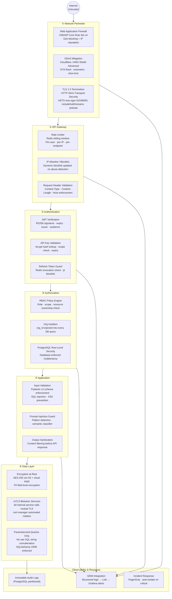
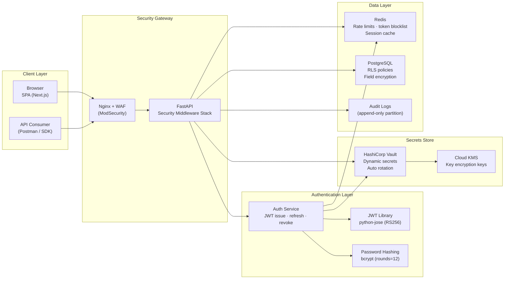

# Security Architecture — Master Overview

## Security Philosophy

The platform is built on **Zero Trust Architecture (ZTA)** principles:

> *"Never Trust, Always Verify — regardless of network location, service identity, or prior session."*

Every request traverses every security layer independently. Passing one layer grants no implicit trust in the next.

---

## Security Design Pillars

| Pillar | Implementation |
|---|---|
| **Identity** | JWT RS256 + API Keys with scoped permissions |
| **Access Control** | RBAC with resource-level permission checks |
| **Data Protection** | Encryption at rest (AES-256) + in transit (TLS 1.3) |
| **Threat Prevention** | WAF, input validation, prompt injection guard, rate limiting |
| **Observability** | Immutable audit logs, distributed tracing, anomaly alerts |
| **Secrets Hygiene** | Vault-injected secrets, no secrets in code or env files |
| **Resilience** | Defense-in-depth: 6 independent security layers |

---

## Defense-in-Depth Stack

---

## Security Component Map

---

## Security Non-Negotiables

> [!IMPORTANT]
> The following are absolute requirements — violations trigger immediate security review.

| Rule | Enforcement |
|---|---|
| TLS 1.2+ required on all connections | Nginx `ssl_protocols TLSv1.2 TLSv1.3;` |
| Passwords never stored in plaintext | bcrypt with minimum 12 rounds |
| Secrets never in code or `.env` files | Vault dynamic injection at startup |
| All DB queries parameterized | SQLAlchemy ORM — no `text()` with user input |
| JWT signed with RS256 (not HS256) | RS256 allows public key verification without sharing secret |
| Refresh tokens are single-use | Redis jti tracking — old token immediately invalidated on use |
| All mutations produce audit records | AuditService called in every service mutating method |
| Org isolation on every DB query | `org_id` filter injected by DI, enforced by RLS |
| No sensitive data in logs | PII fields masked before structured log emission |
| No secrets in HTTP headers or URLs | API keys in `Authorization` header only, never query params |
