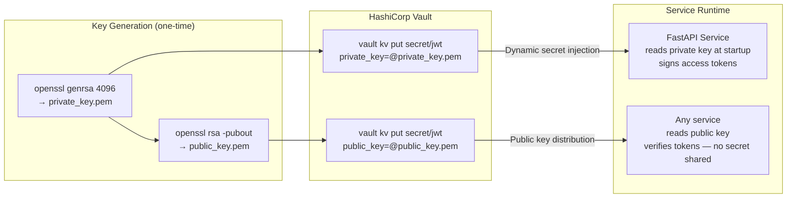
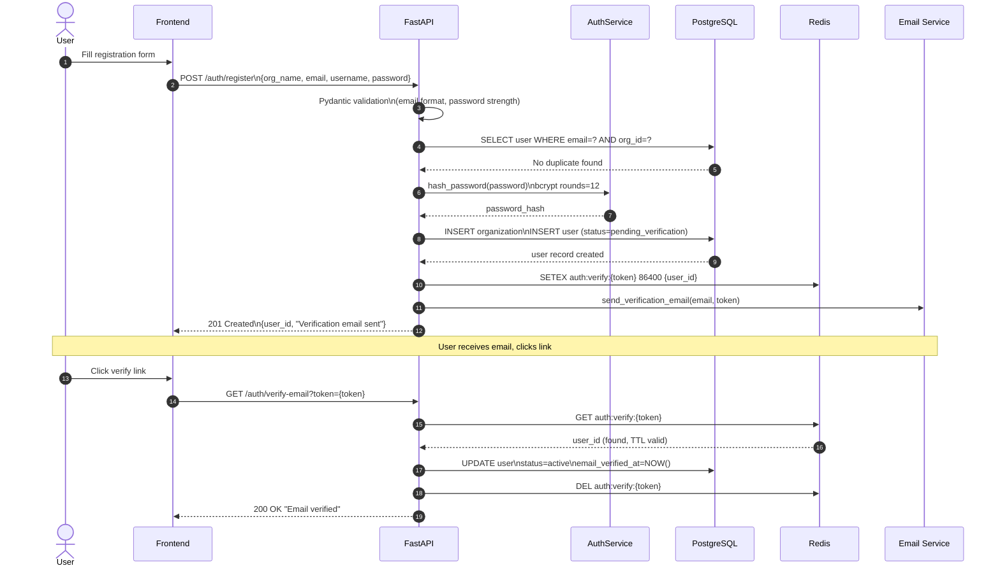
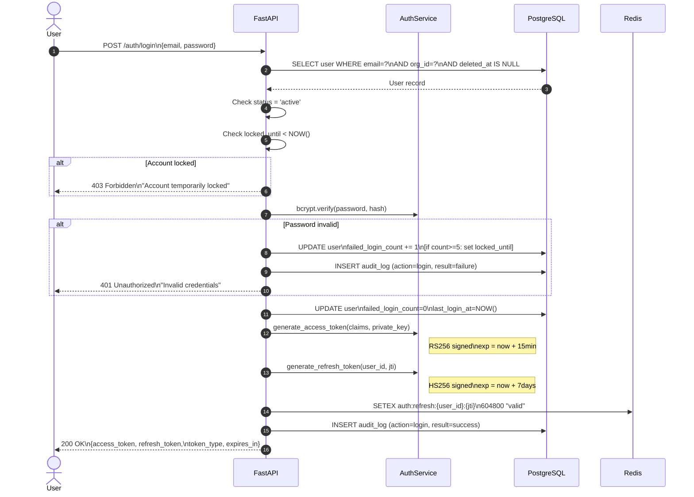
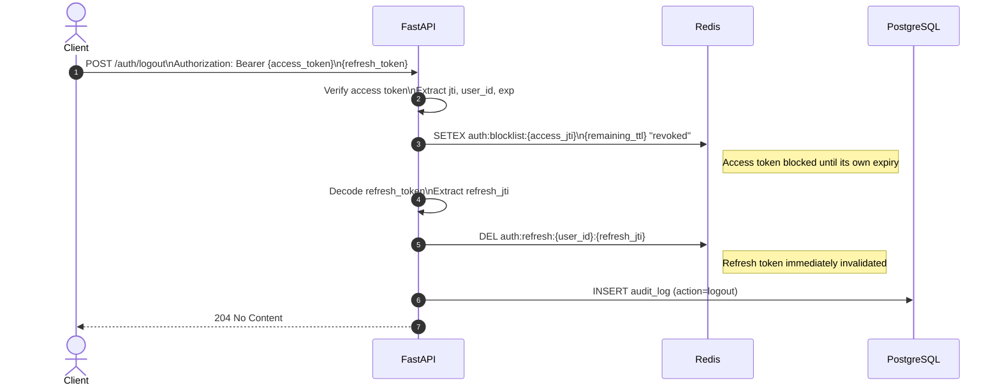
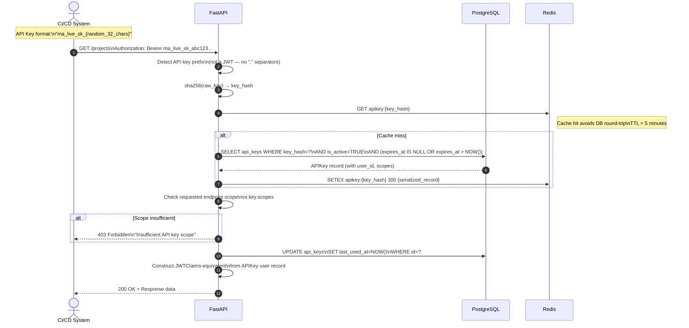

# Security Architecture — Authentication Flow

## Authentication Methods

The platform supports two authentication methods, each with distinct use cases:

| Method | Use Case | Token Lifetime | Revocable |
|---|---|---|---|
| **JWT (Bearer)** | Human users via browser/app | Access: 15 min · Refresh: 7 days | ✅ Via Redis blocklist |
| **API Key** | CI/CD, integrations, agent workers | Until expiry date or revocation | ✅ Immediate |

---

## JWT Architecture

### Token Design

**Access Token** — RS256 signed, short-lived (15 min), stateless verification:

```
Header:  { "alg": "RS256", "typ": "JWT", "kid": "key-2026-06" }
Payload: {
  "sub":    "550e8400-e29b-41d4-a716-446655440000",  // user UUID
  "email":  "alice@acme.com",
  "role":   "researcher",
  "org_id": "org-uuid",
  "scopes": ["read:projects", "write:jobs"],
  "jti":    "unique-jwt-id",                          // JWT ID for revocation
  "iss":    "https://api.platform.com",
  "aud":    "https://api.platform.com",
  "iat":    1717416000,
  "exp":    1717416900                                 // iat + 900s (15 min)
}
```

**Refresh Token** — HS256 signed, long-lived (7 days), server-side tracked:
- Stored as `sha256(token)` hash in Redis with TTL
- Every use issues a new pair and **revokes the old refresh token** (rotation)
- Stolen refresh token detection: re-use of revoked token → revoke entire family

---

## RS256 Key Management



**Key Rotation Schedule**: Every 90 days. Vault manages versioned keys. `kid` (Key ID) in JWT header allows multi-key validation during rotation window.

---

## Registration & Email Verification Flow



---

## Login & Token Issuance Flow



---

## Token Refresh (Rotation) Flow

```mermaid
sequenceDiagram
    autonumber
    actor Client
    participant API as FastAPI
    participant AUTH as AuthService
    participant REDIS as Redis
    participant DB as PostgreSQL

    Client->>API: POST /auth/refresh\n{refresh_token}

    API->>AUTH: decode_refresh_token(token)
    Note right of AUTH: Verifies HS256 signature\nExtracts user_id, jti, exp

    alt Token expired or invalid signature
        API-->>Client: 401 Unauthorized\nTOKEN_EXPIRED
    end

    API->>REDIS: GET auth:refresh:{user_id}:{jti}

    alt Token not found in Redis (revoked)
        Note over API,REDIS: ⚠️ Possible token theft detected
        API->>REDIS: DEL auth:refresh:{user_id}:*\n(revoke all refresh tokens for user)
        API->>DB: INSERT audit_log\n(action=login, result=failure\nfailure_reason="refresh_token_reuse")
        API-->>Client: 401 Unauthorized\n"Session invalidated — please login again"
    end

    API->>REDIS: DEL auth:refresh:{user_id}:{jti}
    Note right of API: Immediately invalidate old token

    API->>DB: SELECT user WHERE id=?\nAND status='active'
    DB-->>API: User record (fresh claims)

    API->>AUTH: generate_access_token(fresh_claims)
    API->>AUTH: generate_refresh_token(user_id, new_jti)
    API->>REDIS: SETEX auth:refresh:{user_id}:{new_jti} 604800 "valid"

    API-->>Client: 200 OK\n{new_access_token, new_refresh_token}
```



---

## Logout & Token Revocation Flow



---

## API Key Authentication Flow



---

## Password Security Policy

| Policy | Requirement |
|---|---|
| **Minimum length** | 10 characters |
| **Maximum length** | 128 characters (prevent DoS via bcrypt long-input attack) |
| **Complexity** | At least 1 uppercase, 1 lowercase, 1 digit, 1 special character |
| **Algorithm** | bcrypt with work factor 12 (re-evaluated annually) |
| **History** | Last 5 passwords cannot be reused |
| **Reset tokens** | Cryptographically random 32-byte tokens, TTL = 1 hour, single-use |
| **Brute force** | Lock account after 5 failures for 30 minutes |
| **Leak detection** | Check against Have I Been Pwned API (k-anonymity model) on registration |

---

## Session Security Checklist

| Control | Implementation |
|---|---|
| Access token short-lived | 15 minutes maximum |
| Refresh token rotation | Single-use; old token revoked on every refresh |
| Concurrent session limit | Max 5 active refresh tokens per user (Redis key count) |
| Geographic anomaly | Flag login from new country → require re-verification |
| Idle timeout | Refresh token revoked after 7 days of non-use |
| Forced logout | Admin can `DEL auth:refresh:{user_id}:*` to terminate all sessions |
| Token binding | `iss` and `aud` claims validated to prevent token relay attacks |
