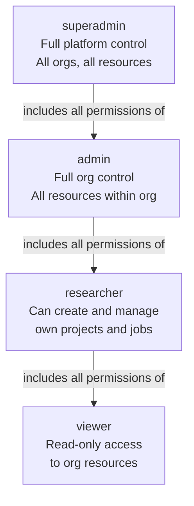
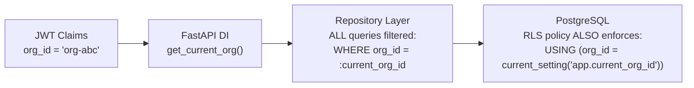

# Security Architecture — Authorization Design

## Authorization Model

The platform uses **Role-Based Access Control (RBAC)** layered with **Resource Ownership Checks** and **Scope-Based API Key Permissions**. All three layers must pass before a request proceeds.

```mermaid
flowchart LR
    REQUEST[Authenticated Request] --> L1

    L1{Layer 1\nRole Check\nDoes role permit\nthis action?} -->|Fail| DENY[403 Forbidden]
    L1 -->|Pass| L2

    L2{Layer 2\nOwnership Check\nDoes user belong\nto this org/project?} -->|Fail| DENY
    L2 -->|Pass| L3

    L3{Layer 3\nScope Check\nDoes API key scope\npermit this endpoint?\n(API key auth only)} -->|Fail| DENY
    L3 -->|Pass| ALLOW[✅ Request Proceeds]
```

---

## Role Hierarchy



---

## RBAC Permission Matrix

### User Management

| Action | superadmin | admin | researcher | viewer |
|---|---|---|---|---|
| Create user in own org | ✅ | ✅ | ❌ | ❌ |
| View any user in org | ✅ | ✅ | ❌ | ❌ |
| Update own profile | ✅ | ✅ | ✅ | ✅ |
| Update other user's role | ✅ | ✅ | ❌ | ❌ |
| Suspend a user | ✅ | ✅ | ❌ | ❌ |
| Delete a user | ✅ | ✅ | ❌ | ❌ |
| Create API key (own) | ✅ | ✅ | ✅ | ✅ |
| Revoke any API key in org | ✅ | ✅ | ❌ | ❌ |

### Project Management

| Action | superadmin | admin | researcher (owner) | researcher (member) | viewer |
|---|---|---|---|---|---|
| Create project | ✅ | ✅ | ✅ | ✅ | ❌ |
| View private project | ✅ | ✅ | ✅ (if member) | ✅ | ✅ (if member) |
| View org-scoped project | ✅ | ✅ | ✅ | ✅ | ✅ |
| Update project | ✅ | ✅ | ✅ (own) | ❌ | ❌ |
| Delete project | ✅ | ✅ | ✅ (own) | ❌ | ❌ |
| Invite project member | ✅ | ✅ | ✅ (own) | ❌ | ❌ |
| Remove project member | ✅ | ✅ | ✅ (own) | ❌ | ❌ |

### Research Jobs

| Action | superadmin | admin | researcher | viewer |
|---|---|---|---|---|
| Create job | ✅ | ✅ | ✅ (if project member) | ❌ |
| View job | ✅ | ✅ | ✅ (if project member) | ✅ (if project member) |
| Cancel job | ✅ | ✅ | ✅ (own only) | ❌ |
| Retry job | ✅ | ✅ | ✅ (own only) | ❌ |

### Reports & Sources

| Action | superadmin | admin | researcher | viewer |
|---|---|---|---|---|
| View report | ✅ | ✅ | ✅ (project member) | ✅ (project member) |
| Publish report | ✅ | ✅ | ✅ (job creator) | ❌ |
| Export report | ✅ | ✅ | ✅ (project member) | ✅ (project member) |
| Delete report | ✅ | ✅ | ✅ (creator only) | ❌ |
| Submit feedback | ✅ | ✅ | ✅ | ✅ |
| Exclude source | ✅ | ✅ | ✅ (job creator) | ❌ |

### Admin-Only

| Action | superadmin | admin | researcher | viewer |
|---|---|---|---|---|
| View audit logs | ✅ | ✅ | ❌ | ❌ |
| Export audit logs | ✅ | ✅ | ❌ | ❌ |
| Manage org settings | ✅ | ✅ | ❌ | ❌ |
| View all org usage/costs | ✅ | ✅ | ❌ | ❌ |
| Manage model registry | ✅ | ❌ | ❌ | ❌ |

---

## Project-Level Roles

Within a project, members can have a secondary role that further restricts access:

| Project Role | Permissions |
|---|---|
| `owner` | Full control — update, delete, manage members |
| `editor` | Create and manage jobs, reports, sources |
| `viewer` | Read-only access to all project resources |

**Effective permission = MIN(org role, project role)**
A `researcher` invited as `viewer` in a project has read-only access to that project.

---

## API Key Scope System

API keys carry explicit, fine-grained scopes independent of user role:

### Available Scopes

```
Format: {action}:{resource}
Actions: read, write, delete, admin
Resources: projects, jobs, sources, reports, logs, users, org
```

| Scope | Grants |
|---|---|
| `read:projects` | GET /projects, GET /projects/{id} |
| `write:projects` | POST /projects, PATCH /projects/{id} |
| `read:jobs` | GET /jobs, GET /jobs/{id} |
| `write:jobs` | POST /jobs, POST /jobs/{id}/cancel |
| `read:reports` | GET /reports, GET /reports/{id} |
| `write:reports` | PATCH /reports, POST /reports/{id}/publish |
| `read:logs` | GET /jobs/{id}/logs |
| `admin:org` | All org management operations |

### Scope Enforcement Flow

```mermaid
flowchart TD
    APIREQ[API Key Request\nto POST /projects/{id}/jobs]

    APIREQ --> KEYLOOKUP[Look up API key\nfrom Authorization header]
    KEYLOOKUP --> SCOPECHECK{key.scopes\ncontains write:jobs?}
    SCOPECHECK -->|No| DENY[403 Forbidden\n"Insufficient scope"]
    SCOPECHECK -->|Yes| ROLECHECK{User's org role\npermits this action?}
    ROLECHECK -->|No| DENY
    ROLECHECK -->|Yes| PROCEED[Request allowed]
```

---

## Authorization Decision Flow (Unified)

```mermaid
flowchart TD
    AUTHED[Authenticated Principal\n(JWT user or API key)] --> EXTRACT[Extract claims:\nuser_id · org_id · role · scopes]

    EXTRACT --> STEP1{Step 1\nIs user active\nand org active?}
    STEP1 -->|No| DENY1[401/403]
    STEP1 -->|Yes| STEP2

    STEP2{Step 2\nDoes role allow\nthis action class?} -->|No| DENY2[403 Role Forbidden]
    STEP2 -->|Yes| STEP3

    STEP3{Step 3\nDoes resource belong\nto user's org?\n(org_id match)} -->|No| DENY3[404 Not Found\nor 403]
    STEP3 -->|Yes| STEP4

    STEP4{Step 4\nAPI Key auth only:\nDoes key scope\ncover this endpoint?} -->|No| DENY4[403 Scope Denied]
    STEP4 -->|Yes| STEP5

    STEP5{Step 5\nResource-level check:\nIs user member of\nthis project?} -->|No| DENY5[403 Not Member]
    STEP5 -->|Yes| STEP6

    STEP6{Step 6\nOwnership check:\n(if action requires ownership)\nIs user the creator?} -->|No| DENY6[403 Not Owner]
    STEP6 -->|Yes| ALLOW[✅ Authorized]
```

---

## Org Isolation Architecture

Every authenticated request has `org_id` injected into the dependency chain:



**Two-layer enforcement**: Application-level filter in repository + database-level RLS. A bug in one layer is caught by the other.

---

## Privilege Escalation Prevention

| Attack Vector | Prevention |
|---|---|
| Horizontal escalation (access another org's data) | org_id in every query + RLS policies |
| Vertical escalation (assign self to higher role) | Role changes only by admin; self-update of role field is blocked at schema level |
| IDOR (Insecure Direct Object Reference) | Resource lookups always include org_id in WHERE clause |
| JWT claim tampering | RS256 signature verification; any modified JWT fails verification |
| API key scope expansion | Scopes set at creation; no self-modification endpoint |
| Mass assignment | Pydantic separates create/update schemas; admin-only fields in `AdminUserUpdate` only |
