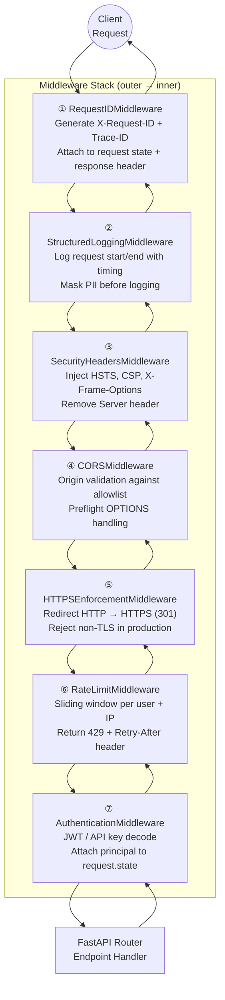
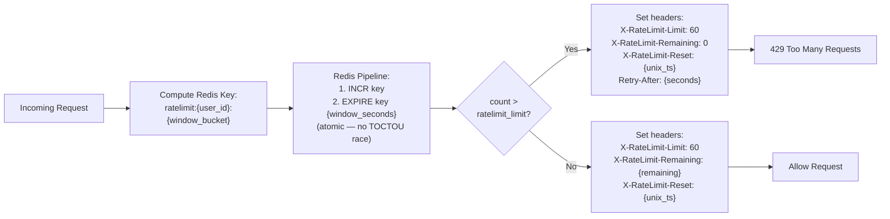
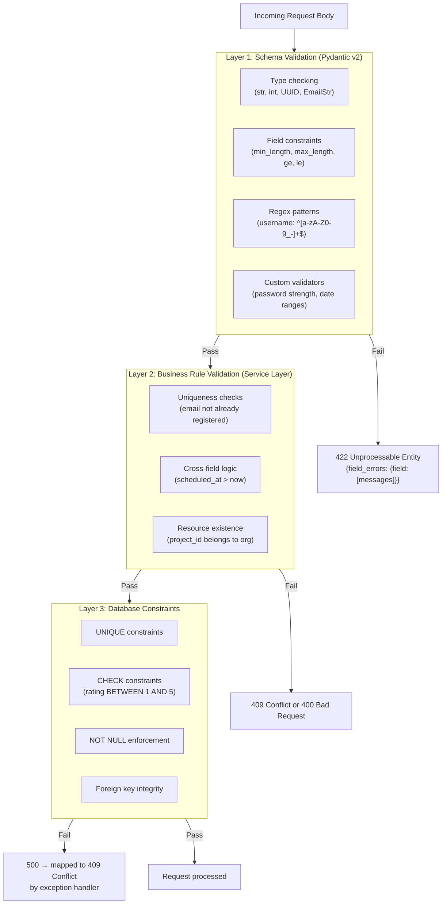

# Security Architecture — Middleware Design

## Middleware Stack

FastAPI middleware executes as an **onion model** — request passes inward through all layers, response peels back outward. Order of registration matters critically.



---

## Middleware Specifications

### ① RequestID Middleware

**Purpose**: Provide distributed tracing identity for every request.

```
Inbound:
  - If X-Request-ID present in headers → use it (client-provided)
  - Otherwise → generate UUIDv4
  - Attach to: request.state.request_id, request.state.trace_id

Outbound:
  - Add X-Request-ID: {id} to response headers
  - Ensures: all log lines, DB audit records, and error responses
    carry the same trace_id for easy correlation
```

---

### ② Structured Logging Middleware

**Purpose**: Emit structured JSON logs for every request/response.

```
Log Fields:
  timestamp, method, path, query_params (sanitized),
  user_id (if authenticated), org_id, status_code,
  response_time_ms, request_id, ip_address, user_agent

PII Masking Rules:
  - Authorization header → "[REDACTED]"
  - password, token, key in body → "[REDACTED]"
  - email → "a***@domain.com"
  - request body logged only for POST/PATCH (not GET) and
    only fields not in PII_FIELDS list

Log Levels:
  - 2xx → INFO
  - 4xx → WARNING
  - 5xx → ERROR (with full stack trace)
```

---

### ③ Security Headers Middleware

**Purpose**: Set HTTP security headers on every response.

| Header | Value | Purpose |
|---|---|---|
| `Strict-Transport-Security` | `max-age=31536000; includeSubDomains; preload` | Force HTTPS |
| `Content-Security-Policy` | `default-src 'self'; script-src 'self'; object-src 'none'` | Prevent XSS |
| `X-Frame-Options` | `DENY` | Prevent clickjacking |
| `X-Content-Type-Options` | `nosniff` | Prevent MIME sniffing |
| `Referrer-Policy` | `strict-origin-when-cross-origin` | Limit referrer leakage |
| `Permissions-Policy` | `camera=(), microphone=(), geolocation=()` | Disable browser features |
| `Cache-Control` | `no-store` (on auth endpoints) | Prevent token caching |
| `Server` | *(removed)* | Don't reveal server technology |
| `X-Powered-By` | *(removed)* | Don't reveal framework |

---

### ④ CORS Middleware

**Purpose**: Restrict cross-origin requests to trusted origins.

```
Configuration:
  allowed_origins:      [
    "https://app.platform.com",
    "https://staging.platform.com",
    "http://localhost:3000"  (development only)
  ]
  allowed_methods:      ["GET", "POST", "PATCH", "DELETE", "OPTIONS"]
  allowed_headers:      ["Authorization", "Content-Type", "X-Request-ID",
                         "X-Idempotency-Key"]
  expose_headers:       ["X-Request-ID", "X-RateLimit-Limit",
                         "X-RateLimit-Remaining", "X-RateLimit-Reset"]
  allow_credentials:    true
  max_age:              600  (preflight cache, 10 min)

Security Rules:
  - Wildcard origins ("*") NEVER allowed in production
  - Dynamic origin validation: exact match against allowlist only
  - allow_credentials=true requires explicit origin (not *)
  - Preflight OPTIONS: respond 200, do NOT log to avoid noise
```

---

### ⑤ HTTPS Enforcement Middleware

**Purpose**: Guarantee all traffic uses encrypted transport.

```
Rules (production only):
  - Incoming request with scheme=http → 301 Redirect to https://
  - Check X-Forwarded-Proto header (behind reverse proxy)
  - If Forwarded header present → parse and validate scheme

Development:
  - Middleware is bypassed when environment != "production"
  - Prevents developer friction during local iteration
```

---

### ⑥ Rate Limit Middleware

**Purpose**: Prevent abuse, DoS, and brute-force attacks.

#### Rate Limit Tiers

| Tier | Applies To | Requests | Window |
|---|---|---|---|
| **Global IP** | All requests (unauthenticated) | 30 req | 1 min |
| **Per User (normal)** | Authenticated users | 60 req | 1 min |
| **Per User (burst)** | Authenticated users | 1000 req | 1 hour |
| **Per User (daily)** | Authenticated users | 10,000 req | 24 hours |
| **Per Endpoint (auth)** | `/auth/login`, `/auth/register` | 10 req | 1 min |
| **Per Endpoint (job)** | `POST /jobs` | 20 req | 1 min |
| **API Key** | Scoped API key requests | 200 req | 1 min |

#### Sliding Window Algorithm



---

### ⑦ Authentication Middleware

**Purpose**: Decode and validate credentials; attach principal to request state.

```mermaid
flowchart TD
    REQ[Request with Authorization header] --> HEADERCHECK{Header\npresent?}

    HEADERCHECK -->|No| PATHCHECK{Is path\npublic?\n/health /docs /auth/login}
    PATHCHECK -->|Yes| SKIP[Skip auth\nAllow through]
    PATHCHECK -->|No| UNAUTH[401 Unauthorized\n"Authentication required"]

    HEADERCHECK -->|Yes| TOKENTYPE{Token format?}

    TOKENTYPE -->|"Bearer ma_live_sk_*"\n(API key prefix)| APIKEY[API Key Auth Flow\n→ See Auth Flow doc]
    TOKENTYPE -->|"Bearer eyJ..."\n(3-part JWT)| JWTFLOW

    subgraph JWTFLOW["JWT Validation Flow"]
        J1["Decode header\nExtract kid (key ID)"]
        J2["Fetch public key for kid\nfrom key registry"]
        J3["Verify RS256 signature"]
        J4["Validate claims:\niss, aud, exp, nbf"]
        J5["Check jti in Redis blocklist"]
        J6["Attach JWTClaims to\nrequest.state.user"]
        J1 --> J2 --> J3 --> J4 --> J5 --> J6
    end

    JWTFLOW --> ALLOWED[Continue to route handler]

    J3 -->|Invalid sig| INVALID[401 Invalid token]
    J4 -->|Expired| EXPIRED[401 Token expired]
    J5 -->|Blocklisted| REVOKED[401 Token revoked]
```

---

## Input Validation Layer

Input validation is enforced at **three independent layers**:



### Specific Sanitization Rules

| Input Type | Validation Rule |
|---|---|
| Email | RFC 5322 via `email-validator` library |
| URLs | `AnyHttpUrl` Pydantic type — scheme must be http/https |
| UUIDs | `UUID` type — rejects any non-UUID string |
| Free text (query, description) | `max_length` enforced; HTML/script tags stripped via `bleach` |
| JSON fields | Size limit 1MB per JSONB field |
| File uploads | MIME type allowlist; max size 10MB; content inspection |
| Integers | `ge`/`le` bounds on all numeric fields |
| Dates | Must be UTC-aware `datetime`; future-date check where applicable |

---

## Prompt Injection Guard

AI query input (`research_jobs.query`) requires additional protection:

```mermaid
flowchart LR
    QUERY[User Research Query] --> CLEAN[HTML strip\nUnicode normalize]
    CLEAN --> PATTERN{Pattern\ndetection}
    PATTERN -->|Match: "ignore previous instructions"\n"system prompt"\n"jailbreak" patterns| BLOCK[400 Bad Request\n"Query contains disallowed content"]
    PATTERN -->|No match| SEMANTIC{Semantic\nclassifier\n(ML model)}
    SEMANTIC -->|Injection probability > 0.85| BLOCK
    SEMANTIC -->|Safe| SANITIZE[Wrap in structured prompt template\nContext isolation - query in separate message]
    SANITIZE --> AGENT[Pass to Agent Orchestrator]
```
