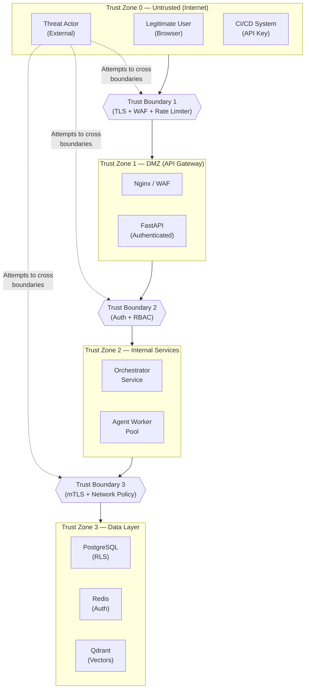
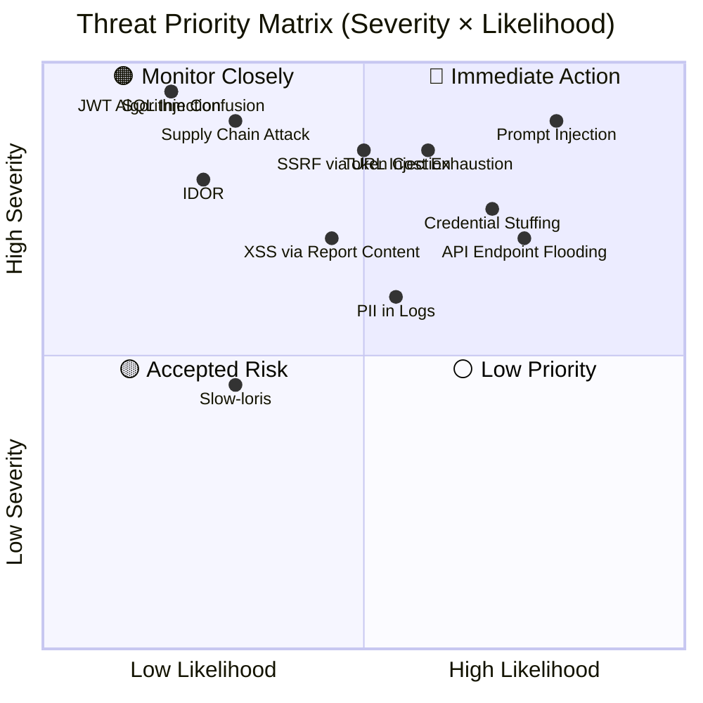

# Security Architecture — Threat Model

## Threat Modeling Methodology

This threat model uses the **STRIDE framework** (Spoofing, Tampering, Repudiation, Information Disclosure, Denial of Service, Elevation of Privilege) applied to each trust boundary in the system.

---

## System Trust Boundaries

---

## STRIDE Threat Register

### T1 — Authentication & Identity

| ID | Threat | STRIDE | Severity | Likelihood | Mitigation | Residual Risk |
|---|---|---|---|---|---|---|
| T1.1 | JWT token theft via XSS | Spoofing | 🔴 Critical | Medium | Tokens in memory (not localStorage); short TTL 15min; `httpOnly` cookies for refresh tokens | Low |
| T1.2 | JWT algorithm confusion attack (RS256 → HS256) | Spoofing | 🔴 Critical | Low | Explicitly enforce `algorithms=["RS256"]` in verify call; reject `alg: none` | Low |
| T1.3 | Brute-force password attack | Spoofing | 🟠 High | High | bcrypt 12 rounds; 5-attempt lockout; rate limit login endpoint (10 req/min) | Low |
| T1.4 | Refresh token theft & replay | Spoofing | 🔴 Critical | Low | Single-use rotation; stolen token reuse → revoke all sessions for user | Low |
| T1.5 | Credential stuffing (known breached passwords) | Spoofing | 🟠 High | High | HaveIBeenPwned k-anonymity check on registration + password change | Medium |
| T1.6 | API key leakage in logs | Info Disclosure | 🔴 Critical | Low | Keys stored as bcrypt hash; plain key shown once at creation; log scrubbing masks `Authorization` header | Low |

---

### T2 — Authorization & Access Control

| ID | Threat | STRIDE | Severity | Likelihood | Mitigation | Residual Risk |
|---|---|---|---|---|---|---|
| T2.1 | Horizontal privilege escalation (access another org) | EoP | 🔴 Critical | Low | `org_id` in every query; RLS policies at DB level (dual enforcement) | Very Low |
| T2.2 | IDOR via predictable resource IDs | EoP | 🟠 High | Low | All IDs are UUIDv4 (not sequential integers); ownership check on every lookup | Low |
| T2.3 | JWT claim tampering (elevate own role) | Tampering | 🔴 Critical | Low | RS256 signature; any modification invalidates token | Very Low |
| T2.4 | Mass assignment (set `role=admin` via API) | EoP | 🟠 High | Medium | Pydantic schema separation; `role` not in `UserUpdate`; only in `AdminUserUpdate` | Low |
| T2.5 | Stale permission cache (role updated, token still active) | EoP | 🟡 Medium | Medium | Access token TTL 15 min; role changes take effect within 15 min maximum | Low |
| T2.6 | Bypassing RLS via superuser connection | EoP | 🔴 Critical | Very Low | App DB user is never superuser; separate migration user; connection string segregated | Very Low |

---

### T3 — Injection Attacks

| ID | Threat | STRIDE | Severity | Likelihood | Mitigation | Residual Risk |
|---|---|---|---|---|---|---|
| T3.1 | SQL Injection | Tampering | 🔴 Critical | Low | SQLAlchemy ORM only; no raw string concatenation; parameterized queries enforced | Very Low |
| T3.2 | Prompt Injection (AI query manipulation) | Tampering | 🔴 Critical | High | Pattern detection + semantic ML classifier; query wrapped in structured template; context isolation per message | Medium |
| T3.3 | XSS via stored report content | Info Disclosure | 🟠 High | Medium | Report content stored raw; HTML sanitized via `bleach` before rendering; strict CSP headers | Low |
| T3.4 | SSRF via source URL injection | Tampering | 🔴 Critical | Medium | URL allowlist for external fetches; internal IP ranges (`169.254.x.x`, `10.x.x.x`) blocked at network policy | Low |
| T3.5 | Path traversal in file upload | Tampering | 🟠 High | Low | Filenames re-generated (UUIDs); no user-controlled paths; S3 pre-signed URLs only | Very Low |
| T3.6 | JSONB injection via metadata fields | Tampering | 🟡 Medium | Low | JSONB fields schema-validated; max depth 5 levels; max 1MB per field | Low |

---

### T4 — Data Exposure

| ID | Threat | STRIDE | Severity | Likelihood | Mitigation | Residual Risk |
|---|---|---|---|---|---|---|
| T4.1 | PII exposure in API responses | Info Disclosure | 🟠 High | Medium | Response schemas exclude sensitive fields; `password_hash` never in any response schema | Low |
| T4.2 | PII in log files | Info Disclosure | 🟠 High | Medium | Structured log middleware masks email, tokens, passwords before emission | Low |
| T4.3 | Secrets in environment variables | Info Disclosure | 🔴 Critical | Medium | HashiCorp Vault dynamic injection; no `.env` files in production containers | Low |
| T4.4 | Database data exfiltration via misconfigured backup | Info Disclosure | 🔴 Critical | Low | Backups encrypted at rest (AES-256); access restricted by IAM; point-in-time recovery | Low |
| T4.5 | Cross-tenant data leakage in vector store | Info Disclosure | 🔴 Critical | Low | Qdrant collections namespaced per org; metadata filter enforced on every query | Low |
| T4.6 | Error messages exposing stack traces | Info Disclosure | 🟡 Medium | Medium | Generic error handler returns `INTERNAL_ERROR` code only; full trace in structured logs only | Low |

---

### T5 — Denial of Service

| ID | Threat | STRIDE | Severity | Likelihood | Mitigation | Residual Risk |
|---|---|---|---|---|---|---|
| T5.1 | API endpoint flooding | DoS | 🟠 High | High | Cloudflare DDoS protection; Nginx rate limiting; per-user sliding window in Redis | Low |
| T5.2 | bcrypt DoS via long password | DoS | 🟠 High | Medium | Maximum password length enforced at 128 chars **before** bcrypt; Pydantic `max_length` | Low |
| T5.3 | Large JSON payload bombing | DoS | 🟡 Medium | Medium | `Content-Length` max 10MB enforced at Nginx; Pydantic max field lengths | Low |
| T5.4 | Zip bomb in file upload | DoS | 🟡 Medium | Low | File size limit before decompression; MIME type inspection; streaming extraction | Low |
| T5.5 | AI model cost exhaustion (token bombing) | DoS | 🔴 Critical | Medium | Per-org monthly token budget; per-job `max_tokens_budget` cap; hard cutoff at agent level | Low |
| T5.6 | Slow-loris HTTP attack | DoS | 🟡 Medium | Low | Nginx `client_body_timeout 10s; client_header_timeout 10s;` | Low |
| T5.7 | Redis connection pool exhaustion | DoS | 🟠 High | Low | Connection pool max 50; per-command timeout 5s; circuit breaker on Redis failure | Low |

---

### T6 — Service-to-Service

| ID | Threat | STRIDE | Severity | Likelihood | Mitigation | Residual Risk |
|---|---|---|---|---|---|---|
| T6.1 | Rogue internal service impersonation | Spoofing | 🔴 Critical | Very Low | mTLS between all internal services; Kubernetes NetworkPolicy restricts pod communication | Very Low |
| T6.2 | Agent worker sending malicious log data | Tampering | 🟡 Medium | Low | Internal API key scoped to `write:logs` only; agent logs schema-validated | Low |
| T6.3 | Redis pub/sub channel spoofing | Tampering | 🟡 Medium | Low | Redis in private VPC; no external access; AUTH password required | Low |
| T6.4 | Supply chain attack (malicious dependency) | Tampering | 🔴 Critical | Low | Dependency pinning with hash verification; Snyk/Dependabot scanning; private PyPI mirror | Medium |

---

## Attack Surface Summary

---

## Incident Response Triggers

| Trigger Condition | Automated Response | Escalation |
|---|---|---|
| `failed_login_count >= 5` on any user | Auto-lock account for 30 min | Notify user via email |
| Revoked refresh token reused | Revoke all user sessions | Log CRITICAL audit event |
| API requests from blocklisted IP | Block at Nginx; return 403 | SIEM alert |
| Error rate > 10% in 60s window | Circuit breaker opens | PagerDuty P2 alert |
| AI cost budget > 90% in billing period | Rate-limit job creation; notify admin | Org admin email |
| SQL error spike (possible injection probe) | Rate-limit source IP | SIEM alert + security review |
| Unusual geographic login | Require email re-verification | User email notification |
| Service-to-service mTLS failure | Reject connection; log cert details | Security team alert |
