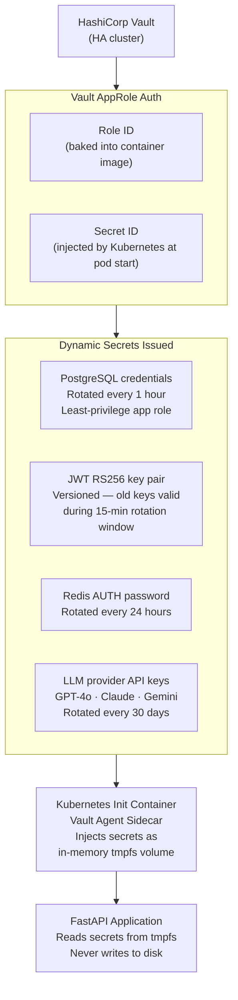
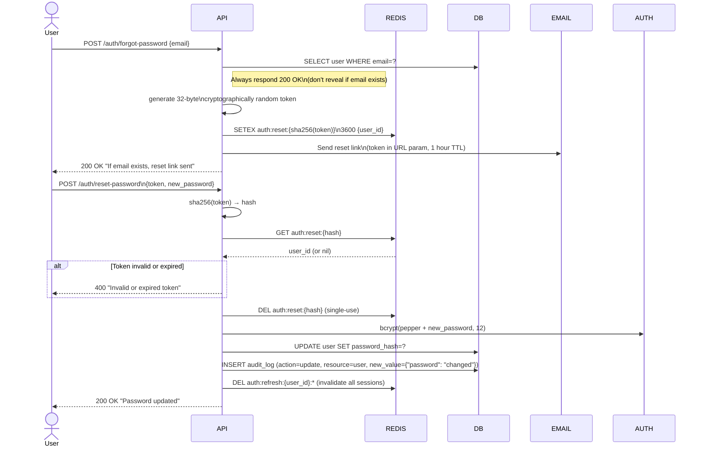
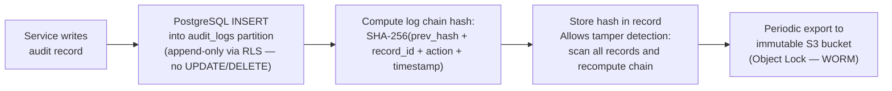
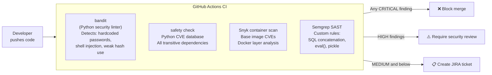

# Security Architecture — Security Best Practices

## Secrets Management

### HashiCorp Vault Integration

All secrets are **injected at runtime** by Vault — nothing is hardcoded or stored in environment files in production.



### Secret Classification

| Secret Type | Storage | Rotation | Access |
|---|---|---|---|
| JWT RS256 private key | Vault KV v2 | 90 days | API service only |
| JWT RS256 public key | Vault KV v2 | 90 days | All services |
| Database password (app) | Vault Dynamic | 1 hour | API service only |
| Database password (migration) | Vault KV v2 | 7 days | Migration job only |
| Redis AUTH password | Vault KV v2 | 24 hours | API + workers |
| LLM API keys (OpenAI, Anthropic, etc.) | Vault KV v2 | 30 days | Orchestrator only |
| S3 / Object storage keys | Vault Dynamic (AWS) | 1 hour | API service only |
| bcrypt pepper | Vault KV v2 | Never (stable) | API service only |

### Rules

> [!CAUTION]
> The following violations are grounds for immediate security incident review.

- ❌ Never hardcode secrets in source code
- ❌ Never commit `.env` files to version control (`.gitignore` enforced)
- ❌ Never log secrets, tokens, or passwords
- ❌ Never pass secrets via URL query parameters
- ❌ Never store secrets in container image layers
- ✅ Always use Vault for every secret in production
- ✅ Always use tmpfs (in-memory) volumes for injected secrets
- ✅ Always set minimum necessary Vault policies (least privilege)

---

## Password Security

### Storage

```
Stored value = bcrypt(pepper + password, rounds=12)

pepper:   32-byte random value from Vault (adds secret to the hash,
          so leaked DB hash alone is not crackable even with rainbow tables)
rounds:   12 (recalculate annually; increase when hardware benchmarks
          show sub-100ms cracking on current hardware)
max_len:  128 chars (enforced BEFORE bcrypt to prevent long-password DoS)
```

### Password Reset Flow



---

## HTTPS & Transport Security

### TLS Configuration (Nginx)

```
ssl_protocols TLSv1.2 TLSv1.3;
ssl_prefer_server_ciphers on;
ssl_ciphers ECDHE-ECDSA-AES128-GCM-SHA256:ECDHE-RSA-AES128-GCM-SHA256:
            ECDHE-ECDSA-AES256-GCM-SHA384:ECDHE-RSA-AES256-GCM-SHA384;
ssl_session_timeout 1d;
ssl_session_cache shared:MozSSL:10m;
ssl_session_tickets off;    # Disable — forward secrecy
ssl_stapling on;
ssl_stapling_verify on;

# HSTS - 1 year, all subdomains, preload
add_header Strict-Transport-Security "max-age=31536000; includeSubDomains; preload" always;
```

### Certificate Management

| Component | Certificate Source | Rotation |
|---|---|---|
| Public API (api.platform.com) | Let's Encrypt (cert-manager) | Auto, 90 days |
| Internal services | Kubernetes cert-manager + Vault PKI | Auto, 30 days |
| Database connections | Vault PKI-issued client certs | Auto, 7 days |
| Redis connections | TLS via Vault PKI | Auto, 7 days |

---

## Audit Logging Best Practices

### What to Log

| Must Log | Never Log |
|---|---|
| All authentication events (login, logout, fail) | Passwords or password hashes |
| All authorization failures | Raw JWT tokens |
| All mutations (create, update, delete) | API key plaintext values |
| All admin actions | Full request bodies (large PII payloads) |
| All data exports | Internal system debugging details |
| Rate limit violations | Stack traces (log separately, not in audit) |
| Suspicious access patterns | Medical, financial, biometric data in plaintext |

### Log Integrity



### Retention Policy

| Log Type | Hot Storage | Cold Storage | Delete After |
|---|---|---|---|
| `audit_logs` | PostgreSQL 90 days | S3 Glacier 7 years | After 7 years (compliance) |
| `agent_logs` | PostgreSQL 30 days | S3 Standard 1 year | After 1 year |
| Application logs | Loki 14 days | S3 90 days | After 90 days |
| Access logs (Nginx) | 7 days | S3 30 days | After 30 days |

---

## Dependency Security

### Scanning Pipeline



### Dependency Rules

| Rule | Enforcement |
|---|---|
| All dependencies pinned with exact version | `poetry.lock` committed; `pip install --require-hashes` |
| No transitive dependency auto-upgrade | `poetry update` only via approved PR |
| Private dependencies via private PyPI | Nexus/Artifactory mirror — no direct PyPI in production |
| Container base image | `python:3.12-slim-bookworm` — minimal attack surface; no dev tools |
| Trivy container scan | Run on every image build; block if CRITICAL CVE |

---

## Secure Development Checklist

### Pre-Commit

- [ ] `bandit` passed with no HIGH/CRITICAL issues
- [ ] No secrets detected by `detect-secrets` pre-commit hook
- [ ] All new endpoints have corresponding RBAC permission check
- [ ] All new DB queries use parameterized form (no string concat)
- [ ] New Pydantic schemas reviewed for mass-assignment risks
- [ ] Audit log call added for every mutating service method

### Pre-Deploy

- [ ] `safety check` passed on all dependencies
- [ ] Container image scanned with Trivy — no CRITICAL CVEs
- [ ] Secrets rotated if any old secrets committed (even in git history)
- [ ] HTTPS enforced — no new HTTP endpoints
- [ ] New endpoints covered in load test (rate limit validated)
- [ ] Database migrations reviewed — no `DROP` without rollback plan

### Post-Deploy

- [ ] Health check `/health` returns 200 within 30 seconds
- [ ] Audit logs flowing to SIEM (spot check 5 records)
- [ ] No spike in 5xx errors (monitor for 15 min post-deploy)
- [ ] Rate limit headers present in responses

---

## OWASP Top 10 Coverage

| # | OWASP Risk | Our Mitigation | Status |
|---|---|---|---|
| A01 | Broken Access Control | RBAC + org_id isolation + RLS | ✅ |
| A02 | Cryptographic Failures | TLS 1.3 + AES-256 at rest + RS256 JWT + bcrypt | ✅ |
| A03 | Injection | ORM parameterization + Pydantic + prompt guard | ✅ |
| A04 | Insecure Design | Threat model + DDD service boundaries + defense-in-depth | ✅ |
| A05 | Security Misconfiguration | Vault secrets + Nginx hardening + security headers | ✅ |
| A06 | Vulnerable Components | Snyk + Bandit + Trivy in CI/CD | ✅ |
| A07 | Auth & Session Failures | RS256 JWT + rotation + lockout + short TTL | ✅ |
| A08 | Software Integrity Failures | Dependency hashing + private mirror + signed images | ✅ |
| A09 | Security Logging Failures | Immutable audit log + SIEM + WORM archive | ✅ |
| A10 | SSRF | URL allowlist + internal IP block + network policy | ✅ |
