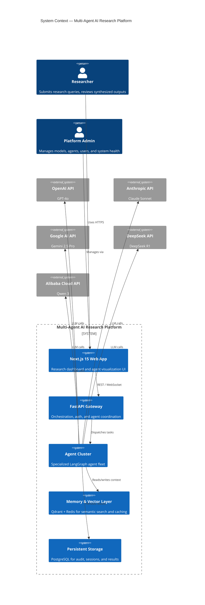
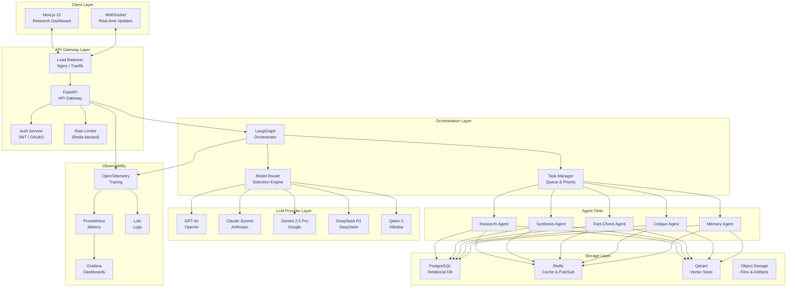

# 1. High-Level Architecture

## Overview

The **Enterprise Multi-Agent AI Research Platform** is a distributed, microservices-based system designed to orchestrate multiple large language models (LLMs) for complex research workflows. It enables parallel model execution, intelligent task routing, result synthesis, and persistent memory across sessions.

---

## Architectural Principles

| Principle | Description |
|---|---|
| **Model Agnosticism** | Agents are decoupled from specific LLM providers via a unified adapter layer |
| **Event-Driven Orchestration** | LangGraph manages stateful agent workflows via directed acyclic graphs (DAGs) |
| **Separation of Concerns** | Each layer (API, Agent, Storage, UI) has independent scaling and deployment |
| **Defense-in-Depth Security** | Multi-layer security: API Gateway → Auth → Network → Data encryption |
| **Observability-First** | Every agent action, LLM call, and data flow is traced, logged, and metered |

---

## System Context Diagram

---

## High-Level Component Architecture

---

## Key Architectural Decisions

| Decision | Choice | Rationale |
|---|---|---|
| **API Framework** | FastAPI | Async-first, OpenAPI auto-docs, Pydantic validation |
| **Orchestration** | LangGraph | Stateful DAGs, cyclical agent loops, built-in checkpointing |
| **Frontend** | Next.js 15 | App Router, Server Components, streaming SSE support |
| **Vector DB** | Qdrant | High-performance ANN search, filterable payloads, gRPC support |
| **Cache/PubSub** | Redis | Session cache, rate limiting, agent pub/sub messaging |
| **Relational DB** | PostgreSQL | ACID compliance, JSONB for flexible schema, pgvector if needed |
| **Containerization** | Docker + Compose | Reproducible environments, isolated services |
