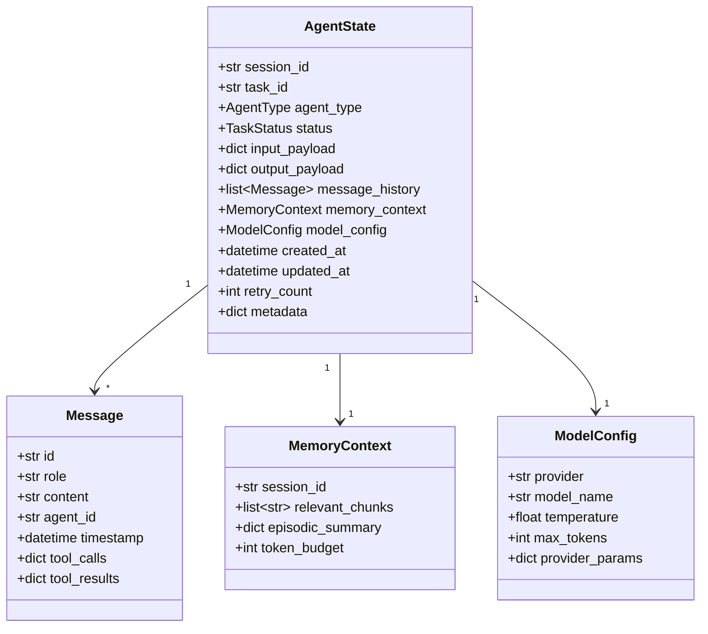
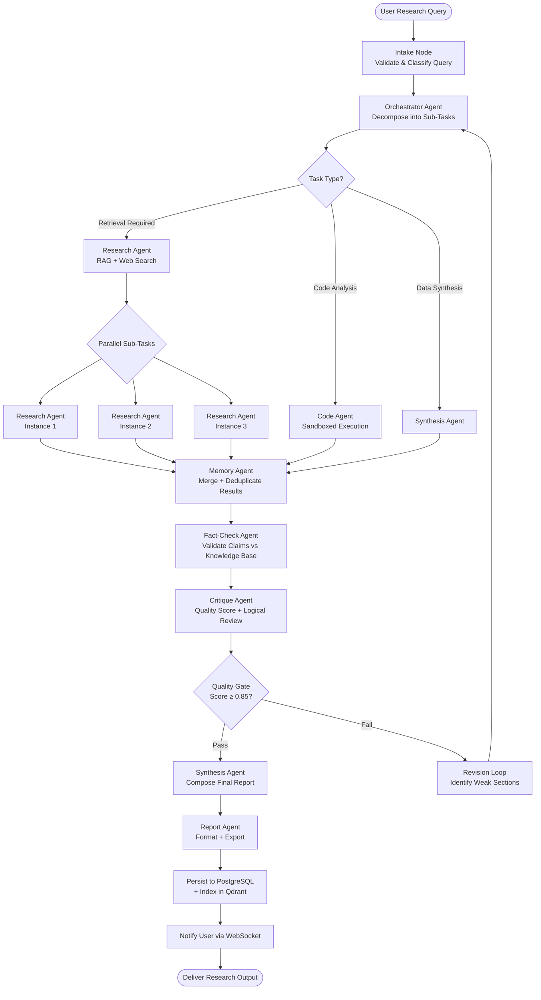
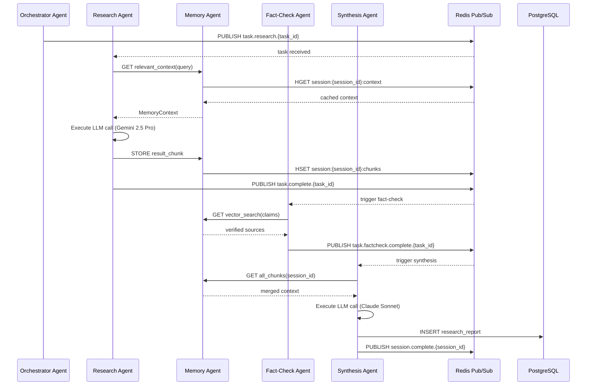
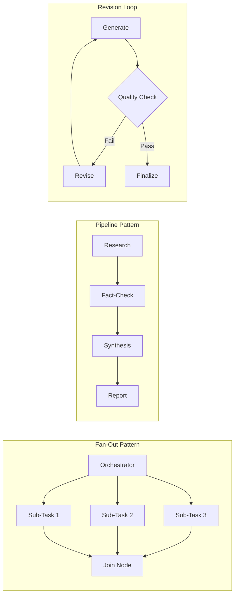

# 2. Multi-Agent Architecture

## Agent Design Philosophy

Each agent in the platform is an autonomous, stateful unit that:
- Receives structured tasks from the LangGraph orchestrator
- Maintains its own working memory and tool access
- Communicates results via a typed message protocol
- Can spawn sub-agents for parallelism (fan-out pattern)

---

## Agent Taxonomy

| Agent | Role | Primary Model | Tools |
|---|---|---|---|
| **Orchestrator Agent** | Decomposes research goals, routes sub-tasks | GPT-4o | Task planner, DAG builder |
| **Research Agent** | Retrieves and summarizes domain knowledge | Gemini 2.5 Pro | Web search, RAG, document loader |
| **Synthesis Agent** | Merges multi-source findings into coherent output | Claude Sonnet | Merge engine, citation formatter |
| **Critique Agent** | Evaluates quality, logic, and factual accuracy | DeepSeek R1 | Scorer, logic checker |
| **Fact-Check Agent** | Validates claims against trusted knowledge base | Qwen 3 | Vector search, external KB |
| **Memory Agent** | Manages context, episodic memory, and retrieval | GPT-4o | Qdrant write/read, Redis cache |
| **Code Agent** | Generates and executes code for data analysis | DeepSeek R1 | Code interpreter, sandboxed exec |
| **Report Agent** | Structures final research output into formats | Claude Sonnet | Template engine, PDF/Markdown export |

---

## Agent State Schema

---

## LangGraph Workflow DAG

---

## Agent Communication Protocol

---

## Agent Parallelism Model

---

## Agent Failure & Recovery

| Failure Mode | Detection | Recovery Strategy |
|---|---|---|
| LLM API timeout | Async timeout (30s) | Retry with exponential backoff (max 3x) |
| Model rate limit | 429 HTTP status | Failover to secondary model |
| Agent crash | Heartbeat miss | Restart from last LangGraph checkpoint |
| Invalid output | Pydantic schema validation | Prompt re-injection with error context |
| Context overflow | Token count check | Summarize and truncate via Memory Agent |
| Circular loop | Max iteration counter | Force-exit, escalate to Orchestrator |
