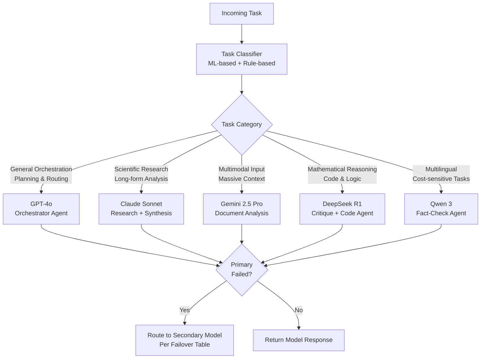
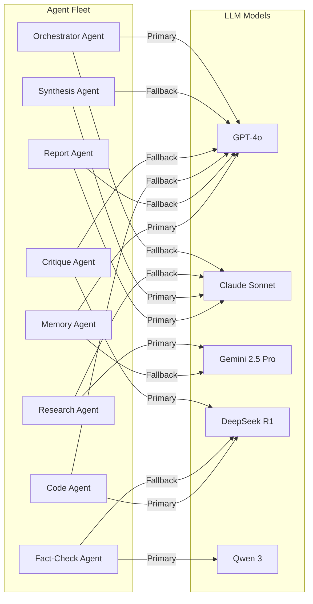

# 3. Model Selection Strategy

## Philosophy

The platform does not commit all tasks to a single model. Instead, a **Model Router** evaluates each task's characteristics against a scoring matrix and selects the optimal model — or combination of models — for that specific job.

---

## Model Capability Matrix

| Capability | GPT-4o | Claude Sonnet | Gemini 2.5 Pro | DeepSeek R1 | Qwen 3 |
|---|---|---|---|---|---|
| **Reasoning Depth** | ★★★★★ | ★★★★☆ | ★★★★★ | ★★★★★ | ★★★★☆ |
| **Long Context (tokens)** | 128K | 200K | 1M | 128K | 32K |
| **Code Generation** | ★★★★★ | ★★★★☆ | ★★★★☆ | ★★★★★ | ★★★★☆ |
| **Multilingual** | ★★★★☆ | ★★★★☆ | ★★★★★ | ★★★★☆ | ★★★★★ |
| **Scientific Research** | ★★★★☆ | ★★★★★ | ★★★★★ | ★★★★☆ | ★★★☆☆ |
| **Creative Synthesis** | ★★★★★ | ★★★★★ | ★★★★☆ | ★★★☆☆ | ★★★☆☆ |
| **Factual Accuracy** | ★★★★☆ | ★★★★★ | ★★★★★ | ★★★★★ | ★★★★☆ |
| **Cost Efficiency** | $$$ | $$$ | $$$$ | $ | $ |
| **Latency (avg)** | Medium | Medium | Medium-High | Low | Low |
| **Tool Use / Function Calling** | ★★★★★ | ★★★★★ | ★★★★★ | ★★★★☆ | ★★★★☆ |

---

## Task-to-Model Routing Rules



---

## Model Routing Decision Engine

### Scoring Algorithm

The Model Router computes a **Task-Model Fitness Score (TMFS)** for each candidate model:

```
TMFS = W1×(ContextFit) + W2×(CapabilityMatch) + W3×(CostScore) + W4×(LatencyScore) + W5×(ReliabilityScore)

Where:
  W1 = 0.25  (context window sufficiency)
  W2 = 0.35  (capability match to task type)
  W3 = 0.15  (cost per token vs. budget)
  W4 = 0.15  (expected latency vs. SLA)
  W5 = 0.10  (recent reliability / uptime)
```

### Failover Table

| Primary | Condition | Failover |
|---|---|---|
| GPT-4o | Rate limit / timeout | Claude Sonnet |
| Claude Sonnet | Rate limit / timeout | GPT-4o |
| Gemini 2.5 Pro | Rate limit / timeout | Claude Sonnet |
| DeepSeek R1 | Rate limit / timeout | GPT-4o |
| Qwen 3 | Rate limit / timeout | DeepSeek R1 |

---

## Model Assignment by Agent



---

## Dynamic Model Configuration

Each model is configurable at runtime via the **Model Registry** — stored in PostgreSQL and cached in Redis:

| Parameter | Description | Default |
|---|---|---|
| `temperature` | Creativity vs. determinism | 0.7 (creative), 0.1 (reasoning) |
| `max_tokens` | Output length cap | 4096 |
| `top_p` | Nucleus sampling | 0.95 |
| `presence_penalty` | Repetition control | 0.0 |
| `system_prompt` | Per-agent persona injection | Agent-specific |
| `tool_choice` | Force tool use or auto | `auto` |
| `stream` | Streaming response | `true` |
| `timeout_ms` | Request timeout | 30000 |

---

## Cost Management Strategy

| Strategy | Implementation |
|---|---|
| **Token Budget per Task** | Max tokens enforced at orchestration level |
| **Model Tier Routing** | Cheap models (Qwen, DeepSeek) for validation; expensive (GPT-4o) for critical paths only |
| **Response Caching** | Identical queries cached in Redis for 24h (hash of prompt + params) |
| **Prompt Compression** | LLMLingua-style compression applied before sending to paid models |
| **Cost Alerting** | Prometheus metric tracks cost/session; Grafana alerts on budget thresholds |
