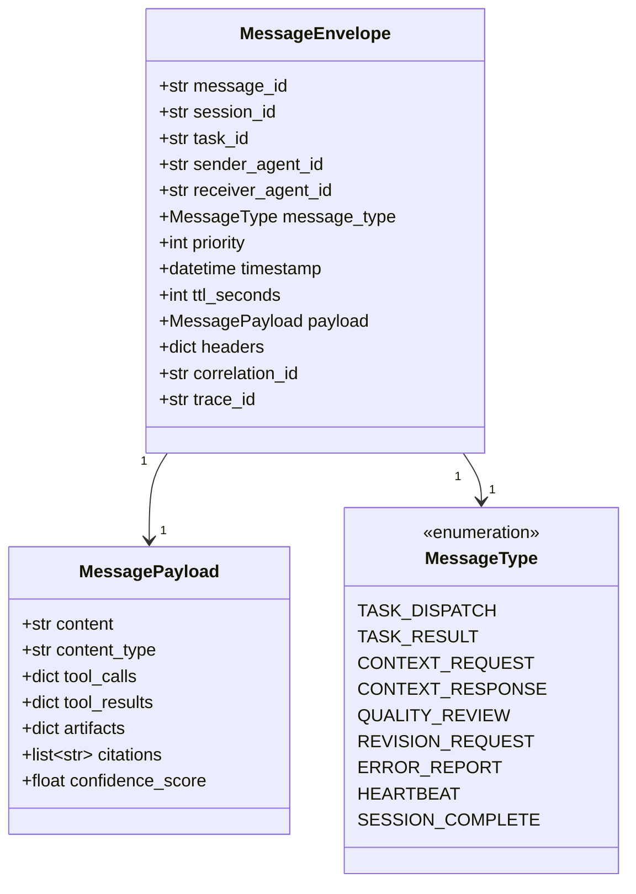
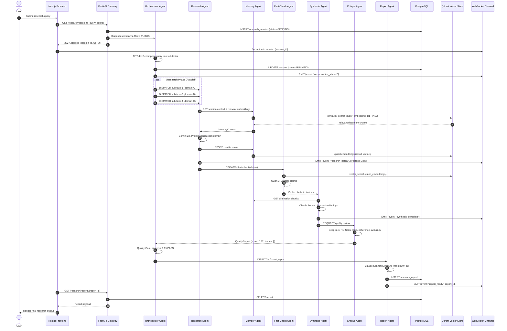
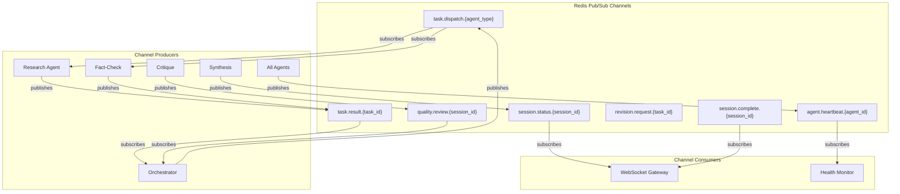
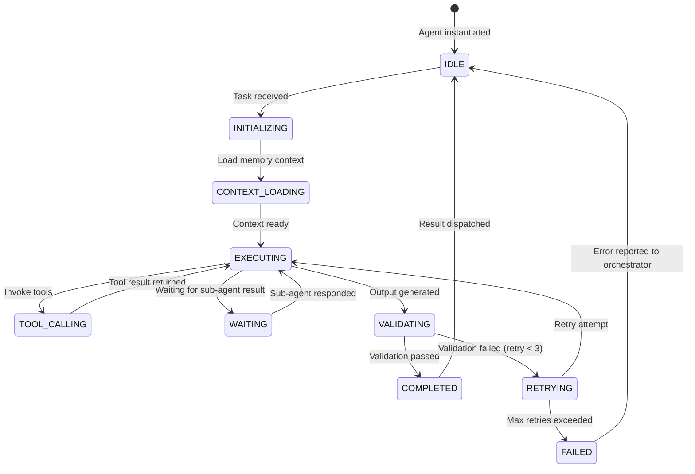

# 4. Agent Communication Workflow

## Communication Layers

Agent communication is implemented in **three layers**:

| Layer | Technology | Purpose |
|---|---|---|
| **Async Messaging** | Redis Pub/Sub | Real-time agent-to-agent event propagation |
| **State Sharing** | Redis Hash + LangGraph Checkpointer | Shared working memory within a session |
| **Persistent Protocol** | PostgreSQL | Durable audit trail of all agent messages |

---

## Message Envelope Schema

---

## End-to-End Research Workflow

---

## Redis Channel Architecture

---

## Agent Lifecycle State Machine

---

## Inter-Agent Trust Model

| Communication Path | Trust Level | Verification |
|---|---|---|
| Orchestrator → Research Agent | Full Trust | Shared session token |
| Research Agent → Memory Agent | Full Trust | Internal gRPC mTLS |
| Fact-Check → External KB | Limited Trust | API key + schema validation |
| Any Agent → LLM Provider | Untrusted Network | TLS + API key per provider |
| Agent → PostgreSQL | Service Trust | Service account + TLS |
| Agent → Redis | Internal Trust | Redis AUTH + ACLs |
