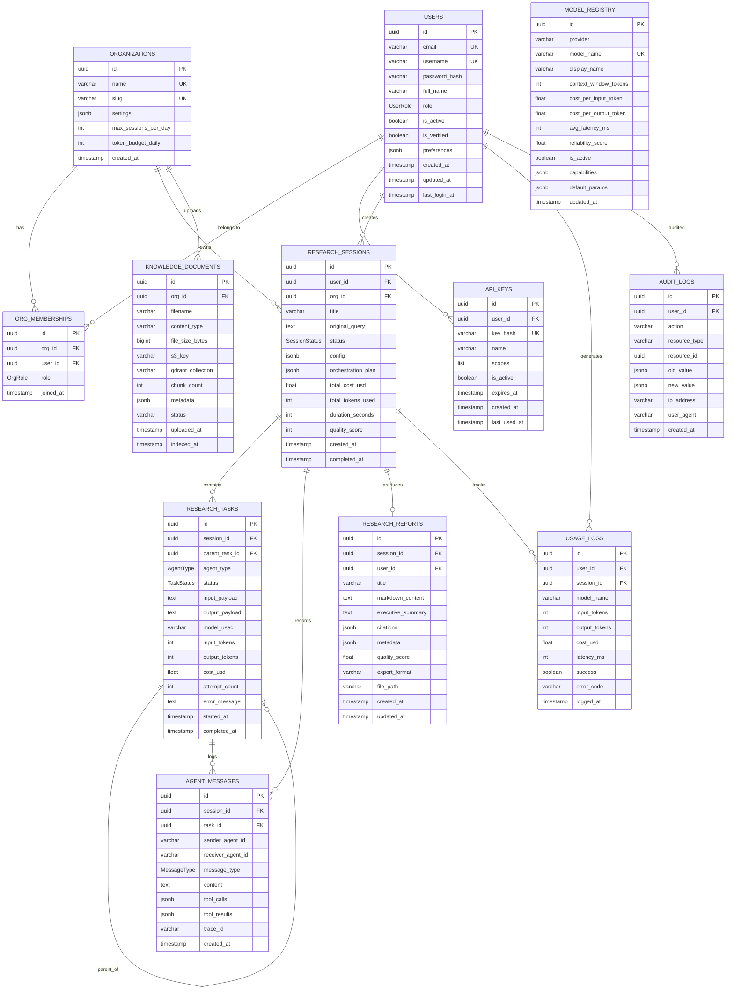
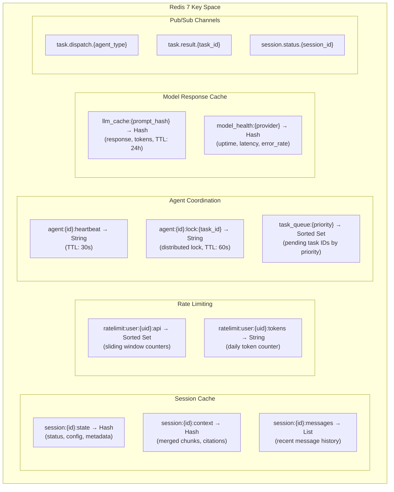
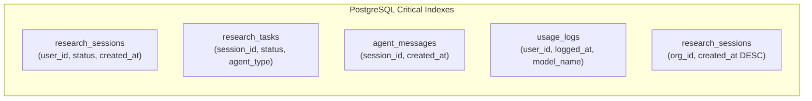

# 5. Database Design

## Storage Strategy Overview

| Store | Technology | Data Type | Retention |
|---|---|---|---|
| Relational | PostgreSQL 16 | Users, sessions, reports, audit logs | Permanent |
| Cache | Redis 7 | Session context, rate limits, pub/sub | TTL-based |
| Vector | Qdrant | Embeddings, semantic search | Permanent |
| Object | S3-compatible | Files, PDFs, exported reports | Permanent |

---

## PostgreSQL Entity-Relationship Diagram

---

## Redis Data Structures

---

## Qdrant Vector Collections

| Collection | Purpose | Vector Dim | Distance | Fields |
|---|---|---|---|---|
| `research_chunks` | Document chunks from research outputs | 1536 | Cosine | session_id, agent_id, timestamp, topic_tags |
| `knowledge_base` | Org-uploaded knowledge documents | 1536 | Cosine | org_id, document_id, chunk_index, source |
| `fact_claims` | Fact-check verified claims | 1536 | Cosine | session_id, verified, confidence, source |
| `agent_memories` | Episodic memories per agent | 1536 | Cosine | agent_type, session_id, importance_score |

---

## Database Indexes

---

## Data Partitioning Strategy

| Table | Partition Key | Strategy | Retention |
|---|---|---|---|
| `usage_logs` | `logged_at` | Range (monthly) | 12 months active, archive after |
| `audit_logs` | `created_at` | Range (quarterly) | 7 years (compliance) |
| `agent_messages` | `created_at` | Range (weekly) | 90 days active |
| `research_tasks` | `session_id` hash | Hash (16 shards) | Permanent |
