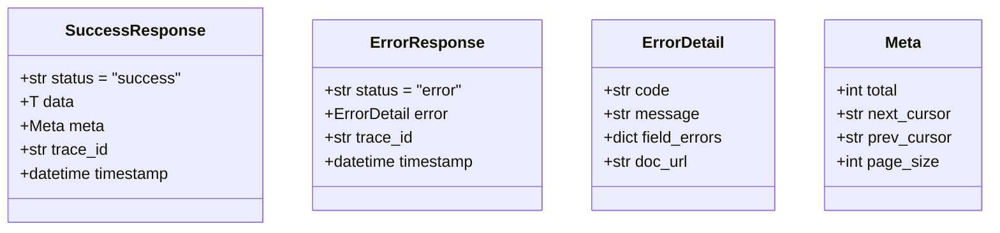
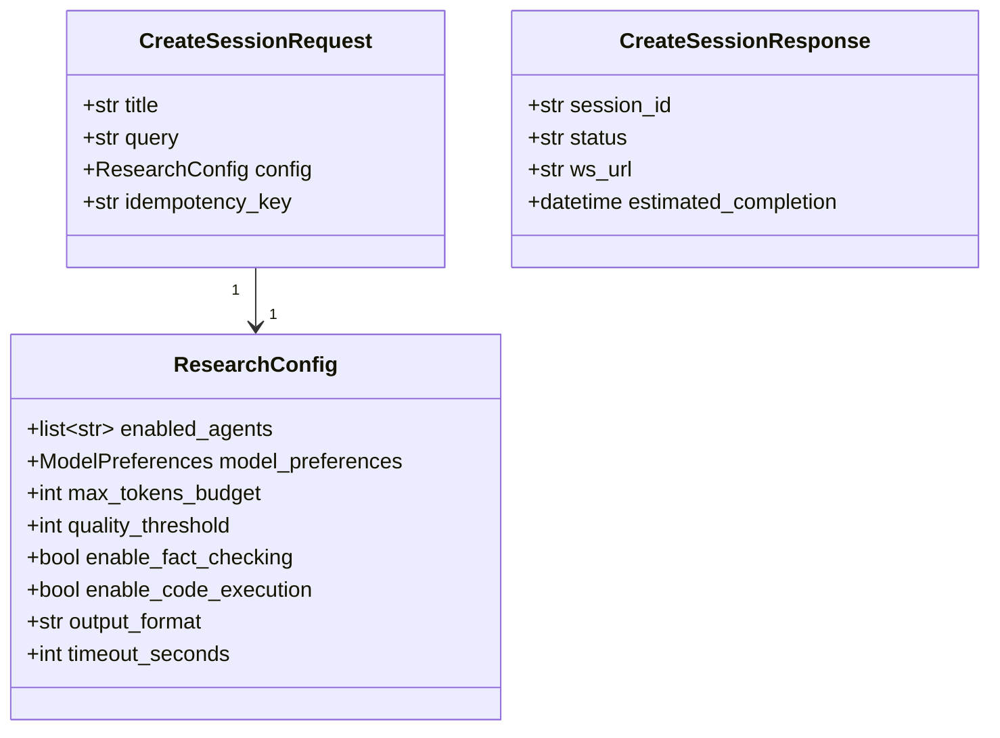
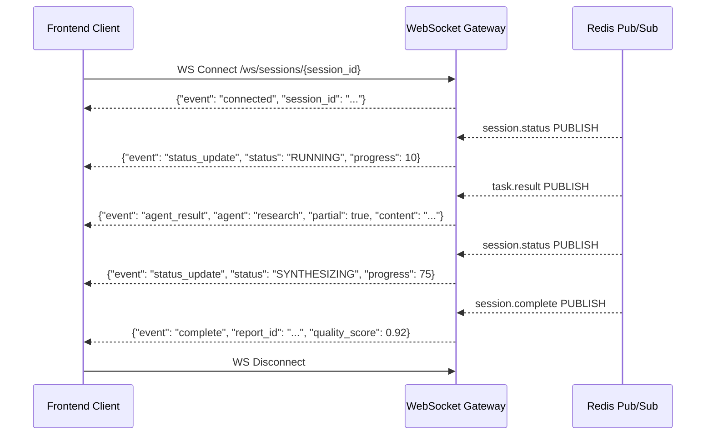
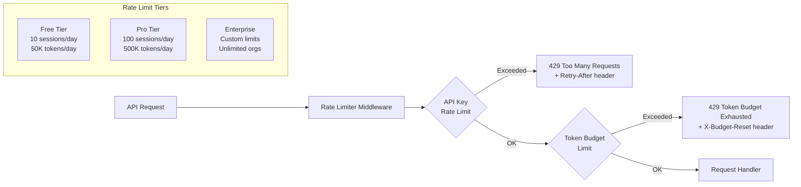
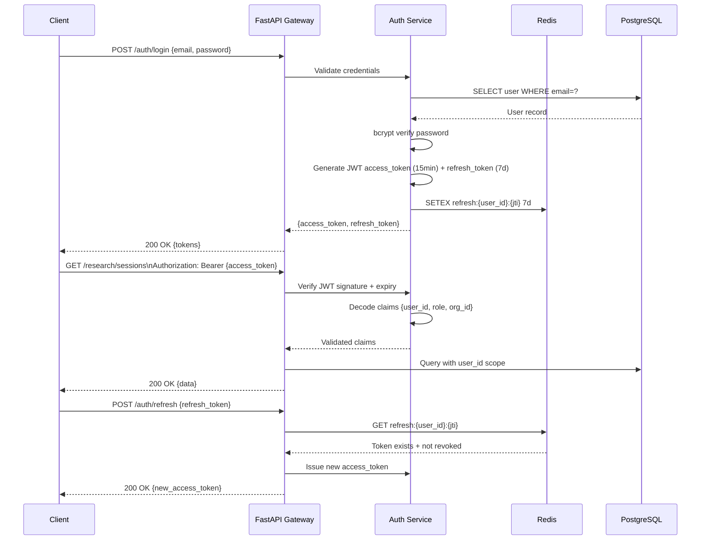

# 6. API Design

## API Design Principles

- **RESTful + WebSocket Hybrid**: REST for CRUD and control; WebSocket for real-time streaming
- **OpenAPI 3.1 First**: All endpoints auto-documented via FastAPI
- **Versioned URLs**: `/api/v1/` prefix for all routes
- **Consistent Envelope**: All responses wrapped in a standard envelope
- **Idempotent Operations**: POST requests with idempotency keys for safe retries
- **Cursor Pagination**: All list endpoints use cursor-based pagination

---

## Standard Response Envelope

---

## API Surface Map

```mermaid
flowchart TD
    API["/api/v1"] --> AUTH["/auth"]
    API --> USERS["/users"]
    API --> ORGS["/organizations"]
    API --> SESSIONS["/research/sessions"]
    API --> REPORTS["/research/reports"]
    API --> DOCS["/knowledge"]
    API --> MODELS["/models"]
    API --> AGENTS["/agents"]
    API --> HEALTH["/health"]
    API --> METRICS["/metrics"]
    API --> WS["/ws"]

    AUTH --> A1["POST /register"]
    AUTH --> A2["POST /login"]
    AUTH --> A3["POST /refresh"]
    AUTH --> A4["POST /logout"]
    AUTH --> A5["POST /api-keys"]

    SESSIONS --> S1["POST / — Create session"]
    SESSIONS --> S2["GET / — List sessions"]
    SESSIONS --> S3["GET /{id} — Get session detail"]
    SESSIONS --> S4["DELETE /{id} — Cancel session"]
    SESSIONS --> S5["GET /{id}/tasks — List tasks"]
    SESSIONS --> S6["GET /{id}/messages — Agent messages"]

    REPORTS --> R1["GET /{id} — Get report"]
    REPORTS --> R2["GET /{id}/export — Download PDF/MD"]
    REPORTS --> R3["POST /{id}/feedback — Rate report"]

    DOCS --> D1["POST /upload — Upload document"]
    DOCS --> D2["GET / — List documents"]
    DOCS --> D3["DELETE /{id} — Remove document"]
    DOCS --> D4["POST /search — Semantic search"]

    MODELS --> M1["GET / — List available models"]
    MODELS --> M2["GET /health — Model health status"]
    MODELS --> M3["GET /usage — Token usage stats"]

    WS --> W1["/ws/sessions/{id} — Real-time events"]
    WS --> W2["/ws/agents — Agent monitor stream"]
```

---

## Core API Endpoints Specification

### Research Sessions

| Method | Path | Description | Auth |
|---|---|---|---|
| `POST` | `/api/v1/research/sessions` | Create and start a new research session | Bearer |
| `GET` | `/api/v1/research/sessions` | List user's sessions (paginated) | Bearer |
| `GET` | `/api/v1/research/sessions/{session_id}` | Get full session details and status | Bearer |
| `DELETE` | `/api/v1/research/sessions/{session_id}` | Cancel a running session | Bearer |
| `GET` | `/api/v1/research/sessions/{session_id}/tasks` | List all agent tasks in session | Bearer |
| `GET` | `/api/v1/research/sessions/{session_id}/messages` | Retrieve agent message audit trail | Bearer |

### Create Session Request/Response

---

## WebSocket Event Protocol

### WebSocket Event Types

| Event | Direction | Payload |
|---|---|---|
| `connected` | Server → Client | `{session_id, user_id}` |
| `status_update` | Server → Client | `{status, progress_percent, message}` |
| `agent_started` | Server → Client | `{agent_type, task_id}` |
| `agent_result` | Server → Client | `{agent_type, task_id, partial, content}` |
| `quality_report` | Server → Client | `{score, issues[], passed}` |
| `complete` | Server → Client | `{report_id, quality_score, duration_s}` |
| `error` | Server → Client | `{code, message, recoverable}` |
| `ping` | Client → Server | `{}` |
| `cancel` | Client → Server | `{reason}` |

---

## Rate Limiting Strategy

---

## API Authentication Flow

