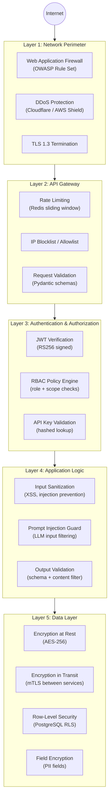
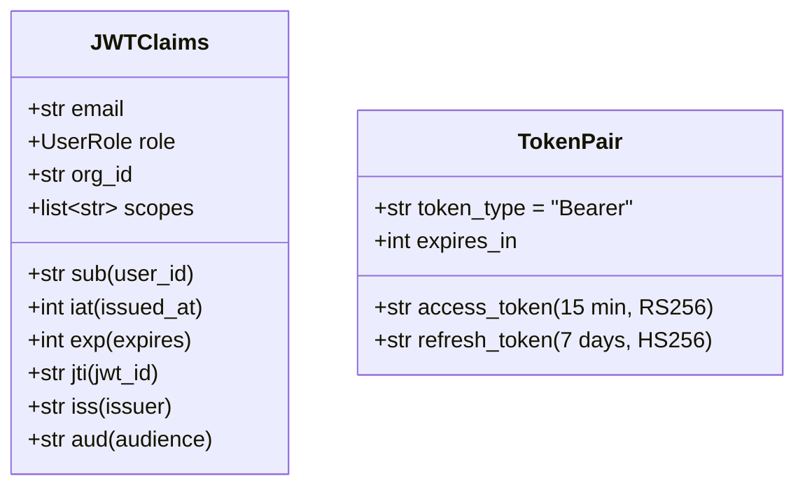
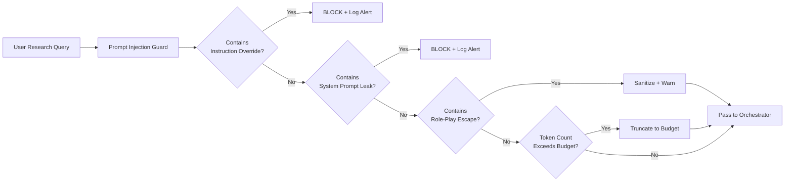
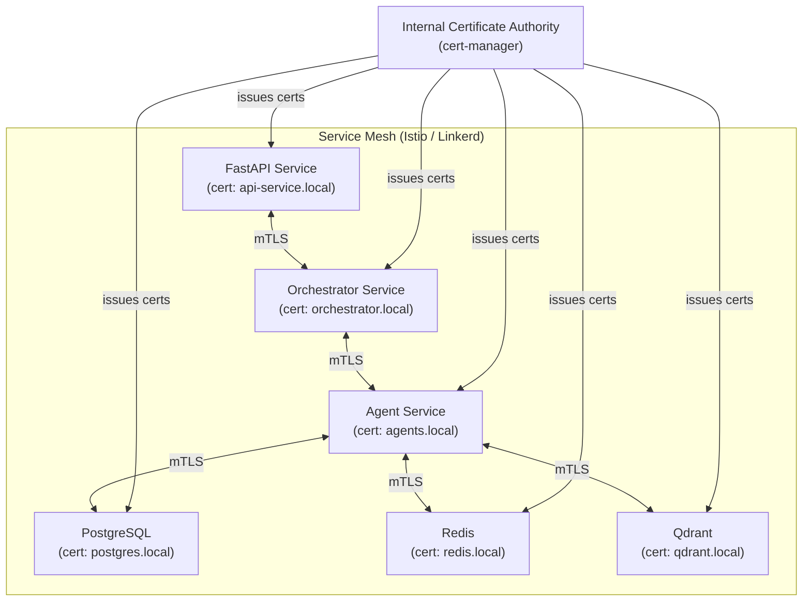
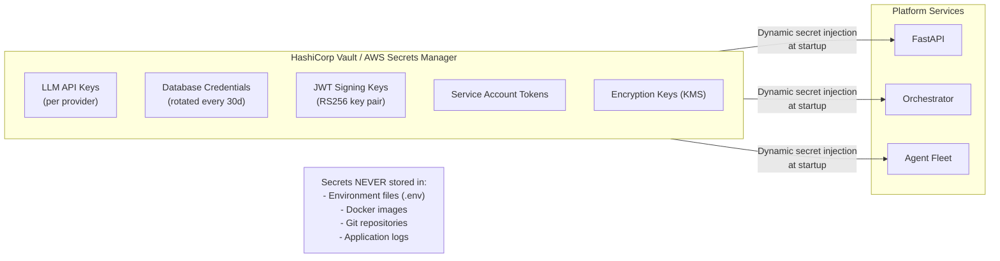
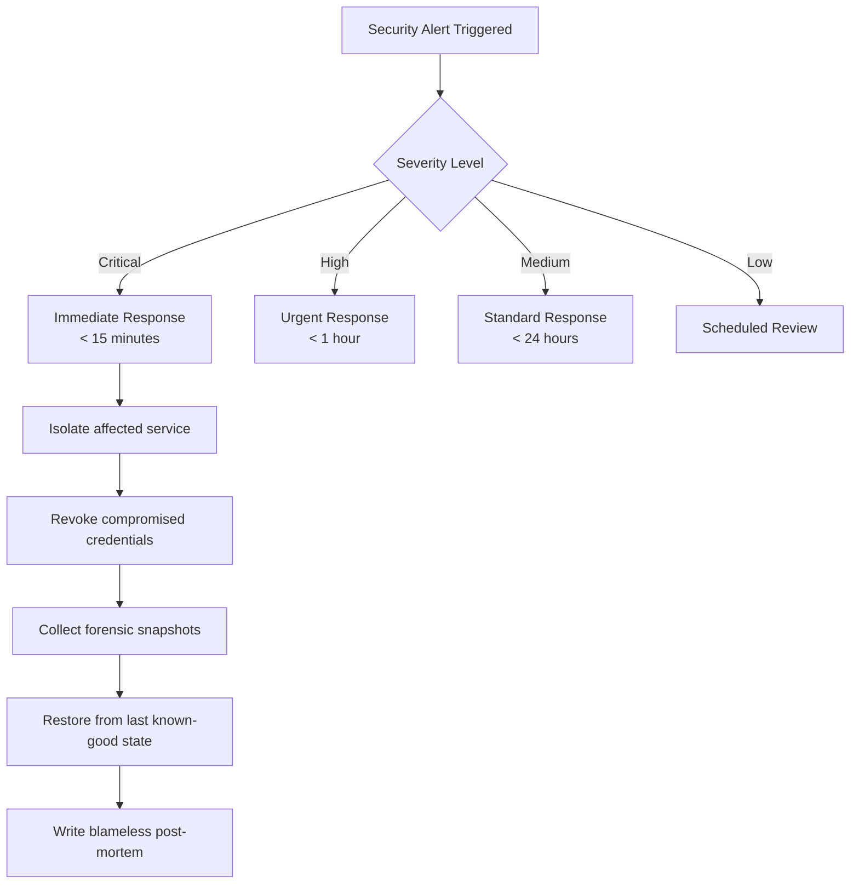

# 7. Security Architecture

## Security Design Philosophy

The platform follows a **Zero Trust Architecture (ZTA)** model: every request is authenticated, every action is authorized, and no implicit trust is granted based on network location or service identity.

---

## Defense-in-Depth Layers

---

## Authentication & Authorization

### JWT Token Structure

### RBAC Permission Matrix

| Resource | Researcher | Org Admin | Platform Admin |
|---|---|---|---|
| Create research session | ✅ Own | ✅ Org | ✅ All |
| View research session | ✅ Own | ✅ Org | ✅ All |
| Delete research session | ✅ Own | ✅ Org | ✅ All |
| Upload knowledge documents | ✅ Own | ✅ Org | ✅ All |
| Manage org members | ❌ | ✅ Org | ✅ All |
| Manage model registry | ❌ | ❌ | ✅ All |
| View usage/billing | ❌ | ✅ Org | ✅ All |
| Access audit logs | ❌ | ✅ Org | ✅ All |
| Manage platform config | ❌ | ❌ | ✅ All |

---

## Prompt Injection Defense

### Injection Pattern Detection Rules

| Pattern Category | Detection Method | Action |
|---|---|---|
| Direct override (`ignore previous`) | Regex + semantic similarity | Block |
| Jailbreak (`DAN`, role-play escapes) | Classifier model | Block |
| System prompt extraction | Pattern matching | Block |
| Indirect injection via documents | Content scanning at upload | Block |
| Token stuffing | Token count threshold | Truncate |
| Encoding attacks (Base64, Unicode) | Normalize + re-check | Sanitize |

---

## Service-to-Service Security (mTLS)

---

## Secrets Management

---

## Data Privacy & Compliance

| Requirement | Implementation |
|---|---|
| **PII Protection** | User email, name encrypted with application-level AES-256 |
| **GDPR Right to Erasure** | Soft delete + async PII scrubber job |
| **Data Residency** | Org-level configuration for data region (EU, US, APAC) |
| **LLM Data Policy** | No training data submission; API calls use `no-log` flags where available |
| **Audit Trail** | All mutations logged to immutable `audit_logs` table |
| **Encryption at Rest** | PostgreSQL + Qdrant volumes encrypted (AES-256 via OS/cloud) |
| **Key Rotation** | Automated 90-day rotation via Vault + cert-manager |
| **SOC 2 Type II** | Audit log completeness, access control reviews, incident response |

---

## Security Incident Response Flow

