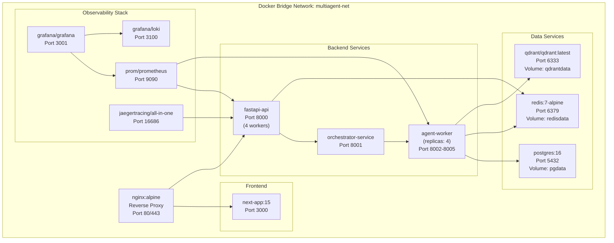
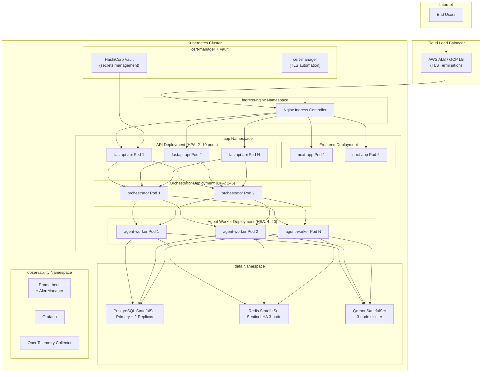

# 8. Deployment Architecture

## Deployment Philosophy

- **Container-First**: Every service runs in Docker containers
- **Infrastructure as Code**: All infrastructure defined via Docker Compose (dev) and Kubernetes manifests (production)
- **Immutable Deployments**: No in-place mutations; blue/green and canary releases
- **GitOps**: All deployments triggered by Git commits via CI/CD pipeline
- **12-Factor App Compliance**: Configuration via environment, stateless services, disposable containers

---

## Environment Tiers

| Environment | Infrastructure | Purpose |
|---|---|---|
| **Local Dev** | Docker Compose | Developer workstation, all services local |
| **CI** | GitHub Actions + Docker | Automated testing, lint, type-check |
| **Staging** | Kubernetes (small) | Integration testing, pre-prod validation |
| **Production** | Kubernetes (HA) | Live traffic, auto-scaling, full observability |

---

## Docker Compose Architecture (Development)



---

## Kubernetes Production Architecture



---

## CI/CD Pipeline

```mermaid
flowchart LR
    subgraph Dev["Developer"]
        CODE[Git Push\nto feature branch]
    end

    subgraph CI["GitHub Actions CI"]
        PR[Pull Request\nOpened]
        LINT[Lint + Type Check\n(ruff, mypy, eslint)]
        TEST[Unit Tests\n(pytest, jest)]
        BUILD[Docker Build\n(multi-stage)]
        SCAN[Security Scan\n(Trivy, Semgrep)]
        INT[Integration Tests\n(docker-compose up)]
    end

    subgraph CD["Continuous Delivery"]
        MERGE[Merge to main]
        TAG[Semantic Version\nTag (v1.2.3)]
        PUSH[Push to\nContainer Registry\n(ECR / GCR)]
        STAGE[Deploy to\nStaging (auto)]
        E2E[E2E Tests\n(Playwright)]
        PROD[Deploy to\nProduction (manual gate)]
    end

    CODE --> PR
    PR --> LINT
    LINT --> TEST
    TEST --> BUILD
    BUILD --> SCAN
    SCAN --> INT
    INT -->|All pass| MERGE
    MERGE --> TAG
    TAG --> PUSH
    PUSH --> STAGE
    STAGE --> E2E
    E2E -->|Approved| PROD
```

---

## Horizontal Pod Autoscaler Configuration

| Service | Min Replicas | Max Replicas | Scale Metric | Target |
|---|---|---|---|---|
| `fastapi-api` | 2 | 10 | CPU Utilization | 70% |
| `orchestrator` | 2 | 5 | CPU + Memory | 75% |
| `agent-worker` | 4 | 20 | Redis queue depth | < 100 tasks/pod |
| `next-app` | 2 | 6 | CPU Utilization | 70% |

---

## Resource Requests & Limits

| Service | CPU Request | CPU Limit | Memory Request | Memory Limit |
|---|---|---|---|---|
| `fastapi-api` | 500m | 2000m | 512Mi | 2Gi |
| `orchestrator` | 1000m | 4000m | 1Gi | 4Gi |
| `agent-worker` | 2000m | 8000m | 2Gi | 8Gi |
| `next-app` | 250m | 1000m | 256Mi | 1Gi |
| `postgres` | 2000m | 8000m | 4Gi | 16Gi |
| `redis` | 500m | 2000m | 512Mi | 4Gi |
| `qdrant` | 1000m | 4000m | 2Gi | 8Gi |

---

## Disaster Recovery Strategy

| Component | RTO | RPO | Strategy |
|---|---|---|---|
| PostgreSQL | < 1 hour | < 5 minutes | Streaming replication + hourly snapshots to S3 |
| Redis | < 15 minutes | < 1 minute | Redis Sentinel HA + AOF persistence |
| Qdrant | < 30 minutes | < 1 hour | Distributed snapshots to S3 |
| API Services | < 5 minutes | N/A (stateless) | Multi-AZ deployment, auto-restart |
| LangGraph State | < 10 minutes | < 30 seconds | PostgreSQL checkpointer |
