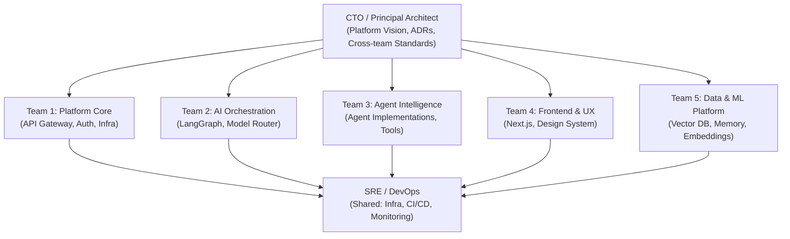
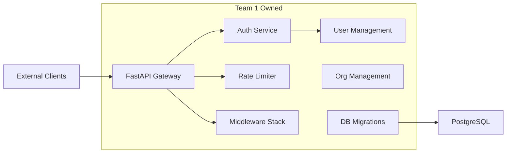
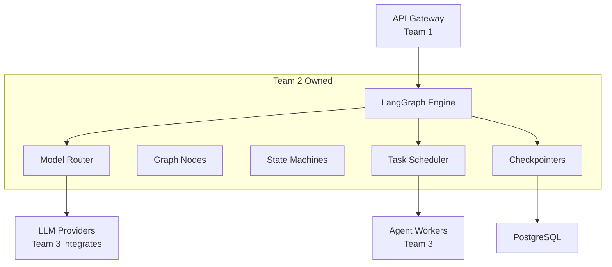
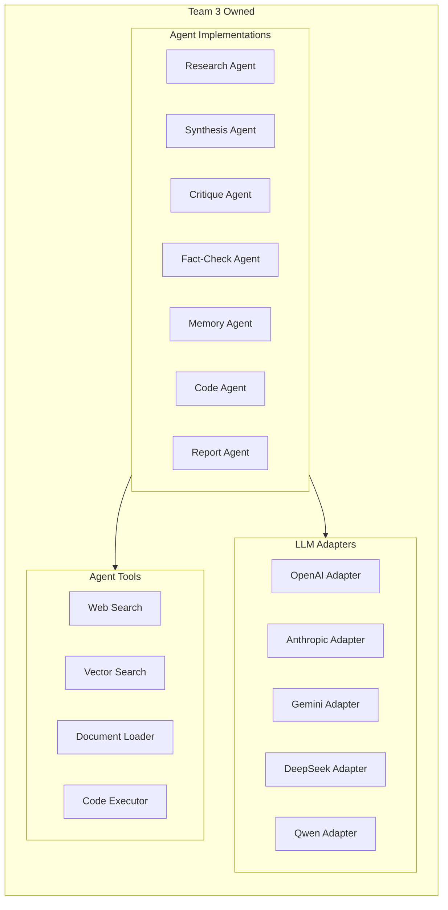
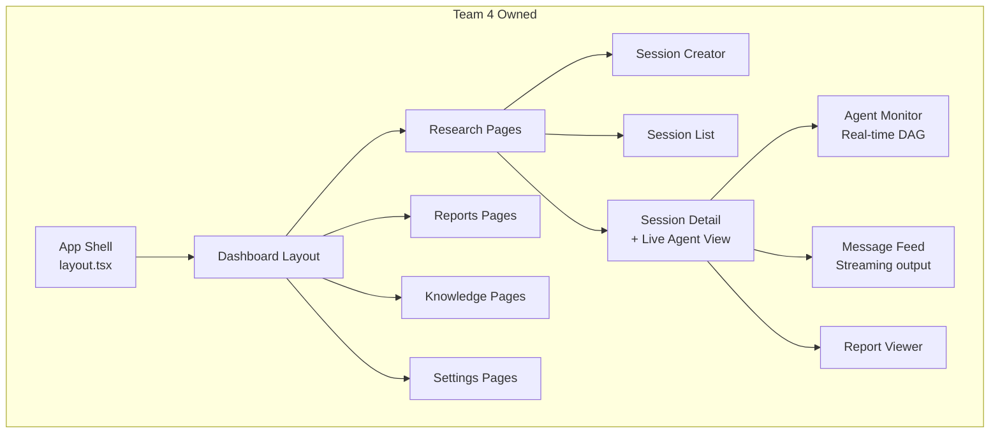
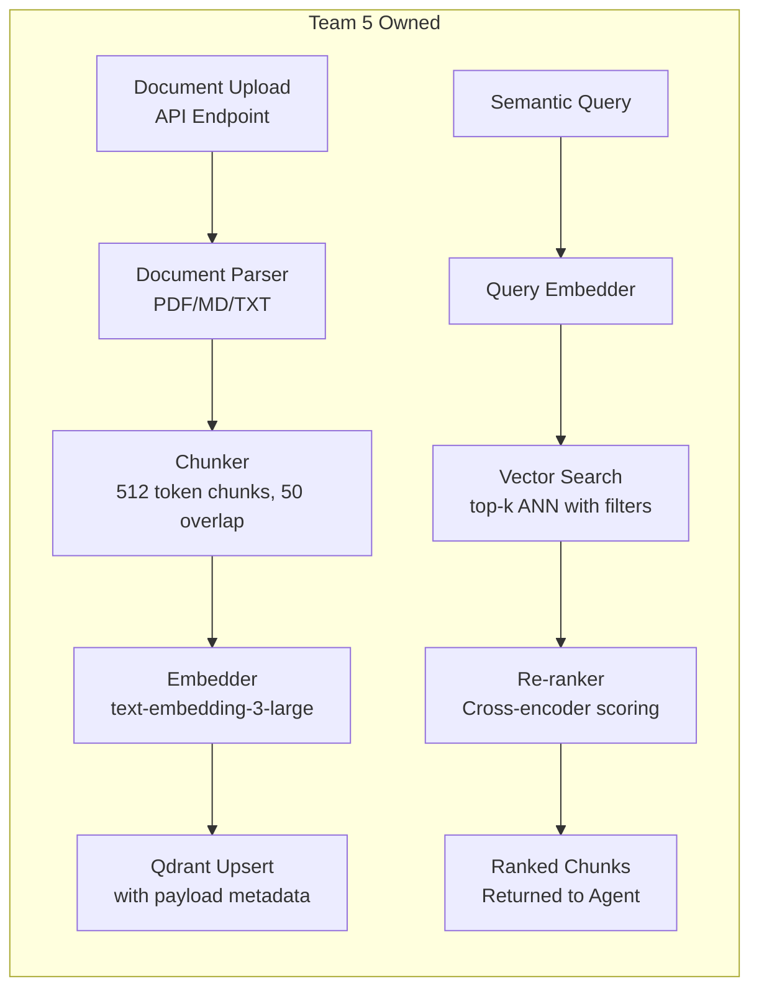
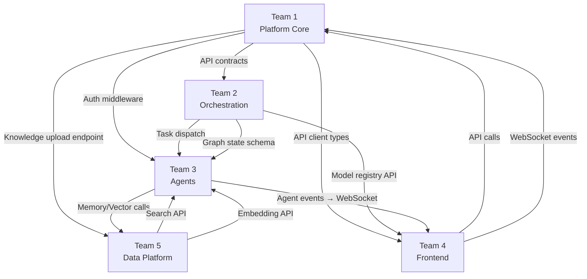

# 10. Team-Wise Module Separation

## Team Structure Overview

The platform is organized into **5 specialized engineering teams**, each owning distinct vertical slices of the system. Each team has full ownership — from design to deployment — of their modules.

---

## Team Topology

---

## Team 1: Platform Core

**Mission**: Build and maintain the API gateway, authentication, multi-tenancy, and all platform-wide infrastructure.

### Module Ownership

| Module | Path | Responsibility |
|---|---|---|
| API Gateway | `backend/app/api/` | All REST + WebSocket route definitions |
| Authentication | `backend/app/domain/auth/` | JWT, OAuth2, API key management |
| User Management | `backend/app/domain/users/` | User CRUD, profile, preferences |
| Organization | `backend/app/domain/organizations/` | Multi-tenancy, org membership, billing |
| Rate Limiting | `backend/app/core/rate_limiter.py` | Redis sliding window rate limits |
| Middleware | `backend/app/core/middleware.py` | Request logging, CORS, tracing injection |
| Database Migrations | `backend/alembic/` | Schema versioning and migrations |
| Shared Schemas | `shared/` | Cross-service Pydantic models and enums |
| Docker Compose | `docker-compose.yml` | Dev environment orchestration |

### Team 1 Architecture Responsibility

### Team 1 Service Level Objectives

| SLO | Target |
|---|---|
| API Gateway Availability | 99.95% |
| Auth response latency (p99) | < 50ms |
| Rate limiter latency (p99) | < 5ms |
| Migration deployment time | < 5 minutes |

---

## Team 2: AI Orchestration

**Mission**: Design and implement the LangGraph orchestration engine, model selection router, and task scheduling system.

### Module Ownership

| Module | Path | Responsibility |
|---|---|---|
| LangGraph Graphs | `orchestrator/orchestrator/graphs/` | Research, revision, and sub-task DAGs |
| LangGraph Nodes | `orchestrator/orchestrator/nodes/` | Intake, decompose, quality gate nodes |
| State Schemas | `orchestrator/orchestrator/state/` | Typed state objects for all workflows |
| Model Router | `orchestrator/orchestrator/router/` | TMFS scoring, failover logic |
| Checkpointer | `orchestrator/orchestrator/checkpointers/` | PostgreSQL-backed state persistence |
| Task Scheduler | `orchestrator/orchestrator/scheduler/` | Priority queue, fan-out/fan-in patterns |
| Model Registry | `backend/app/domain/models/` | Model capability database + health tracking |

### Team 2 Workflow Design Responsibility

### Team 2 Service Level Objectives

| SLO | Target |
|---|---|
| Orchestration scheduling latency | < 200ms |
| Graph checkpoint write time | < 100ms |
| Model failover time | < 5 seconds |
| Task queue throughput | > 500 tasks/minute |

---

## Team 3: Agent Intelligence

**Mission**: Implement all specialized agents, LLM adapter layer, and the tool ecosystem that agents use.

### Module Ownership

| Module | Path | Responsibility |
|---|---|---|
| Base Agent | `agents/agents/base_agent.py` | Abstract agent contract, retry logic |
| Research Agent | `agents/agents/implementations/research_agent.py` | Domain research, RAG retrieval |
| Synthesis Agent | `agents/agents/implementations/synthesis_agent.py` | Multi-source synthesis |
| Critique Agent | `agents/agents/implementations/critique_agent.py` | Quality scoring, logic evaluation |
| Fact-Check Agent | `agents/agents/implementations/factcheck_agent.py` | Claim validation |
| Memory Agent | `agents/agents/implementations/memory_agent.py` | Context management, episodic memory |
| Code Agent | `agents/agents/implementations/code_agent.py` | Code generation + sandboxed execution |
| Report Agent | `agents/agents/implementations/report_agent.py` | Report formatting and export |
| LLM Adapters | `agents/agents/llm_adapters/` | Unified interface for all 5 LLMs |
| Tools | `agents/agents/tools/` | Web search, vector search, code executor |
| Prompt Library | `agents/agents/prompts/` | System prompts and prompt templates |

### Team 3 Agent Ownership Map

### Team 3 Service Level Objectives

| SLO | Target |
|---|---|
| Agent task execution (p95) | < 30 seconds |
| LLM adapter call success rate | > 99.5% |
| Tool call failure rate | < 0.5% |
| Prompt injection block rate | > 99.9% |

---

## Team 4: Frontend & UX

**Mission**: Build the Next.js 15 research dashboard, design system, and real-time agent visualization.

### Module Ownership

| Module | Path | Responsibility |
|---|---|---|
| App Router Pages | `frontend/app/` | All pages and layouts |
| Design System | `frontend/components/ui/` | Buttons, inputs, modals, typography |
| Research Components | `frontend/components/research/` | Session cards, query builder, result viewer |
| Agent Monitor | `frontend/components/agents/` | Real-time agent DAG visualization |
| Charts & Analytics | `frontend/components/charts/` | Usage graphs, quality metrics |
| API Client | `frontend/lib/api-client.ts` | Type-safe HTTP client |
| WebSocket Client | `frontend/lib/ws-client.ts` | Real-time event handler |
| State Management | `frontend/stores/` | Zustand stores for global state |
| Auth Hooks | `frontend/hooks/` | Auth, session, WebSocket hooks |

### Team 4 Component Hierarchy

### Team 4 Service Level Objectives

| SLO | Target |
|---|---|
| First Contentful Paint | < 1.2 seconds |
| Core Web Vitals (LCP) | < 2.5 seconds |
| WebSocket reconnect time | < 3 seconds |
| Accessibility score (Lighthouse) | > 95 |

---

## Team 5: Data & ML Platform

**Mission**: Own the vector database, embedding pipeline, semantic search, and knowledge ingestion infrastructure.

### Module Ownership

| Module | Path | Responsibility |
|---|---|---|
| Memory Manager | `agents/agents/memory/context_manager.py` | Session context assembly |
| Embedder | `agents/agents/memory/embedder.py` | Text-to-vector embedding (OpenAI / local) |
| Qdrant Client | `agents/agents/memory/qdrant_client.py` | Collection management, upsert, search |
| Knowledge Service | `backend/app/domain/knowledge/` | Document upload, chunking, indexing API |
| Document Loader | `agents/agents/tools/document_loader.py` | PDF/TXT/Markdown parsing + chunking |
| Vector Search Tool | `agents/agents/tools/vector_search.py` | Semantic search with metadata filters |
| Qdrant Infrastructure | `infra/k8s/base/qdrant/` | Cluster config, snapshots, backups |
| Embedding Models | `agents/agents/memory/embedding_config.py` | Model selection for embedding generation |

### Team 5 Data Pipeline

### Team 5 Service Level Objectives

| SLO | Target |
|---|---|
| Document indexing time (per MB) | < 10 seconds |
| Vector search latency (p99) | < 50ms |
| Embedding generation throughput | > 1000 chunks/minute |
| Search recall@10 | > 90% |

---

## Cross-Team Dependency Map

---

## Team Interface Contracts

| Interface | Consumer | Provider | Contract Type |
|---|---|---|---|
| `POST /research/sessions` | Team 4 (UI) | Team 1 (API) | OpenAPI 3.1 spec |
| `Redis PUBLISH task.*` | Team 2 → Team 3 | MessageEnvelope schema | AsyncAPI spec |
| `MemoryContext` return type | Team 3 (Agents) | Team 5 (Memory) | Pydantic schema |
| `WebSocket event payload` | Team 4 (UI) | Team 1 (WS Gateway) | TypeScript types |
| `Qdrant collection schema` | Team 3 (Agents) | Team 5 (Data) | Collection config doc |
| `ModelConfig` schema | Team 2 (Router) | Team 3 (Adapters) | Shared Pydantic model |

---

## Team Collaboration Cadence

| Meeting | Frequency | Participants | Purpose |
|---|---|---|---|
| Architecture Review | Bi-weekly | All TLs + Architect | ADRs, cross-cutting decisions |
| API Contract Review | Weekly | T1 + T4 | Frontend-backend alignment |
| Agent Sprint Review | Weekly | T2 + T3 | Workflow + agent coordination |
| Data Platform Sync | Weekly | T3 + T5 | Memory and search API changes |
| All-Hands Engineering | Monthly | All teams | Platform vision, metrics review |
