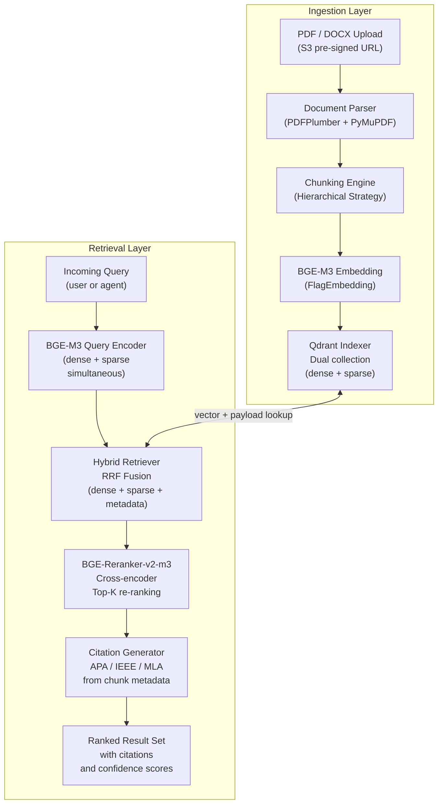
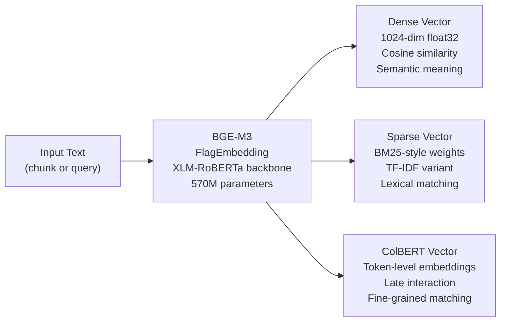
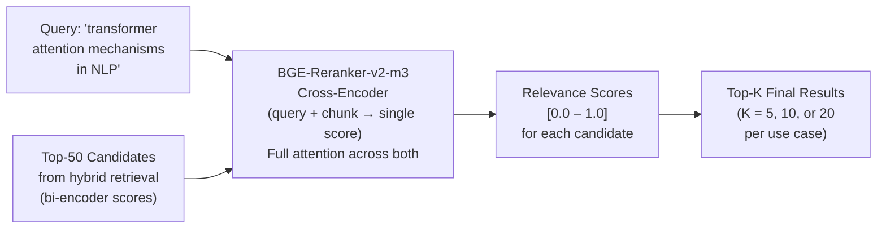
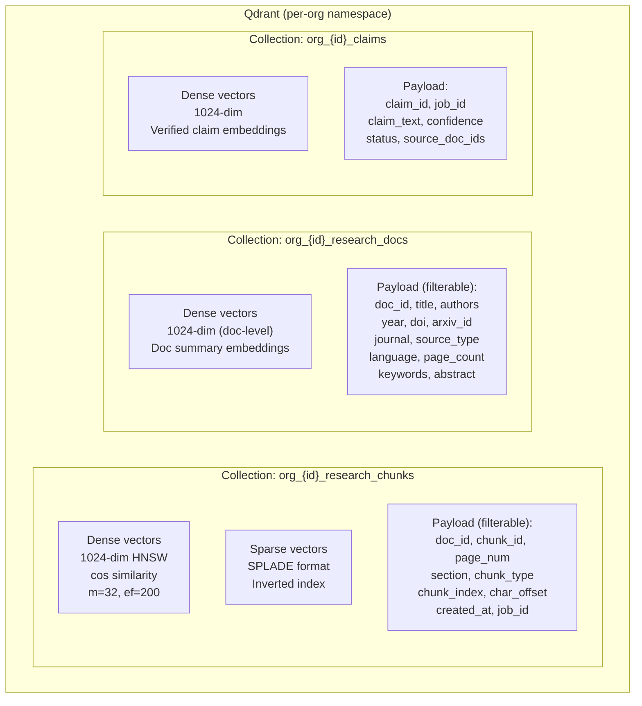
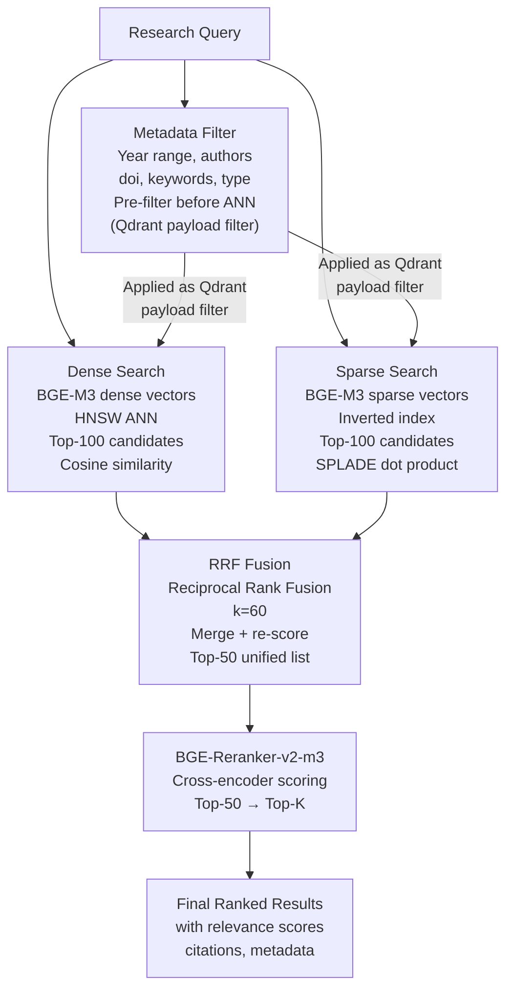
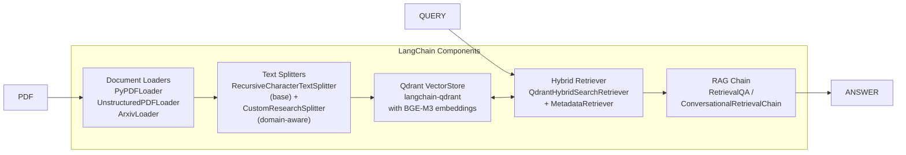

# Research RAG Engine — Retrieval Architecture

## System Overview

The Research RAG Engine is a **production-grade, hybrid retrieval system** purpose-built for academic and enterprise research documents. It combines dense semantic search (BGE-M3), sparse lexical search (BM25), and cross-encoder re-ranking (BGE-Reranker-v2-m3) to deliver the highest-precision retrieval for research queries.



---

## Core Components

### Component 1 — BGE-M3 Embedding Model

BGE-M3 is the cornerstone of the system — a single model that produces **three complementary representations simultaneously**:



| Representation | Dimension | Search Type | Best For |
|---|---|---|---|
| **Dense** | 1024 float32 | Cosine similarity | Semantic / conceptual queries |
| **Sparse** | Variable (SPLADE) | Dot product on sparse index | Exact term, keyword, technical jargon |
| **ColBERT** | 128 × token_count | MaxSim aggregation | Fine-grained multi-aspect matching |

**Why BGE-M3?** — Single model inference produces all three representations in one forward pass. No separate BM25 index maintenance. State-of-the-art on BEIR benchmark across 18 retrieval tasks.

---

### Component 2 — BGE-Reranker-v2-m3

Cross-encoder that sees both the query and candidate chunk simultaneously — far more accurate than bi-encoder retrieval but too expensive for full corpus scanning:



**Cross-encoder advantage**: The model sees query and document together — it can detect relevance that a bi-encoder misses (negation, implicit context, multi-hop relevance).

---

### Component 3 — Qdrant Collection Architecture



### Qdrant Index Configuration

| Parameter | Value | Rationale |
|---|---|---|
| **HNSW m** | 32 | Graph connectivity — higher = better recall, more memory |
| **HNSW ef_construct** | 200 | Build-time graph quality |
| **HNSW ef (query)** | 128 | Search-time beam width |
| **Distance** | Cosine | Normalized BGE-M3 embeddings |
| **Quantization** | Scalar (int8) | 4× memory reduction, <1% recall loss |
| **On-disk payload** | No | Payloads in RAM for fast filter pushdown |
| **Replication factor** | 2 | HA — one node failure transparent |
| **Shard count** | 2 per collection | Horizontal scaling across nodes |

---

### Component 4 — Hybrid Retrieval Fusion (RRF)

Reciprocal Rank Fusion combines dense and sparse results without requiring score normalization:

```
RRF_score(doc) = Σ [ 1 / (k + rank_in_list_i) ]
                  i

where k = 60 (smoothing constant)
      rank_in_list_i = position in each ranked list (1-indexed)
```



---

### Component 5 — LangChain Integration Layer

LangChain serves as the **orchestration glue** connecting all retrieval components:



---

## Collection Schema — Full Payload Definition

### `research_chunks` Collection Payload

```json
{
  "chunk_id":        "chunk_doc123_004",
  "doc_id":          "doc_abc123",
  "job_id":          "job_xyz789",
  "org_id":          "org_456",
  "source_type":     "pdf | arxiv | web | manual",
  "chunk_index":     4,
  "total_chunks":    47,
  "page_number":     3,
  "page_range":      [3, 4],
  "char_offset":     1240,
  "char_length":     512,
  "chunk_type":      "abstract | introduction | methodology | results | discussion | conclusion | references | table | figure_caption | equation",
  "section_title":   "3. Methodology",
  "section_level":   2,
  "text_preview":    "First 200 chars of chunk...",
  "has_table":       false,
  "has_equation":    true,
  "has_figure":      false,
  "language":        "en",
  "token_count":     128,
  "embedding_model": "BAAI/bge-m3",
  "embedding_dim":   1024,
  "indexed_at":      "2026-06-03T08:00:00Z"
}
```

### `research_docs` Collection Payload

```json
{
  "doc_id":          "doc_abc123",
  "org_id":          "org_456",
  "job_id":          "job_xyz789",
  "title":           "Attention Is All You Need",
  "authors":         ["Vaswani, A.", "Shazeer, N.", "Parmar, N."],
  "year":            2017,
  "doi":             "10.48550/arXiv.1706.03762",
  "arxiv_id":        "1706.03762",
  "journal":         "NeurIPS 2017",
  "source_type":     "arxiv",
  "url":             "https://arxiv.org/abs/1706.03762",
  "abstract":        "We propose a new simple network architecture...",
  "keywords":        ["transformer", "attention", "NLP", "sequence-to-sequence"],
  "language":        "en",
  "page_count":      15,
  "chunk_count":     47,
  "level_of_evidence": "conference_paper",
  "citation_count":  120000,
  "is_open_access":  true,
  "license":         "arXiv",
  "s3_key":          "org_456/docs/doc_abc123/original.pdf",
  "processing_status": "indexed",
  "uploaded_at":     "2026-06-03T08:00:00Z",
  "indexed_at":      "2026-06-03T08:05:00Z"
}
```

---

## Source Ranking Algorithm

Final ranking combines multiple signals for research quality:

```
final_score(doc) = α × reranker_score
                 + β × relevance_score      (from retrieval)
                 + γ × source_quality_score
                 + δ × recency_score
                 + ε × citation_weight

where:
  α = 0.45   (reranker is primary signal)
  β = 0.25   (retrieval relevance)
  γ = 0.15   (source quality)
  δ = 0.10   (recency)
  ε = 0.05   (citation count weight)
  α + β + γ + δ + ε = 1.0

source_quality_score:
  tier_1 (peer-reviewed, .edu, .gov) = 1.0
  tier_2 (established media, preprints) = 0.7
  tier_3 (blogs, forums) = 0.4

recency_score:
  current_year = 1.0
  1 year ago   = 0.9
  2 years ago  = 0.8
  5 years ago  = 0.5
  10+ years ago = 0.2 (unless seminal)

citation_weight:
  citations >= 1000 = 1.0
  citations >= 100  = 0.7
  citations >= 10   = 0.4
  citations < 10    = 0.2
  unknown           = 0.3
```
