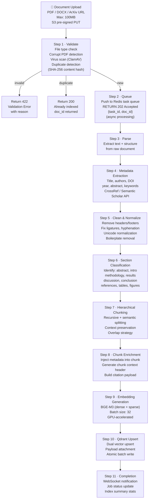
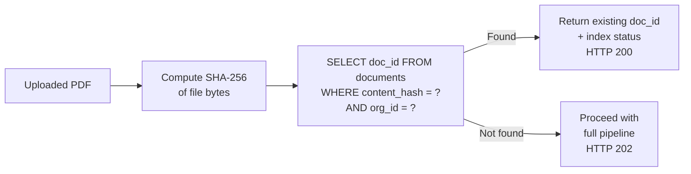
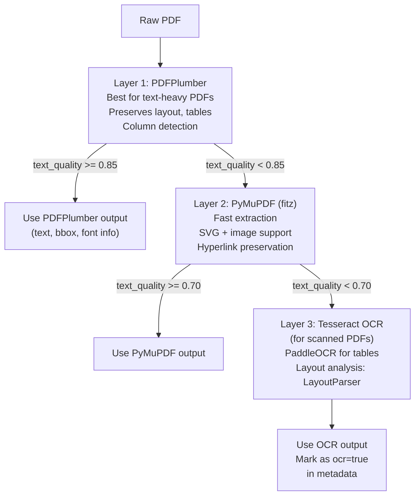
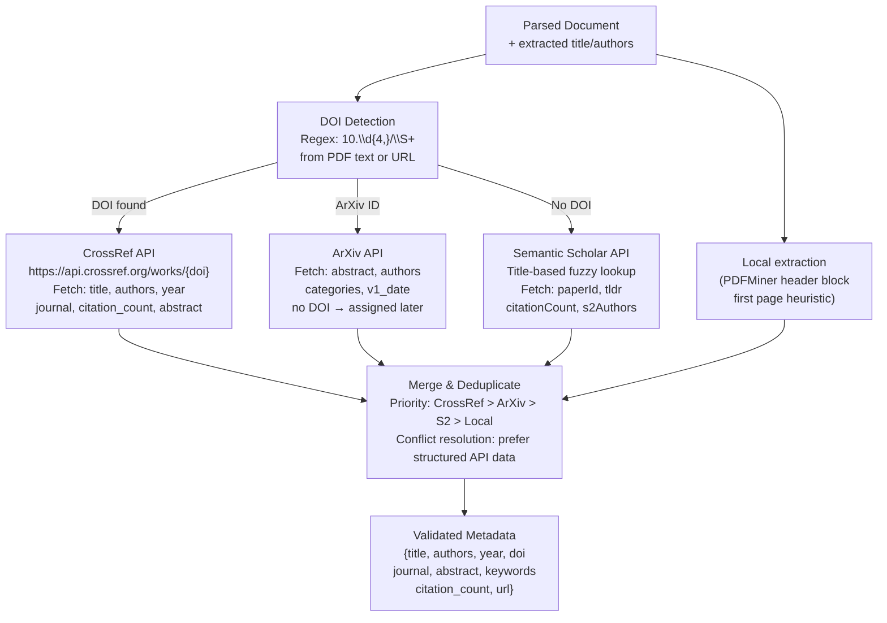
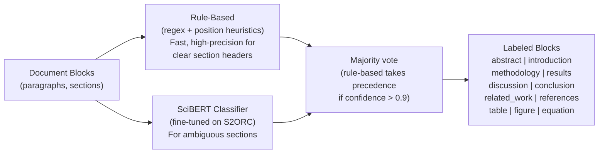
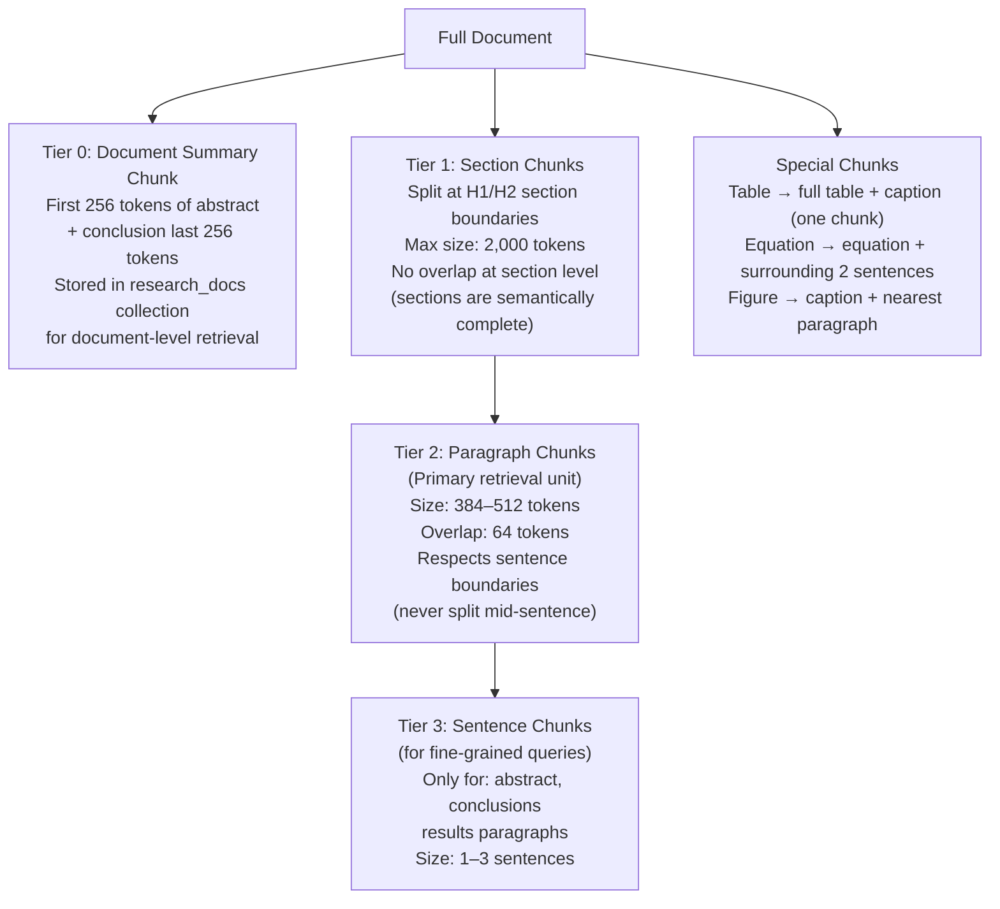
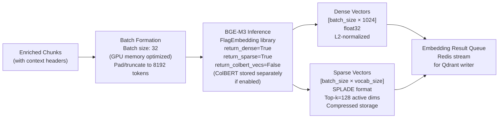
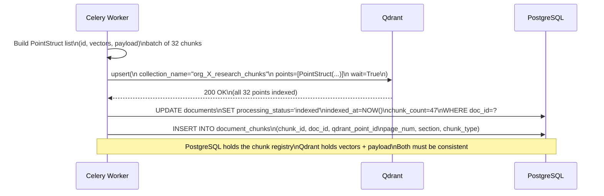

# Research RAG Engine — Indexing Pipeline

## Pipeline Overview

The indexing pipeline transforms raw research documents (PDF, DOCX, ArXiv) into richly-annotated, semantically-indexed chunks stored in Qdrant. The pipeline is **asynchronous, fault-tolerant, and idempotent** — re-uploading the same document produces the same result.



---

## Step 1 — Document Upload & Validation

### Upload Protocol

```
POST /api/v1/documents/upload
Content-Type: multipart/form-data
Authorization: Bearer {token}

Form fields:
  file:       PDF binary (max 100MB)
  source_url: optional (ArXiv, DOI URL)
  project_id: UUID (associate with research project)
  job_id:     UUID (optional — link to active research job)
  metadata:   JSON string (optional overrides)
```

### Validation Checks

| Check | Method | Failure Action |
|---|---|---|
| File type | Magic bytes (not just extension) | Reject 422 |
| PDF corruption | PyPDF2 structure check | Reject 422 |
| File size | ≤ 100MB | Reject 413 |
| Virus scan | ClamAV daemon | Reject 422 + alert |
| Duplicate detection | SHA-256 content hash vs PostgreSQL | Return existing doc_id |
| Encoding check | chardet for text PDFs | Log warning, proceed |
| Page count | ≤ 1,000 pages | Warn + proceed (split) |

### Duplicate Detection



---

## Step 2 — Async Task Queue

All processing is asynchronous — the API returns `202 Accepted` immediately. Users poll status or receive WebSocket updates:

```
Redis Task Queue: rag:tasks:org:{org_id}:index
Task payload: {
  task_id:    UUID,
  doc_id:     UUID,
  org_id:     UUID,
  job_id:     UUID | null,
  s3_key:     "org_xxx/docs/doc_yyy/original.pdf",
  priority:   1 (high) | 2 (normal) | 3 (batch),
  created_at: ISO8601,
  retry_count: 0
}

Workers: Celery workers (4 concurrent per node)
Queue priority: HIGH > NORMAL > BATCH
Dead letter queue: rag:tasks:dlq (after 3 failures)
```

---

## Step 3 — Document Parsing

### PDF Parsing Strategy (Layered Fallback)



**Text quality score** = `(readable_chars / total_chars)` — low score indicates scanned/image-based PDF.

### Parsed Document Structure

```json
{
  "doc_id":      "doc_abc123",
  "raw_text":    "..full document text..",
  "pages": [
    {
      "page_num": 1,
      "text":     "..page 1 text..",
      "blocks": [
        {
          "type":   "text | table | figure | equation | header | footer",
          "text":   "..block text..",
          "bbox":   [x0, y0, x1, y1],
          "font":   "Times-Roman",
          "size":   12,
          "bold":   false
        }
      ],
      "tables": [
        {
          "table_id": "tbl_001",
          "caption":  "Table 1: Experimental Results",
          "headers":  ["Method", "Accuracy", "F1"],
          "rows":     [["BERT", "92.4", "91.8"]],
          "markdown_repr": "| Method | Accuracy | F1 |\n|---|---|---|\n| BERT | 92.4 | 91.8 |"
        }
      ]
    }
  ],
  "total_pages":    15,
  "parser_used":    "pdfplumber",
  "text_quality":   0.96,
  "has_tables":     true,
  "has_equations":  true,
  "has_figures":    true
}
```

---

## Step 4 — Metadata Extraction

### Automated Metadata Resolution



### Metadata Schema (Final)

| Field | Source | Fallback |
|---|---|---|
| `title` | CrossRef / ArXiv | PDF first-page header extraction |
| `authors` | CrossRef / ArXiv | PDF author block regex |
| `year` | CrossRef / ArXiv | PDF date extraction |
| `doi` | PDF text / URL | Semantic Scholar lookup |
| `arxiv_id` | URL / PDF | None |
| `journal` | CrossRef | PDF header text |
| `abstract` | CrossRef / ArXiv | First paragraph heuristic |
| `keywords` | CrossRef / RAKE | TF-IDF top-10 terms from full text |
| `citation_count` | CrossRef / S2 | 0 (unknown) |
| `level_of_evidence` | Rule-based classifier | `unknown` |

---

## Step 5 — Text Cleaning & Normalization

### Cleaning Operations (in order)

```
1. Remove page headers/footers
   - Detect: repeated text across 3+ pages at top/bottom → header/footer
   - Action: strip from all pages

2. Fix ligatures
   - fi → fi, fl → fl, ffi → ffi, ffl → ffl (Unicode ligature decoding)

3. Fix hyphenation
   - "trans-\nformer" → "transformer" (end-of-line hyphenation)
   - Preserve: "state-of-the-art" (mid-line hyphenation kept)

4. Unicode normalization
   - NFKC normalization for all text
   - Convert: curly quotes → straight, em-dash → --

5. Reference section removal from chunks
   - Detect [References] / [Bibliography] section header
   - Store separately as reference_text (for citation extraction only)
   - Do NOT chunk reference section into retrieval corpus

6. Boilerplate removal
   - Strip: "This article is protected by copyright..."
   - Strip: "Downloaded from..." / "Accepted manuscript..."
   - Strip: journal submission headers

7. Table preservation
   - Tables → Markdown table format
   - Include column headers + caption as context
   - Index as separate chunk type = "table"
```

---

## Step 6 — Section Classification

Uses a **rule-based + ML classifier** (fine-tuned SciBERT) to label each block:



### Section Priority in Retrieval

Different sections have different retrieval weights:

| Section | Chunk Priority | Rationale |
|---|---|---|
| `abstract` | HIGH | Dense summary of entire paper |
| `methodology` | HIGH | Technical details most queried |
| `results` | HIGH | Core findings |
| `conclusion` | HIGH | Synthesized findings |
| `introduction` | MEDIUM | Context and problem statement |
| `discussion` | MEDIUM | Interpretation layer |
| `related_work` | LOW | Background only |
| `references` | NONE | Not chunked for retrieval |
| `table` | HIGH | Data-dense, precise |
| `equation` | MEDIUM | Indexed with context |

---

## Step 7 — Hierarchical Chunking Strategy

The chunking strategy is **hierarchical** — preserving document structure while creating retrieval-optimal chunks:

### Chunking Tiers



### Chunking Parameters

| Chunk Type | Size (tokens) | Overlap | Splitter |
|---|---|---|---|
| Document summary | 512 (fixed) | 0 | First + last paragraphs |
| Section | up to 2,000 | 0 | H1/H2 headers |
| Paragraph (primary) | 384–512 | 64 tokens | RecursiveChar + sentence-aware |
| Sentence (fine) | 64–128 | 16 tokens | spaCy sentence boundary |
| Table | Variable | 0 | Table block (atomic) |
| Equation | Context ± 2 sentences | 0 | Block + context window |

### Context Header Injection

Each chunk gets a **context header** prepended before embedding — proven to improve retrieval by 20-30%:

```
[CONTEXT HEADER — prepended before embedding, not stored in chunk text]

Document: "Attention Is All You Need" (Vaswani et al., 2017)
Section: 3. Model Architecture → 3.2 Attention
Chunk type: methodology | Page 4 of 15

[CHUNK TEXT BEGINS]
An attention function can be described as mapping a query and a set of key-value 
pairs to an output, where the query, keys, values, and output are all vectors...
```

This means the embedding captures both **what the chunk says** and **where it fits** in the document.

---

## Step 8 — Chunk Enrichment

Before embedding, each chunk is enriched with all metadata needed for retrieval-time filtering and citation generation:

```json
{
  "enriched_chunk": {
    "chunk_id":        "chunk_doc123_042",
    "doc_id":          "doc_abc123",
    "text_with_header":"[CONTEXT HEADER...]\n[CHUNK TEXT...]",
    "text_clean":      "[CHUNK TEXT ONLY — stored in Qdrant payload]",
    "section":         "3.2 Attention",
    "section_level":   2,
    "chunk_type":      "methodology",
    "page_range":      [4, 5],
    "char_offset":     12400,
    "token_count":     432,
    "citation": {
      "apa":   "Vaswani, A., et al. (2017). Attention Is All You Need. NeurIPS.",
      "ieee":  "[1] A. Vaswani et al., 'Attention Is All You Need,' in NeurIPS, 2017.",
      "mla":   "Vaswani, Ashish, et al. \"Attention Is All You Need.\" NeurIPS, 2017.",
      "inline": "(Vaswani et al., 2017, p. 4)"
    },
    "doc_metadata": {
      "title":   "Attention Is All You Need",
      "authors": ["Vaswani, A.", "Shazeer, N."],
      "year":    2017,
      "doi":     "10.48550/arXiv.1706.03762",
      "journal": "NeurIPS 2017"
    }
  }
}
```

---

## Step 9 — Embedding Generation

### BGE-M3 Batch Embedding



### Embedding Throughput

| Hardware | Batch Size | Throughput | Cost Estimate |
|---|---|---|---|
| A100 80GB | 64 | ~2,000 chunks/min | $2.50/hr GPU |
| RTX 4090 | 32 | ~800 chunks/min | On-premise |
| CPU (32-core) | 8 | ~120 chunks/min | Fallback only |

For a typical 15-page research paper (~50 chunks): **embedding time ≈ 2 seconds on GPU**.

---

## Step 10 — Qdrant Upsert

### Atomic Batch Upsert Protocol



### Upsert Failure Handling

| Failure | Recovery |
|---|---|
| Qdrant connection error | Retry with exponential backoff (3x) |
| Partial batch failure | Re-upsert failed points individually |
| Collection not found | Auto-create collection with config, retry |
| PostgreSQL write failure | Mark chunks as `vector_indexed=true, pg_indexed=false`, reconcile job runs every 5 min |
| Worker crash mid-batch | Idempotent upsert — re-run from last successful batch checkpoint |

---

## Step 11 — Completion Events

```json
// WebSocket event on job completion
{
  "event":       "document_indexed",
  "doc_id":      "doc_abc123",
  "job_id":      "job_xyz789",
  "task_id":     "task_001",
  "status":      "success",
  "stats": {
    "total_pages":          15,
    "total_chunks":         47,
    "paragraph_chunks":     38,
    "table_chunks":         4,
    "equation_chunks":      5,
    "embedding_model":      "BAAI/bge-m3",
    "dense_vectors":        47,
    "sparse_vectors":       47,
    "processing_time_s":    12.4,
    "ocr_used":             false
  },
  "metadata": {
    "title":     "Attention Is All You Need",
    "authors":   ["Vaswani, A.", "Shazeer, N."],
    "year":      2017,
    "doi":       "10.48550/arXiv.1706.03762"
  }
}
```

---

## End-to-End Indexing Timing

| Step | Duration (15-page PDF) | Duration (100-page PDF) |
|---|---|---|
| Validate + upload | 1–3s | 3–8s |
| Queue enqueue | < 1s | < 1s |
| Parse (PDFPlumber) | 1–2s | 5–15s |
| Metadata extraction | 1–3s (API call) | 1–3s |
| Clean + classify | < 1s | 1–3s |
| Chunking | < 1s | 1–2s |
| Enrichment | < 1s | < 1s |
| BGE-M3 embedding (GPU) | 2–4s | 15–30s |
| Qdrant upsert | 1–2s | 5–10s |
| PostgreSQL write | < 1s | < 1s |
| **Total** | **~12–18s** | **~35–75s** |
