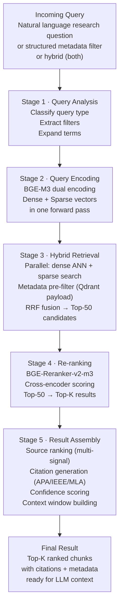
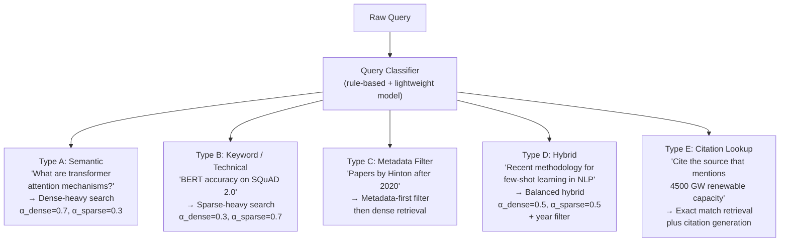
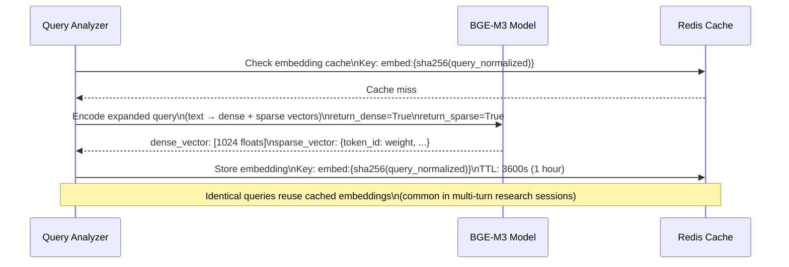
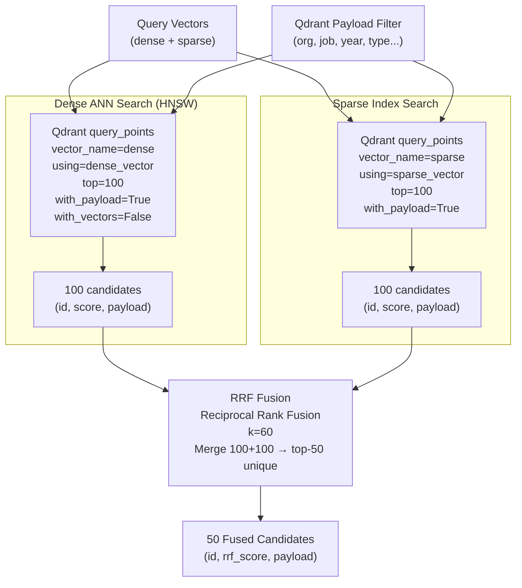
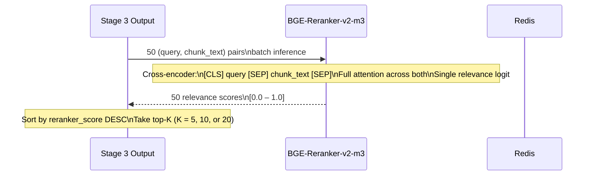
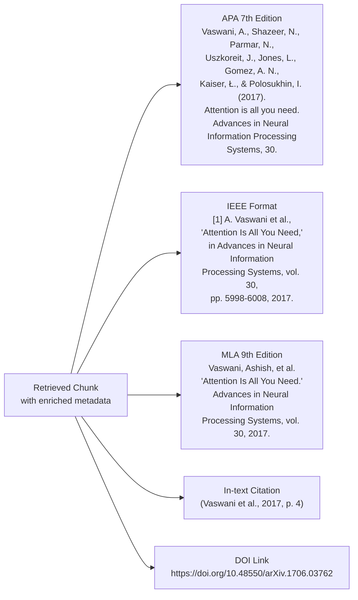
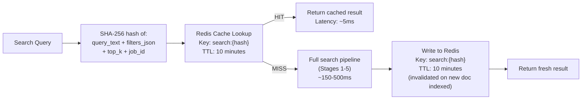

# Research RAG Engine — Search Pipeline

## Search Pipeline Overview

The search pipeline processes an incoming research query through **5 sequential stages** that progressively narrow and improve result quality:



---

## Stage 1 — Query Analysis

### Query Type Classification

Before retrieval, the query is classified to determine the optimal retrieval strategy:



### Query Analysis Output

```json
{
  "query_id":          "qry_001",
  "raw_query":         "recent methodology for few-shot learning in NLP",
  "query_type":        "hybrid",
  "intent":            "methodology_search",
  "extracted_filters": {
    "year_min":        2021,
    "year_max":        null,
    "section_types":   ["methodology", "results"],
    "source_type":     null,
    "keywords":        ["few-shot", "learning", "NLP"]
  },
  "expanded_query":    "recent methodology for few-shot learning in NLP natural language processing prompt-based meta-learning in-context learning",
  "retrieval_weights": {
    "alpha_dense":     0.5,
    "alpha_sparse":    0.5
  },
  "top_k_candidates":  50,
  "final_top_k":       10
}
```

### Query Expansion

Queries are expanded before encoding to improve recall:

```
Expansion methods (applied in order):

1. Synonym Expansion
   "NLP" → "NLP", "natural language processing"
   "few-shot" → "few-shot", "few shot", "low-resource"

2. Acronym Expansion
   "BERT" → "BERT", "Bidirectional Encoder Representations from Transformers"

3. Hypothetical Document Expansion (HyDE)
   Generate a short hypothetical abstract that would answer the query:
   "A methodology for few-shot learning in NLP involves..."
   Embed the HyDE text alongside the original query
   Blend: query_vec = 0.7 × original + 0.3 × hyde_vec

4. Domain Term Injection
   Detect research domain → inject domain-specific vocabulary
   (from org's domain knowledge base)
```

---

## Stage 2 — Query Encoding



### Query Embedding Cache Policy

| Cache Hit Condition | Action |
|---|---|
| Exact query text match | Return cached vector, skip encoding |
| Query differs only in trailing spaces/case | Normalize → likely cache hit |
| Query expanded (synonyms added) | Cache the **expanded** query vector, not original |
| Cache TTL | 1 hour (queries recur within sessions) |
| Max cache size | 10,000 query embeddings per org (LRU eviction) |

---

## Stage 3 — Hybrid Retrieval

### 3A — Metadata Pre-Filter (Qdrant Payload Filter)

Metadata filters are applied **inside Qdrant** before ANN search — this is filter-then-search (not search-then-filter), which preserves recall while removing irrelevant documents:

```json
// Qdrant Filter object
{
  "must": [
    {"key": "org_id",    "match": {"value": "org_456"}},
    {"key": "job_id",    "match": {"value": "job_xyz789"}}
  ],
  "should": [
    {"key": "chunk_type", "match": {"any": ["methodology", "results"]}}
  ],
  "must_not": [
    {"key": "chunk_type", "match": {"value": "references"}}
  ],
  "filter": {
    "key": "year",
    "range": {"gte": 2021}
  }
}
```

### Filterable Metadata Fields (Indexed in Qdrant)

| Field | Type | Filter Operation |
|---|---|---|
| `org_id` | keyword | `match` (always applied) |
| `job_id` | keyword | `match` |
| `doc_id` | keyword | `match` |
| `chunk_type` | keyword | `match`, `any` |
| `section` | keyword | `match` |
| `page_number` | integer | `range` |
| `year` | integer | `range` (from doc metadata) |
| `source_type` | keyword | `match` |
| `language` | keyword | `match` |
| `has_table` | boolean | `match` |
| `has_equation` | boolean | `match` |
| `level_of_evidence` | keyword | `match` |

### 3B — Parallel Dense + Sparse Search



### RRF Fusion Implementation

```
For each document d that appears in dense_results (rank_d) and/or sparse_results (rank_s):

  rrf_score(d) = (1 / (60 + rank_d) if d in dense_results else 0)
               + (1 / (60 + rank_s) if d in sparse_results else 0)

Sort all documents by rrf_score descending.
Take top-50.
```

**Example**:
| doc | Dense rank | Sparse rank | RRF score |
|---|---|---|---|
| chunk_A | 1 | 3 | 1/61 + 1/63 = 0.032 |
| chunk_B | 5 | 1 | 1/65 + 1/61 = 0.032 |
| chunk_C | 2 | — | 1/62 + 0 = 0.016 |
| chunk_D | — | 2 | 0 + 1/62 = 0.016 |

Documents appearing in **both** lists score highest — confirming both semantic and lexical relevance.

---

## Stage 4 — Re-Ranking

### BGE-Reranker-v2-m3 Cross-Encoder



### Reranker Configuration

| Parameter | Value |
|---|---|
| Model | `BAAI/bge-reranker-v2-m3` |
| Max input length | 512 tokens (query + chunk combined) |
| Batch size | 16 pairs per inference call |
| Output | Relevance score [0.0 – 1.0] |
| Threshold | Discard chunks scoring < 0.3 |
| Hardware | GPU preferred; CPU fallback (3× slower) |

### Chunk Truncation for Reranker Input

```
If (query_tokens + chunk_tokens) > 512:
    Reserve: 64 tokens for query
    Remaining: 512 - 64 - 3 (special tokens) = 445 tokens for chunk
    Strategy: Take first 223 tokens + last 222 tokens from chunk
    (Preserves chunk start and end — most information-dense parts)
```

---

## Stage 5 — Result Assembly

### Multi-Signal Source Ranking

After reranking, a **composite score** is computed for final ordering:

```python
# Composite ranking formula (conceptual — no code generation)

final_score = (
    0.45 × reranker_score          +  # Cross-encoder relevance
    0.25 × rrf_retrieval_score     +  # Hybrid retrieval score (normalized)
    0.15 × source_quality_score    +  # Tier-based source quality
    0.10 × recency_score           +  # Year-based recency
    0.05 × citation_weight            # Citation count weight
)

# Tie-breaking: prefer higher section_priority (abstract > methodology > results > ...)
```

### Citation Generation

Each result chunk gets citations in all 3 formats, generated from its enriched metadata:



### Citation Generation Rules

| Field | APA Rule | IEEE Rule | Fallback |
|---|---|---|---|
| ≤ 2 authors | List both | List both | — |
| 3–20 authors | All authors | First et al. | — |
| > 20 authors | First 19 + last 1, `...` | First et al. | — |
| No DOI | Use URL | Use URL | `(n.d.)` |
| No year | `(n.d.)` | `n.d.` | — |
| Page number | From `page_range[0]` | From chunk metadata | `p. [unavailable]` |

### Context Window Assembly

The final ranked results are assembled into an **LLM-ready context window**:

```
[RETRIEVED CONTEXT]

Source 1 (Relevance: 0.94 | Section: Methodology | Page 4)
---
Title: "Attention Is All You Need" | Vaswani et al. (2017) | NeurIPS
DOI: https://doi.org/10.48550/arXiv.1706.03762

"An attention function can be described as mapping a query and a set of 
key-value pairs to an output, where the query, keys, values, and output 
are all vectors..."

Citation: (Vaswani et al., 2017, p. 4)
---

Source 2 (Relevance: 0.87 | Section: Results | Page 9)
---
Title: "BERT: Pre-training of Deep Bidirectional Transformers" | Devlin et al. (2019) | NAACL
DOI: https://doi.org/10.18653/v1/N19-1423

"BERT achieves state-of-the-art results on eleven NLP benchmarks..."

Citation: (Devlin et al., 2019, p. 9)
---

[INSTRUCTION TO LLM]
Answer the user's question using ONLY the information in the retrieved sources above.
Cite sources using inline citation format: (Author et al., Year, p. X).
If the answer is not found in the sources, state: "The retrieved sources do not contain 
sufficient information to answer this question."
```

---

## Metadata Search API

Beyond vector search, the system supports **structured metadata queries** via a dedicated metadata search endpoint:

### Metadata Search Request

```json
POST /api/v1/rag/search/metadata

{
  "filters": {
    "authors":          ["Vaswani"],
    "year_range":       {"min": 2015, "max": 2023},
    "keywords":         ["attention", "transformer"],
    "source_type":      "arxiv",
    "level_of_evidence":"conference_paper",
    "doi":              null,
    "job_id":           "job_xyz789"
  },
  "sort_by":            "year_desc | relevance | citation_count",
  "page":               1,
  "page_size":          20
}
```

### Metadata Search Response

```json
{
  "total":   3,
  "page":    1,
  "results": [
    {
      "doc_id":        "doc_abc123",
      "title":         "Attention Is All You Need",
      "authors":       ["Vaswani, A.", "Shazeer, N."],
      "year":          2017,
      "doi":           "10.48550/arXiv.1706.03762",
      "journal":       "NeurIPS 2017",
      "citation_count":120000,
      "keywords":      ["transformer", "attention", "NLP"],
      "chunk_count":   47,
      "citations": {
        "apa":  "Vaswani, A., et al. (2017)...",
        "ieee": "[1] A. Vaswani et al., ...",
        "mla":  "Vaswani, Ashish, et al. ..."
      }
    }
  ]
}
```

---

## Search API Endpoint Specifications

### Endpoint 1 — Semantic Search

```
POST /api/v1/rag/search/semantic
Authorization: Bearer {token}

Request:
{
  "query":     "transformer attention mechanisms",
  "job_id":    "job_xyz789",
  "filters": {
    "year_min":       2020,
    "section_types":  ["methodology", "results"],
    "source_type":    null
  },
  "top_k":       10,
  "include_citations": true,
  "citation_format":   "apa"
}

Response:
{
  "query_id":   "qry_001",
  "latency_ms": 145,
  "results": [
    {
      "chunk_id":        "chunk_doc123_042",
      "doc_id":          "doc_abc123",
      "text":            "..chunk content..",
      "section":         "3.2 Attention",
      "chunk_type":      "methodology",
      "page_range":      [4, 5],
      "scores": {
        "reranker":        0.94,
        "rrf_fusion":      0.031,
        "composite":       0.872
      },
      "metadata": { ...doc_metadata... },
      "citation":        "(Vaswani et al., 2017, p. 4)",
      "citation_full":   "Vaswani, A., et al. (2017)...",
      "doi_url":         "https://doi.org/10.48550/arXiv.1706.03762"
    }
  ],
  "context_window": "..assembled context for LLM.."
}
```

### Endpoint 2 — Hybrid Search (Semantic + Metadata)

```
POST /api/v1/rag/search/hybrid

Same as semantic + metadata filters combined.
Additional field: "retrieval_weights": {"dense": 0.6, "sparse": 0.4}
```

### Endpoint 3 — Citation Lookup

```
GET /api/v1/rag/cite/{doc_id}?format=apa

Response:
{
  "doc_id":    "doc_abc123",
  "apa":       "Vaswani, A., et al. (2017)...",
  "ieee":      "[1] A. Vaswani et al., ...",
  "mla":       "Vaswani, Ashish, et al. ...",
  "bibtex":    "@inproceedings{vaswani2017attention,...}",
  "doi_url":   "https://doi.org/10.48550/arXiv.1706.03762"
}
```

---

## Search Performance Targets

| Metric | Target | Measurement |
|---|---|---|
| P50 latency | < 100ms | Stage 3 only (no reranker) |
| P95 latency (with reranker) | < 500ms | Stages 1-5 complete |
| P99 latency | < 1,000ms | Worst case with cold cache |
| Recall@10 (BEIR benchmark) | > 0.75 | BGE-M3 hybrid |
| NDCG@10 (post-reranker) | > 0.85 | BGE-Reranker-v2-m3 |
| Throughput | 50 concurrent searches/node | Qdrant + GPU reranker |
| Cache hit rate | > 40% | Repeated session queries |

---

## Search Caching Strategy



**Cache invalidation**: When a new document is indexed into a `job_id`, all cached searches for that `job_id` are invalidated via Redis key pattern deletion.
