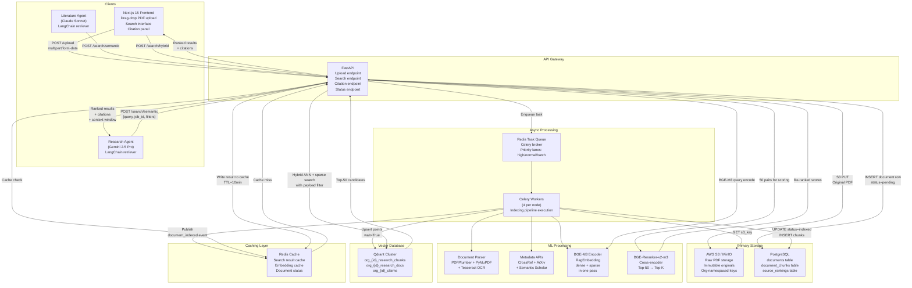
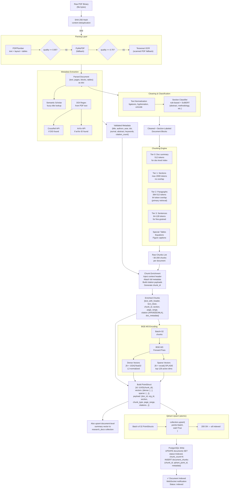
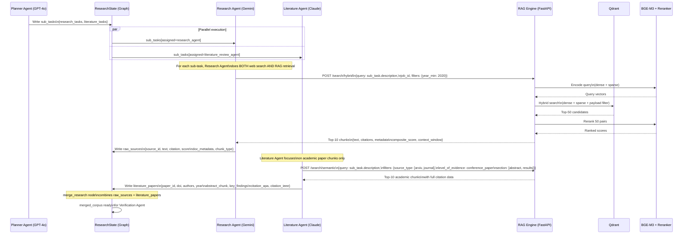
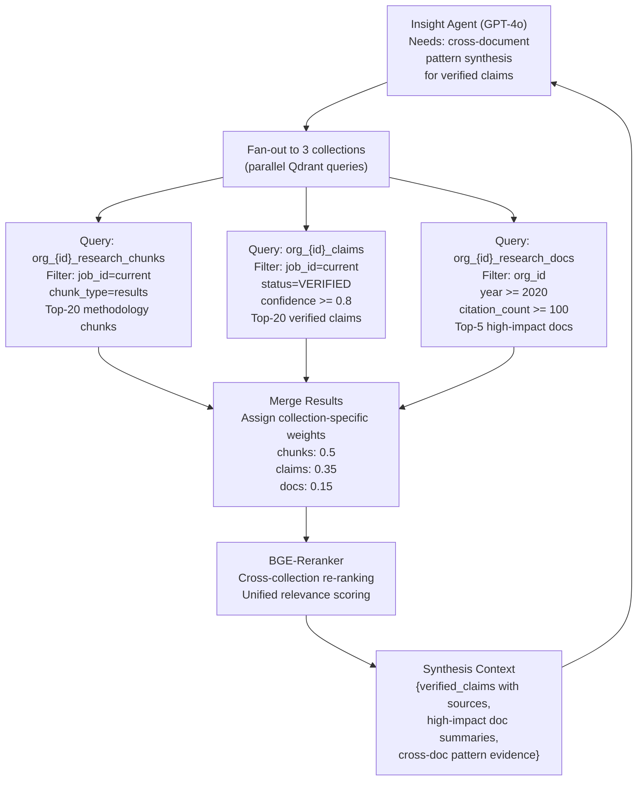
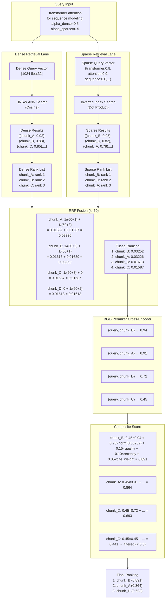
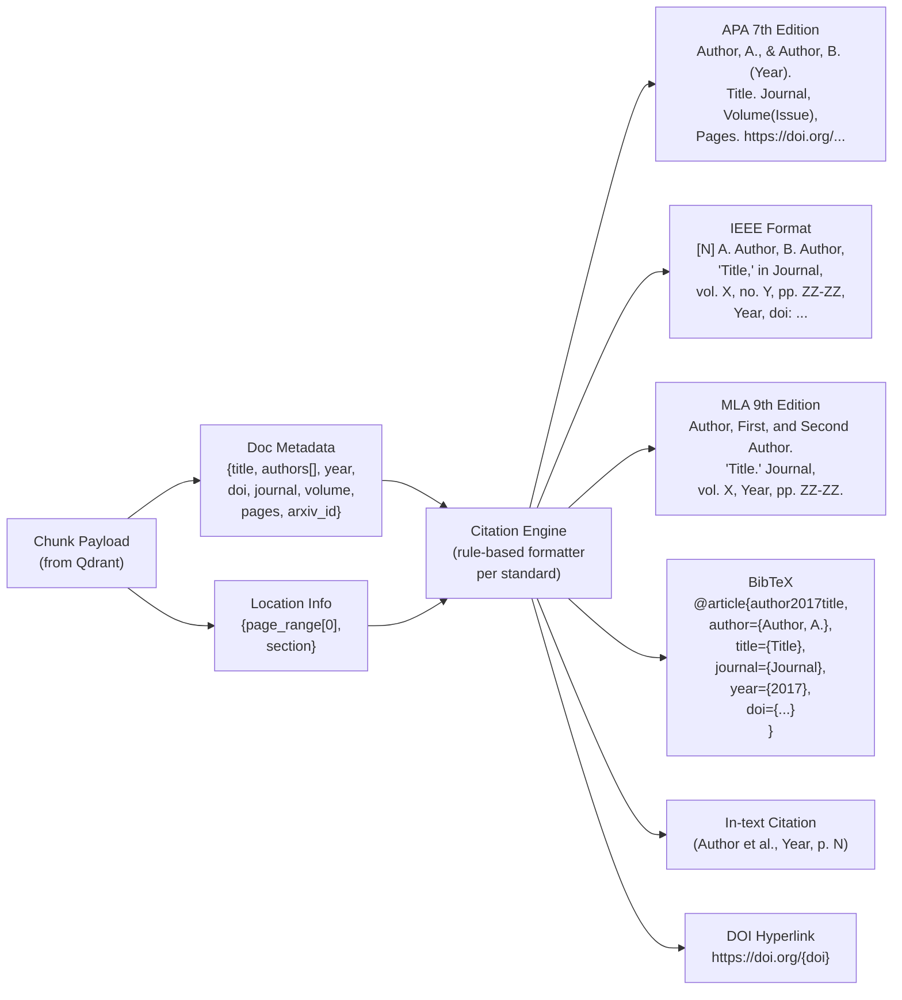
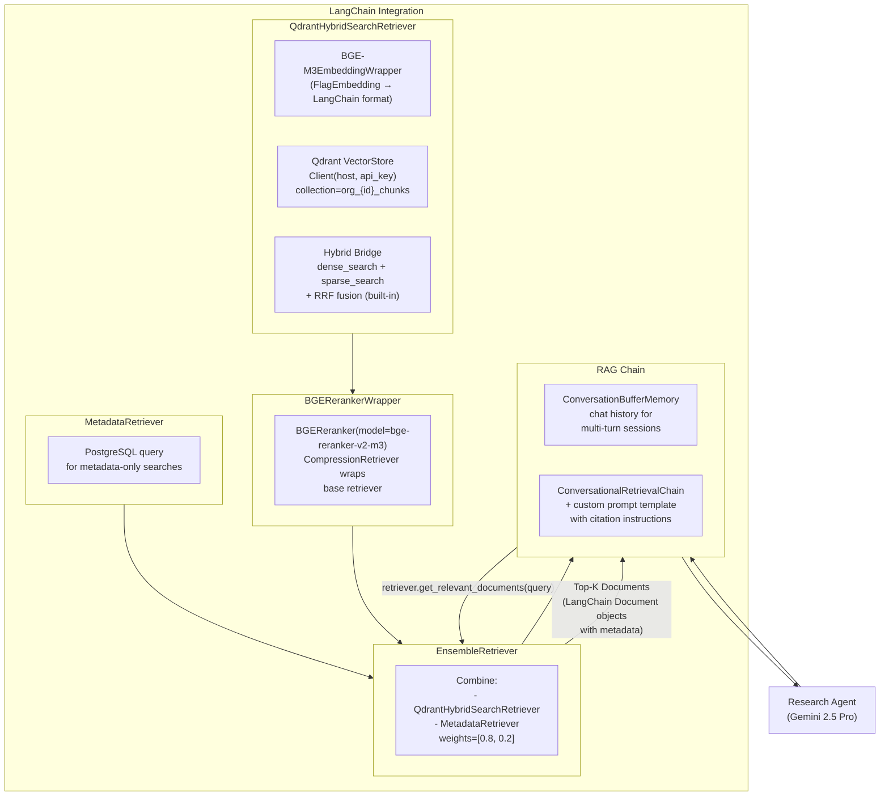
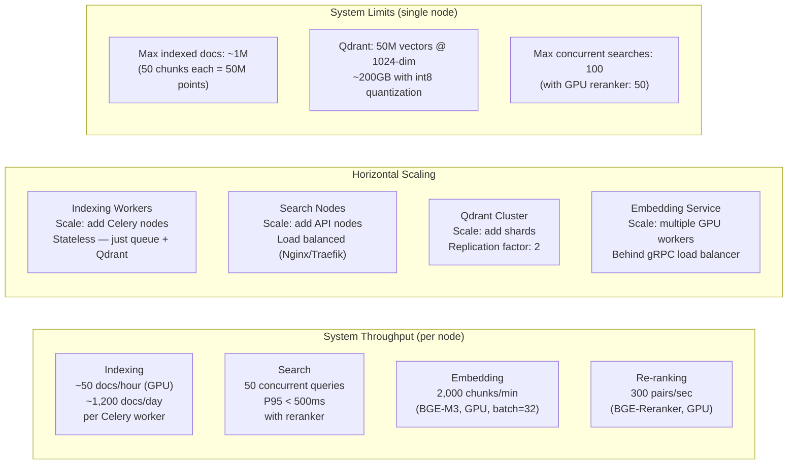

# Research RAG Engine — Data Flow Diagrams

## Diagram 1 — Complete System Data Flow

End-to-end view of all data paths from document upload to agent consumption:

---

## Diagram 2 — Indexing Pipeline Data Flow

Detailed data transformations from raw PDF to indexed vectors:

---

## Diagram 3 — Search Pipeline Data Flow

Query-to-result data transformations:

```mermaid
flowchart TD
    QUERY["User/Agent Query\n'What are recent methodologies\nfor few-shot NLP?'"]

    QUERY --> ANALYZE

    subgraph ANALYZE["Query Analysis"]
        TYPE["Type Classification\nhybrid query"]
        FILTER_EX["Filter Extraction\nyear_min=2021\nsection=[methodology, results]"]
        EXPAND["Query Expansion\n+ synonyms, acronyms\n+ HyDE generation\n(0.7 × query + 0.3 × hyde)"]
        TYPE --> FILTER_EX --> EXPAND
    end

    ANALYZE --> ANALYSIS_OUTPUT["Analysis Output\n{query_type: hybrid,\nalpha_dense: 0.5, alpha_sparse: 0.5,\nfilters: {year>=2021, section:[...]}}\nexpanded_query: '...'"]

    ANALYSIS_OUTPUT --> CACHE_CHECK["Redis Cache Check\nKey: search:{sha256(query+filters)}\nTTL: 10 min"]

    CACHE_CHECK -->|HIT ~5ms| RETURN_CACHED["Return Cached Result\n{ranked chunks + citations}"]

    CACHE_CHECK -->|MISS| ENCODE

    subgraph ENCODE["Query Encoding (BGE-M3)"]
        Q_DENSE["Dense Query Vector\n[1024 float32]"]
        Q_SPARSE["Sparse Query Vector\n{token: weight, ...}"]
    end

    ENCODE --> PARALLEL_SEARCH

    subgraph PARALLEL_SEARCH["Parallel Qdrant Search"]
        direction LR
        D_SEARCH["Dense ANN Search\nHNSW ef=128\nTop-100\nwith payload filter"]
        S_SEARCH["Sparse Index Search\nInverted index\nTop-100\nwith payload filter"]
    end

    PARALLEL_SEARCH --> D_RESULTS["Dense Results\n100 chunks\n{chunk_id, score, payload}"]
    PARALLEL_SEARCH --> S_RESULTS["Sparse Results\n100 chunks\n{chunk_id, score, payload}"]

    D_RESULTS & S_RESULTS --> RRF["RRF Fusion\nk=60\nMerge 100+100 lists\nDeduplicate\nTop-50 by RRF score"]

    RRF --> TOP50["50 Fused Candidates\n{chunk_id, chunk_text,\nrrf_score, section,\npages, doc_metadata}"]

    TOP50 --> RERANK

    subgraph RERANK["BGE-Reranker-v2-m3"]
        PAIRS["50 (query, chunk_text) pairs"]
        CROSS["Cross-encoder\nFull attention\nquery + chunk together"]
        SCORES["50 relevance scores\n[0.0 – 1.0]"]
        PAIRS --> CROSS --> SCORES
    end

    RERANK --> FILTER_LOW["Filter: score < 0.3 → discard"]

    FILTER_LOW --> COMPOSITE["Composite Score\n0.45×reranker\n+ 0.25×rrf\n+ 0.15×source_quality\n+ 0.10×recency\n+ 0.05×citations"]

    COMPOSITE --> TOPK["Top-K Results\n(K = 10 default)\nsorted by composite score"]

    TOPK --> CITE_GEN

    subgraph CITE_GEN["Citation Generation"]
        APA_GEN["APA 7th\n(Vaswani et al., 2017)"]
        IEEE_GEN["IEEE Format\n[1] A. Vaswani et al."]
        INLINE_GEN["Inline Citation\n(Vaswani et al., 2017, p.4)"]
        BIBTEX["BibTeX\n@inproceedings{...}"]
    end

    CITE_GEN --> CONTEXT["Context Window Assembly\n[RETRIEVED CONTEXT]\nSource 1 (0.94)...\nSource 2 (0.87)...\n[INSTRUCTION TO LLM]"]

    TOPK --> CACHE_WRITE["Write to Redis\nTTL: 10 minutes"]

    CONTEXT --> RESPONSE["Search Response\n{results: [...],\ncontext_window: '...',\nlatency_ms: 145,\ntotal_results: 10}"]
```

---

## Diagram 4 — Agent Integration Data Flow

How the Research and Literature agents use the RAG engine:

---

## Diagram 5 — Multi-Collection Query Fan-Out

When the Insight Agent needs cross-document retrieval:

---

## Diagram 6 — Hybrid Retrieval Scoring Data Flow

Detailed view of how scores flow through the hybrid retrieval system:

---

## Diagram 7 — Citation Generation Data Flow

---

## Diagram 8 — LangChain Retriever Integration

How LangChain wraps the RAG engine for agent consumption:

---

## Diagram 9 — System Capacity & Throughput

